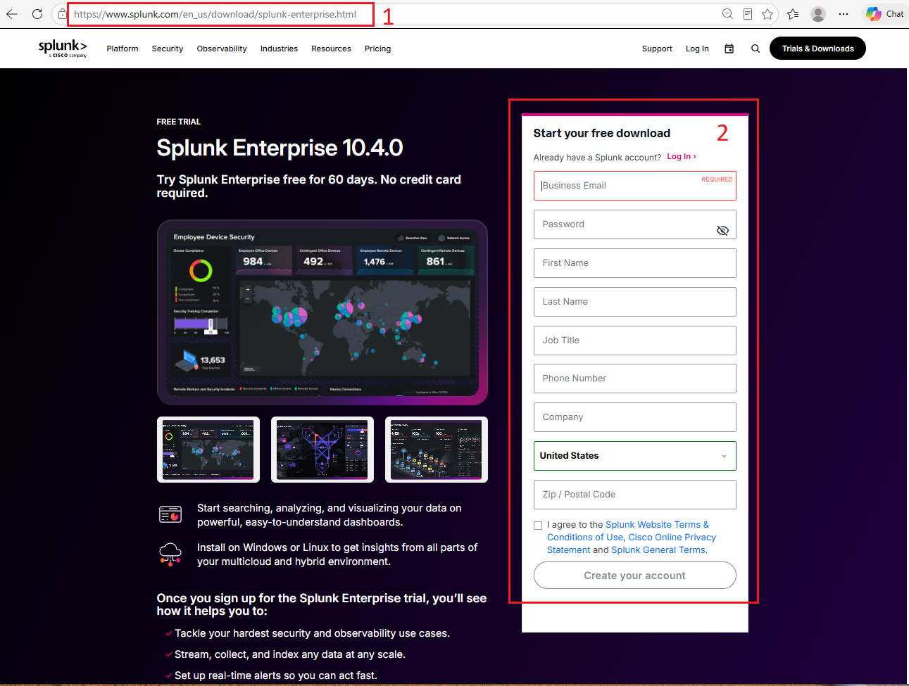
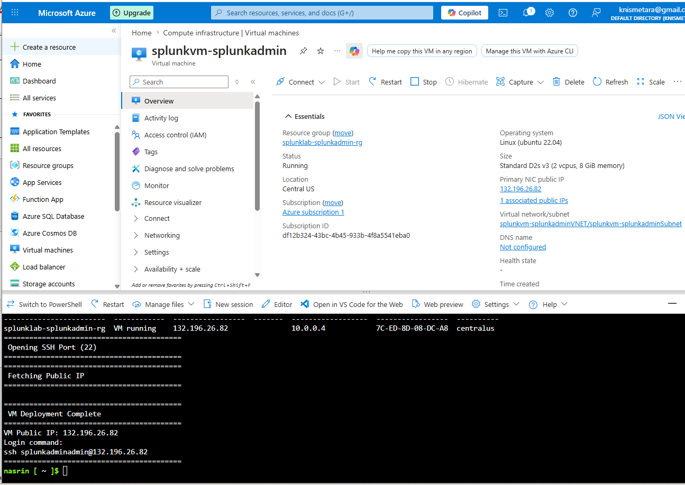
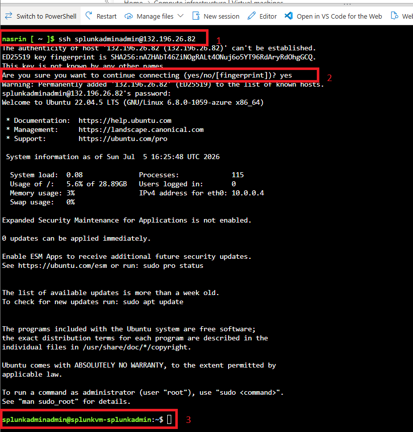
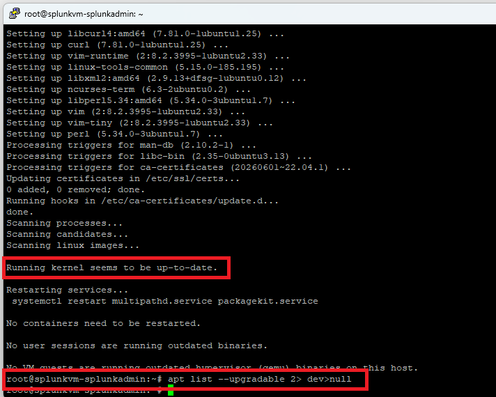
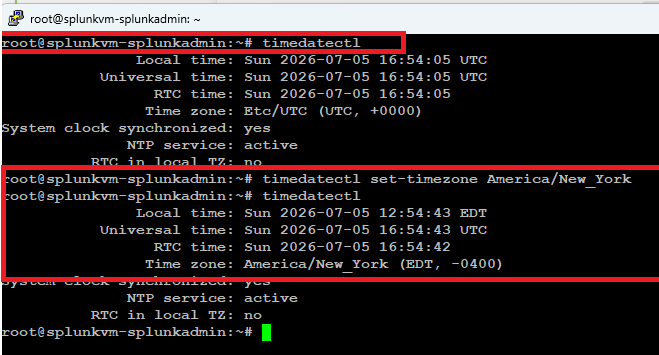

# Lab 01 — Building the Splunk Environment


Provision the cloud infrastructure that the rest of this lab series runs on — an Azure Ubuntu VM, hardened and time-synced, ready for a Splunk Enterprise install.

**Time:** ~45 minutes · **Cost:** ~$0.10/hr while running (stop the VM when idle)

---

## What You'll Build

By the end of this lab you will have a running Ubuntu 22.04 server in Azure, reachable over key-based SSH, fully patched, with its clock configured for accurate event timestamping.

| Skill | Why it matters in a SOC |
|---|---|
| Cloud VM provisioning via CLI | Repeatable infrastructure beats clicking through a portal |
| Key-based SSH authentication | Password auth on an internet-facing host is an open invitation |
| Patch management | Unpatched services are the most common initial access vector |
| Timezone configuration | Correlating events across sources fails when clocks disagree |

---

## Prerequisites

- Splunk account — free, at [splunk.com](https://www.splunk.com)
- Microsoft Azure account — free tier is sufficient
- An SSH client (built into macOS, Linux, and Windows Terminal)

**Tested on:** Splunk Enterprise 9.x / 10.x · Ubuntu 22.04 LTS · Azure East US

---

## 🏗️ What You're Building

```
                  Your Local Computer
                          │
                          │  SSH (key-based, port 22)
                          ▼
        ┌─────────────────────────────────────┐
        │   Azure NSG (Cloud Firewall)        │
        │   Inbound allow: port 22 only       │
        └─────────────────────────────────────┘
                          │
                          ▼
        ┌─────────────────────────────────────┐
        │   Ubuntu 22.04 VM                   │
        │   ───────────────────────────────   │
        │   • Fully patched                   │
        │   • Timezone configured             │
        │   • Ready for Splunk (Lab 02)       │
        │                                     │
        │   Resource Group: rg-splunk-lab     │
        └─────────────────────────────────────┘
```

This is the foundation. Every later lab in the series runs on top of this VM.

---

## Concepts

| Term | What it means |
|---|---|
| **Virtual Machine** | A computer that runs as software on shared cloud hardware rather than as a physical box you own |
| **SSH** | Encrypted remote shell access to a Linux server |
| **Resource Group** | An Azure container that holds related resources so they can be managed and deleted together |
| **NSG** | Network Security Group — Azure's host-level firewall, controlling which ports are reachable |
| **sudo** | Runs a single command with administrator privileges |

---

## Task 1 — Create a Splunk Account

1. Go to [splunk.com](https://www.splunk.com)
2. **Trials & Downloads** → **Splunk Enterprise** → **Start free trial**
3. **Create Your Account** — provide name, email, username, and a strong password
4. Accept the terms and submit
5. Click the verification link in your inbox

> The free trial converts to a permanent free license at 500 MB/day of indexing, which is plenty for this lab series.



**✅ Checkpoint:** You can log in at splunk.com.

---

## Task 2 — Provision the Ubuntu VM

### Design decisions

Before running anything, understand what this script chooses and why:

| Choice | Reasoning |
|---|---|
| `Standard_D2s_v3` (2 vCPU / 8 GB) | Splunk's documented minimum. Smaller sizes will install but index poorly. |
| Ubuntu 22.04 LTS | Long-term support through 2027 — no OS migration mid-series. |
| `--generate-ssh-keys` | Key-based auth only. No password is ever set on this host. |
| Only port 22 opened | Splunk Web (8000) stays closed until Lab 02, and then only to a known source IP. |

### Steps

1. Log in to the [Azure Portal](https://portal.azure.com)
2. Open **Cloud Shell** (the `>_` icon in the top bar) and select **Bash**
3. Save the script below as `provision-splunk-vm.sh`, then run it

```bash
#!/bin/bash
# ============================================================
# Splunk Lab 01 — Provision Ubuntu VM on Azure
# Key-based SSH only. No password authentication is configured.
# ============================================================
set -euo pipefail

RESOURCE_GROUP="rg-splunk-lab"
LOCATION="eastus"
VM_NAME="splunk-lab-01"
ADMIN_USER="labadmin"
VM_SIZE="Standard_D2s_v3"
IMAGE="Ubuntu2204"

az group create \
  --name "$RESOURCE_GROUP" \
  --location "$LOCATION"

az vm create \
  --resource-group "$RESOURCE_GROUP" \
  --name "$VM_NAME" \
  --image "$IMAGE" \
  --size "$VM_SIZE" \
  --admin-username "$ADMIN_USER" \
  --generate-ssh-keys

az vm open-port \
  --resource-group "$RESOURCE_GROUP" \
  --name "$VM_NAME" \
  --port 22

echo "Public IP:"
az vm show \
  --resource-group "$RESOURCE_GROUP" \
  --name "$VM_NAME" \
  --show-details \
  --query publicIps -o tsv
```

### What each line does

| Element | Purpose |
|---|---|
| `set -euo pipefail` | Abort on any error, unset variable, or failed pipe stage — prevents a half-built environment |
| `RESOURCE_GROUP` | Logical container; deleting it removes every resource in this lab at once |
| `LOCATION` | Azure region. Pick one near you to reduce latency. |
| `--generate-ssh-keys` | Creates a keypair in `~/.ssh/` and installs the public half on the VM |
| `az vm open-port --port 22` | Adds an NSG rule permitting inbound SSH |



4. Record the public IP printed at the end.

> **If the script fails with a `\r` or "bad interpreter" error:** it was saved with Windows line endings. Fix with `sed -i 's/\r$//' provision-splunk-vm.sh` and re-run.

> **⚠️ Cost:** The VM bills while running. `az vm deallocate --resource-group rg-splunk-lab --name splunk-lab-01` stops the charges. `az group delete --name rg-splunk-lab` removes everything.

**✅ Checkpoint:** A running Ubuntu 22.04 VM with a public IP and port 22 reachable.

---

## Task 3 — Connect over SSH

```bash
ssh labadmin@<YOUR_VM_PUBLIC_IP>
```

Accept the host key fingerprint on first connection by typing `yes`.



**Windows users** can use Windows Terminal or PowerShell with the command above. PuTTY also works — enter the public IP as the hostname, port 22, connection type SSH.

### Troubleshooting

| Symptom | Cause and fix |
|---|---|
| `Connection refused` | Port 22 not open in the NSG. Re-run `az vm open-port --resource-group rg-splunk-lab --name splunk-lab-01 --port 22` |
| `Connection timed out` | Wrong IP, or the VM is deallocated. Re-check with `az vm show --show-details --query publicIps -o tsv` |
| `Permission denied (publickey)` | Wrong username, or you're connecting from a machine that doesn't hold the private key |
| `Host key verification failed` | The VM was rebuilt with a new key. Remove the stale entry: `ssh-keygen -R <IP>` |

**✅ Checkpoint:** A shell prompt in the form `labadmin@splunk-lab-01:~$`.

---

## Task 4 — Patch the System

```bash
sudo apt update              # refresh the package index
sudo apt upgrade -y          # apply all available updates
sudo apt list --upgradable   # confirm nothing remains
```



If the upgrade touches the kernel, reboot before continuing:

```bash
sudo reboot
```

> **Why this matters:** A newly provisioned cloud image is built from a snapshot that may be weeks or months old. Every CVE patched since that snapshot is live on your host until you run this.

**✅ Checkpoint:** No packages listed as upgradable.

---

## Task 5 — Set the Timezone

Splunk stamps every ingested event with a timestamp. If the host clock is wrong, your event correlation is wrong, and an investigation built on it will reach the wrong conclusion.

```bash
timedatectl                                    # current setting
timedatectl list-timezones | grep America      # find yours
sudo timedatectl set-timezone America/New_York # set it
timedatectl                                    # verify
```



> **Production note:** Most enterprises standardize every server on UTC regardless of physical location and convert to local time only at the presentation layer. It removes an entire class of daylight-saving correlation bugs. This lab uses local time so the timestamps are readable while learning; switching to UTC is a one-line change.

**✅ Checkpoint:** `timedatectl` reports the intended timezone and shows NTP synchronized.

---

## Key Takeaways

- Provisioning through the CLI makes the environment reproducible; portal clicks don't.
- Key-based SSH removes password brute-force as an attack path entirely — the most valuable single hardening step on an internet-facing host.
- A fresh cloud image is not a patched image.
- Accurate timestamps are a prerequisite for every detection you'll write in the labs ahead.
- Opening only the ports you currently need, rather than the ports you'll eventually need, keeps the attack surface minimal at every stage.

---

## Verify Before Moving On

```bash
lsb_release -a      # Ubuntu 22.04 LTS
timedatectl         # correct timezone, NTP synchronized
free -h             # ~8 GB available
df -h /             # at least 20 GB free for indexes
```

---

**Next:** [Lab 02 — Installing Splunk Enterprise →](../lab-02-install-splunk/)

[← Back to lab index](../README.md)

---

## 👤 Author

**Ismet Ara**
SOC Analyst & GRC Consultant | M.S. Cybersecurity

*"Where detection meets governance — building security that holds up to both attackers and auditors."*

[](https://linkedin.com/in/YOUR-HANDLE)
[](https://github.com/ismet60)

⭐ *Star this repo if these labs helped you learn Splunk.*
