# 🛡️ Lab 02 — Installing Splunk Enterprise on Ubuntu


> **A production-style Splunk Enterprise installation** — dedicated service account, least-privilege ownership, boot-persistent service management, and layered host + cloud firewalling. Documented step by step so a beginner can follow every command and understand *why* it matters.

---

## 🎯 Project Overview

This lab installs Splunk Enterprise on the Ubuntu server provisioned in Lab 01, following the same security practices used in enterprise SOC environments. Rather than a quick default install, every step is done the way a security team would do it in production: Splunk runs under its own unprivileged account, survives reboots as a managed service, and is reachable only through two deliberately configured firewall layers.

**The result:** a hardened, browser-accessible Splunk instance ready to start ingesting data in Lab 03.

---

## 📦 What This Setup Includes

| Component | Purpose |
|---|---|
| **Dedicated `splunk` service account** | Runs Splunk with minimal permissions (Least Privilege) |
| **Splunk Enterprise (Linux .tgz)** | The SIEM platform itself, installed under `/opt/splunk` |
| **systemd service (`splunkd`)** | Auto-starts Splunk on every reboot |
| **Host firewall (ufw)** | Controls which ports are open on the Ubuntu server |
| **Cloud firewall (Azure NSG)** | Controls which traffic reaches the VM from the internet |
| **Web interface (port 8000)** | Browser access to search, dashboards, and configuration |

---

## 💡 Why This Matters

- **Least privilege limits blast radius.** If Splunk is ever compromised, a dedicated non-root account means the attacker inherits one unprivileged user — not the entire server.
- **Boot persistence removes blind spots.** A SIEM that doesn't restart after a reboot silently stops collecting data. Registering it as a systemd service guarantees it comes back.
- **Layered firewalling is defense in depth.** Two independent firewall layers mean a single misconfiguration doesn't expose the service to the open internet.
- **Accurate time is non-negotiable.** Correct timezone configuration ensures every event timestamp reflects reality — the foundation of every investigation to come.

---

## 🏗️ Architecture

```
                    Your Local Browser
                            │
                            │  http://<VM_IP>:8000
                            ▼
        ┌───────────────────────────────────────┐
        │   Azure NSG (Cloud Firewall)          │
        │   Inbound allow: 22, 8000 → your IP   │
        └───────────────────────────────────────┘
                            │
                            ▼
        ┌───────────────────────────────────────┐
        │   Ubuntu 22.04 VM                     │
        │   ┌─────────────────────────────────┐ │
        │   │  ufw (Host Firewall)            │ │
        │   │  allow 8000/tcp, 8089/tcp       │ │
        │   └─────────────────────────────────┘ │
        │   ┌─────────────────────────────────┐ │
        │   │  Splunk Enterprise              │ │
        │   │  Runs as: splunk (non-root)     │ │
        │   │  Managed by: systemd (splunkd)  │ │
        │   │  Web: 8000   Mgmt API: 8089     │ │
        │   └─────────────────────────────────┘ │
        └───────────────────────────────────────┘
```

---

## 🎓 Learning Objectives

By the end of this lab, you will be able to:

- Create a dedicated system user account for running Splunk securely
- Download and install the official Splunk Enterprise package
- Set correct file ownership using the principle of least privilege
- Configure Splunk to start automatically on every reboot
- Open the required ports on both the host and cloud firewalls
- Access the Splunk web interface and complete first-time configuration

**⏱️ Estimated time:** ~40 minutes · **Builds on:** [Lab 01 — Environment Setup](../lab-01-environment-setup/)

---

## 🧩 Concepts You'll Meet

| Term | What it means |
|---|---|
| **Least Privilege** | A service runs with the minimum permissions it needs and nothing more |
| **/opt** | The standard Linux location for third-party software (like Program Files on Windows) |
| **systemd** | The Linux service manager that starts, stops, and auto-restarts background services |
| **ufw** | Uncomplicated Firewall — Ubuntu's built-in host firewall |
| **NSG** | Azure Network Security Group — the cloud firewall in front of the VM |

---

## Task 1 — Create a Dedicated Splunk User

Running Splunk under its own unprivileged account is the most important security decision in this lab. If Splunk is ever compromised, the attacker only gets this limited user — not the whole server.

**1. Make sure you are root.** Your prompt should end in `#`. If not, switch to root:

```bash
sudo -i
```

**2. Create the `splunk` user account:**

```bash
useradd -m -r -s /bin/bash splunk
```

| Part | What it means |
|---|---|
| `useradd` | The Linux command to add a new user |
| `-m` | Create a home directory at `/home/splunk` |
| `-r` | Make it a system account (for services, not interactive logins) |
| `-s /bin/bash` | Set the shell to bash |
| `splunk` | The username |

**3. Verify the user exists:**

```bash
id splunk
```

**4. Set a password** for the account:

```bash
passwd splunk
```

> 💡 Use a strong, unique password and save it in a password manager.

**✅ Checkpoint:** `id splunk` returns a valid user and group ID.

---

## Task 2 — Prepare the Installation Directory

```bash
mkdir -p /opt/splunkinstaller
cd /opt/splunkinstaller
pwd
```

**✅ Checkpoint:** `pwd` prints `/opt/splunkinstaller`.

---

## Task 3 — Download Splunk Enterprise

On your **local computer**, log in at [splunk.com/download](https://www.splunk.com/en_us/download/splunk-enterprise.html), choose the **Linux `.tgz`** package, and copy the `wget` command Splunk generates.

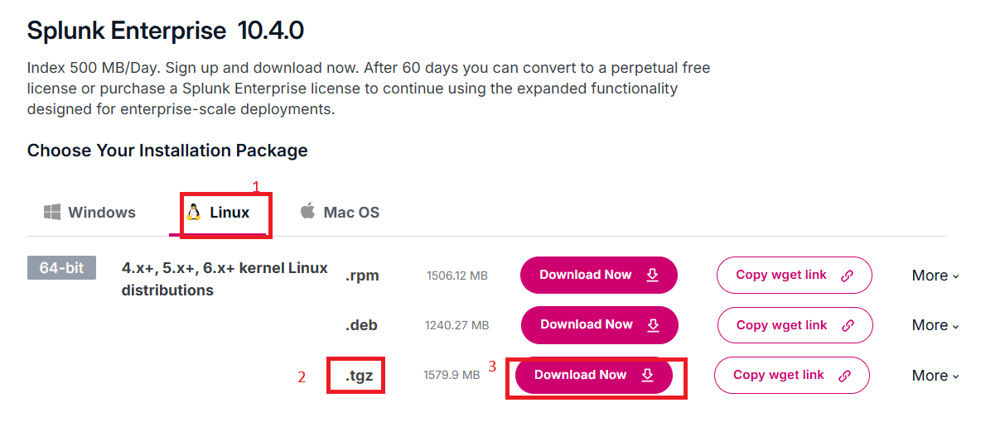

Back in your SSH session, run that command from inside `/opt/splunkinstaller` (your URL will differ):

```bash
wget -O splunk-10.x.x-linux-amd64.tgz \
  "https://download.splunk.com/products/splunk/releases/10.x.x/linux/splunk-10.x.x-linux-amd64.tgz"
```

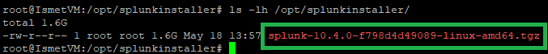

Confirm the download:

```bash
ls -lh /opt/splunkinstaller/
```

**✅ Checkpoint:** A `.tgz` file of roughly 300–500 MB is present.

---

## Task 4 — Extract and Set Ownership

**1. Extract into `/opt`:**

```bash
sudo tar -xzvf /opt/splunkinstaller/splunk-10.x.x-linux-amd64.tgz -C /opt/
```

| Flag | Meaning |
|---|---|
| `-x` | Extract |
| `-z` | Decompress (gzip) |
| `-v` | Verbose — list files as they extract |
| `-f` | From this file |
| `-C /opt/` | Extract into `/opt` |

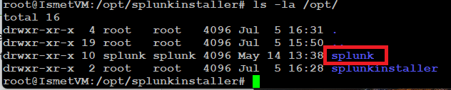

**2. Give ownership to the `splunk` user:**

```bash
chown -R splunk:splunk /opt/splunk
```

**3. Verify — both columns should read `splunk`:**

```bash
ls -la /opt/ | grep splunk
```


> 💡 **Why this matters:** Extraction runs as root, so files start root-owned. Without this `chown`, Splunk fails to start or runs as root — defeating the dedicated account.

**✅ Checkpoint:** `/opt/splunk` is owned by `splunk:splunk`.

---

## Task 5 — First Start and Create the Admin Account

**1. Switch to the splunk user:**

```bash
su - splunk
whoami
```

**2. Start Splunk for the first time:**

```bash
/opt/splunk/bin/splunk start --accept-license
```

Splunk shows the license, then prompts you to create an admin username and password.

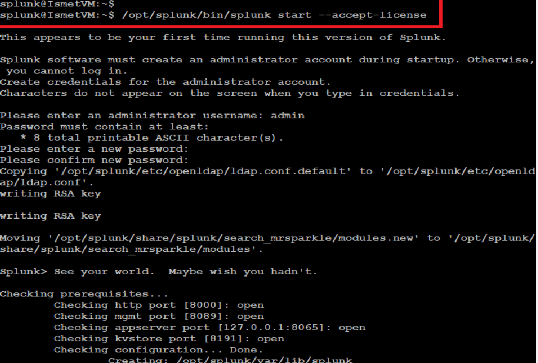

When startup finishes, Splunk prints the web interface address — your success signal.

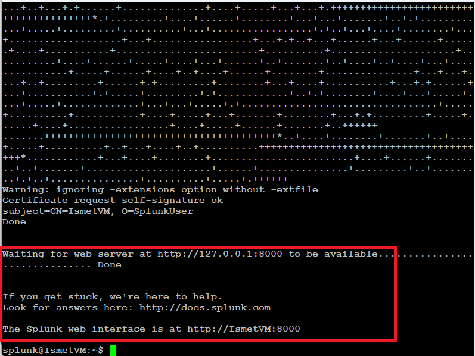

> 💡 Choose the admin credentials carefully — they control access to your entire Splunk instance.

**✅ Checkpoint:** Startup ends with the web interface address.

---

## Task 6 — Configure Splunk to Start on Boot

**1. Return to root:**

```bash
exit
```

**2. Enable boot-start:**

```bash
/opt/splunk/bin/splunk enable boot-start -user splunk --accept-license --answer-yes
```

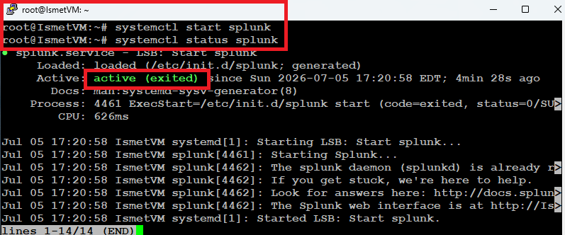

**3. Reload and enable the service:**

```bash
systemctl daemon-reload
systemctl enable splunkd
```

**4. Confirm it's running — look for active (running) in green:**

```bash
systemctl status splunkd
```

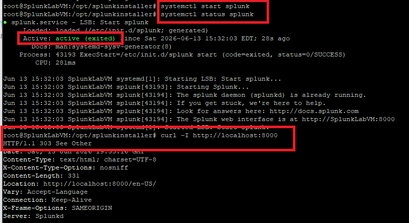

| Command | Action |
|---|---|
| `systemctl start splunkd` | Start |
| `systemctl stop splunkd` | Stop |
| `systemctl restart splunkd` | Restart (after config changes) |
| `systemctl status splunkd` | Show status and recent logs |

**✅ Checkpoint:** `systemctl status splunkd` reads `active (running)`.

---

## Task 7 — Open the Firewalls

Both firewall layers must allow the traffic before you can reach Splunk in a browser.

### 7a. Host firewall (ufw)

```bash
ufw status
ufw allow 8000/tcp        # Splunk web interface
ufw allow 8089/tcp        # Splunk management API
ufw enable
ufw status verbose
```

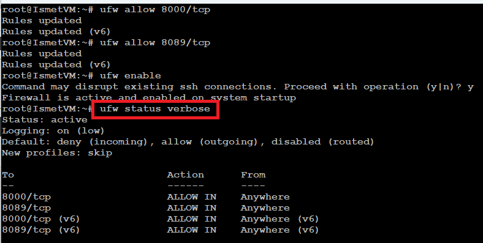

### 7b. Cloud firewall (Azure NSG)

> ⚠️ **Best practice:** Scope this rule to *your own* public IP, not the whole internet. Find your IP at [whatismyip.com](https://www.whatismyip.com).

Azure Portal → **Network Security Groups** → your VM's NSG → **Inbound security rules** → **+ Add**:

| Field | Value |
|---|---|
| Source | IP Addresses |
| Source IP | *your public IP* `/32` |
| Destination port ranges | `8000` |
| Protocol | TCP |
| Action | Allow |
| Priority | `310` |
| Name | `Allow-Splunk-8000` |

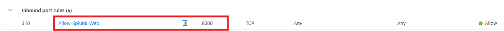

**✅ Checkpoint:** Port 8000 is allowed at both layers.

---

## Task 8 — Log In to the Web Interface

From your local browser:

```
http://<YOUR_VM_PUBLIC_IP>:8000
```


Enter the admin credentials from Task 5.

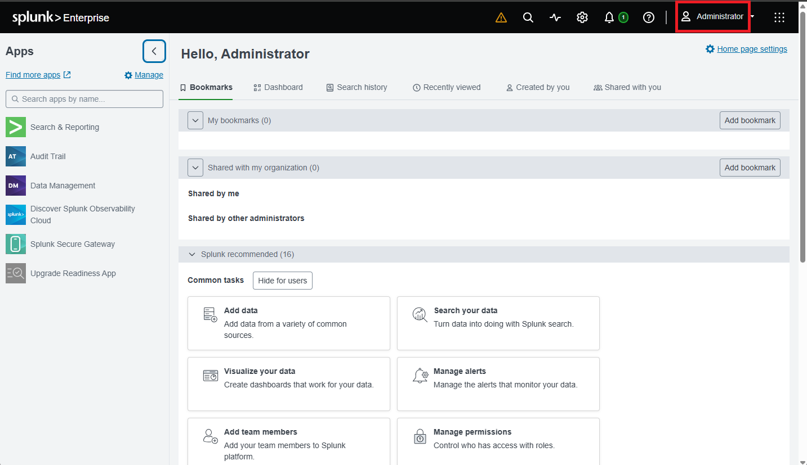

You land on the Splunk home dashboard.

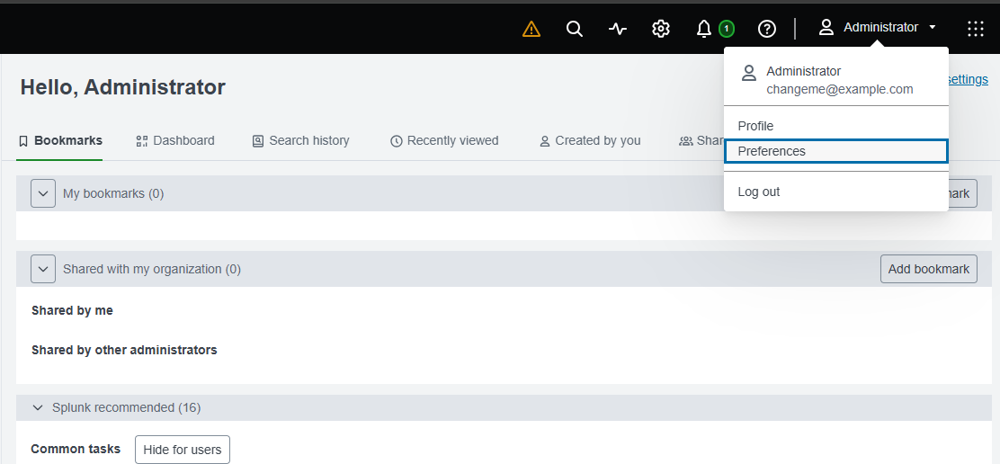

**✅ Checkpoint:** The home dashboard loads.

---

## Task 9 — Set the Timezone in Splunk

Splunk's display timezone and the server clock are two separate settings. Both must agree, or every timestamp you read is offset from reality.

**1. Click the admin menu (top-right) → Preferences:**

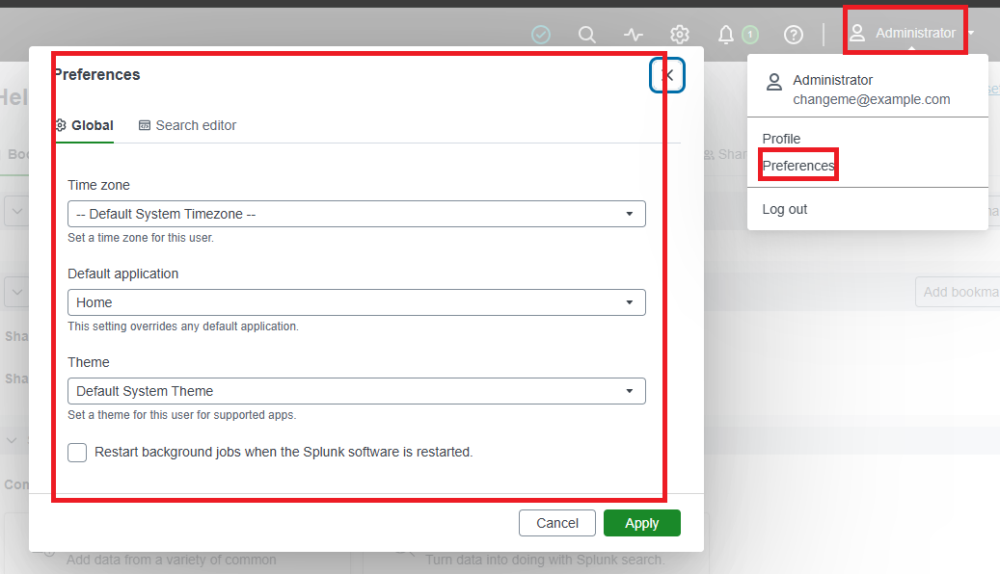

**2. Set your time zone and click Apply:**

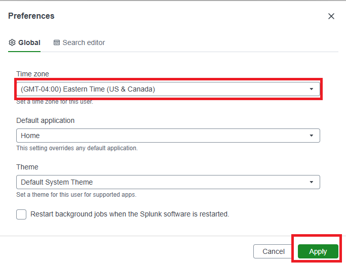

**✅ Checkpoint:** Timestamps now display in your timezone.

---

## 🧠 Key Takeaways

- A dedicated non-root service account contains the damage if Splunk is compromised.
- Correct recursive ownership is what actually enforces that isolation.
- A SIEM must be a boot-persistent systemd service, or it goes dark on reboot.
- Defense in depth means both firewall layers — host and cloud.
- Scoping management interfaces to known IPs is the difference between a lab and an incident.

---

## ✅ Verify Before Moving On

```bash
systemctl is-active splunkd                      # active
sudo -u splunk /opt/splunk/bin/splunk status     # splunkd is running
curl -I http://localhost:8000                    # 303 or 200
```

---

**Next:** [Lab 03 — Adding Data to Splunk →](../lab-03-adding-data/)

[← Back to lab index](../README.md)

---

## 👤 Author

**Nasrin Ismet**
SOC Analyst & GRC Consultant | M.S. Cybersecurity

*"Find it, prove it, govern it."*

[](https://www.linkedin.com/in/kismetara/)
[](https://github.com/ismet60)

⭐ *Star this repo if it helped*
