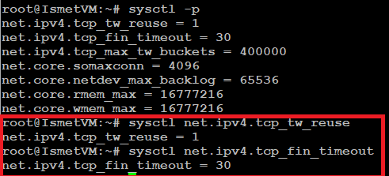
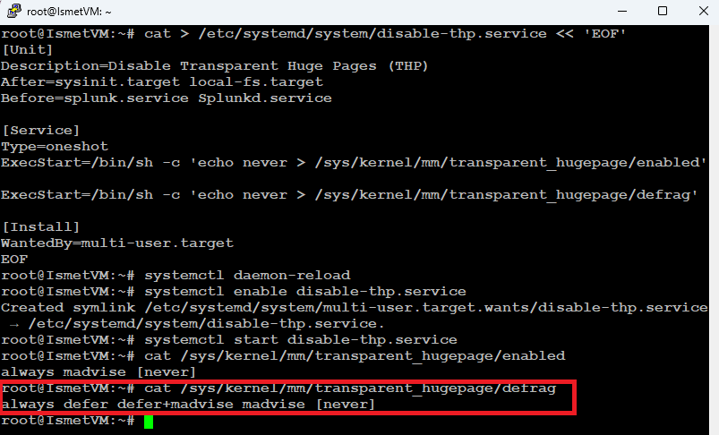
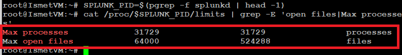

# ⚡ Lab 03 — Tuning Splunk Enterprise for Production Performance


> **Taking Splunk from "installed" to "production-ready."** Out of the box, Ubuntu's defaults are tuned for general use — not high-volume data processing. This lab applies the three kernel and system optimizations Splunk's own documentation requires for enterprise deployments: TCP connection tuning, disabling Transparent Huge Pages, and raising resource limits.

---

## 🎯 Project Overview

Installing Splunk is only the starting point. A default Ubuntu configuration will run Splunk, but under real ingestion load it will drop data, slow searches, and eventually run out of file descriptors. This lab tunes the operating system underneath Splunk so it can handle enterprise-scale workloads reliably.

Every change here is drawn from Splunk's official performance guidance and is standard practice in any production Splunk environment. The lab covers not just *what* to change, but *why* each setting matters — and provides multiple persistence methods so the tuning survives a reboot.

---

## 📦 What This Setup Includes

| Optimization | What it fixes |
|---|---|
| **TCP connection tuning** (sysctl) | Prevents port exhaustion and dropped connections during high-volume ingestion |
| **Transparent Huge Pages disabled** | Removes memory-latency spikes and inconsistent search performance |
| **Raised ulimits** (open files, processes) | Stops "too many open files" crashes under load |
| **Multiple persistence methods** | Ensures every optimization survives a reboot (sysctl.conf, GRUB, systemd) |

---

## 💡 Why This Matters

Skipping these optimizations leads directly to the failure modes a SOC can't afford:

- **Slow search performance** — analysts waiting on queries during an active incident
- **Dropped data during high-volume ingestion** — the one log you needed is the one that never got indexed
- **System instability under heavy load** — the SIEM falling over exactly when an attack generates the most events
- **File descriptor exhaustion** — Splunk unable to open enough files simultaneously, silently failing

Tuning the OS is what separates a lab install from a system you'd trust in production.

---

## 🏗️ What Gets Tuned

```
┌─────────────────────────────────────────────────────────┐
│                  Ubuntu 22.04 Host                      │
│                                                         │
│   ┌─────────────────┐   ┌──────────────────┐            │
│   │  Network Stack  │   │  Memory Manager  │            │
│   │  TCP tuning via │   │  THP disabled    │            │
│   │  sysctl         │   │  (never)         │            │
│   └─────────────────┘   └──────────────────┘            │
│              │                    │                      │
│              └────────┬───────────┘                      │
│                       ▼                                  │
│              ┌──────────────────┐                        │
│              │  Splunk Process  │                        │
│              │  ulimits raised: │                        │
│              │  65536 files     │                        │
│              │  16000 processes │                        │
│              └──────────────────┘                        │
└─────────────────────────────────────────────────────────┘
```

---

## 🎓 Learning Objectives

By the end of this lab, you will be able to:

- Explain why performance tuning is critical for Splunk in enterprise environments
- Configure TCP connection teardown settings for better network throughput
- Disable Transparent Huge Pages (THP) to improve memory performance
- Configure system resource limits (ulimits) for enterprise-scale workloads
- Make every change persistent across reboots using multiple methods

**⏱️ Estimated time:** ~45 minutes · **Builds on:** [Lab 02 — Installing Splunk](../lab-02-installing-splunk/)

---

## Task 1 — Optimize TCP Connection Teardown

**Background:** TCP is how data moves reliably over networks. When a connection closes, Linux keeps it in a waiting state (`TIME_WAIT`) for 60–120 seconds by default. When Splunk processes millions of events, it opens and closes thousands of connections — those lingering `TIME_WAIT` states pile up and consume memory and ports.

### TCP connection states, in plain English

| State | What it means |
|---|---|
| **ESTABLISHED** | Active connection — data is flowing |
| **TIME_WAIT** | Closing, but waiting to confirm all data arrived (60–120s by default) |
| **CLOSE_WAIT** | The remote side closed; our side hasn't confirmed yet |
| **FIN_WAIT** | We sent a close request, waiting for acknowledgment |

### Steps

**1. Ensure you're root** (`sudo -i` if your prompt doesn't end in `#`).

**2. Check the current TCP settings:**

```bash
sysctl net.ipv4.tcp_tw_reuse
sysctl net.ipv4.tcp_fin_timeout
sysctl net.ipv4.tcp_max_tw_buckets
```

**3. Apply the optimized settings:**

```bash
sysctl -w net.ipv4.tcp_tw_reuse=1            # reuse TIME_WAIT sockets for new connections
sysctl -w net.ipv4.tcp_fin_timeout=30        # close idle connections faster (was 60s)
sysctl -w net.ipv4.tcp_max_tw_buckets=400000 # cap total TIME_WAIT sockets
sysctl -w net.core.somaxconn=4096            # larger incoming connection queue
sysctl -w net.core.netdev_max_backlog=65536  # larger network receive queue
sysctl -w net.core.rmem_max=16777216         # 16 MB receive buffer
sysctl -w net.core.wmem_max=16777216         # 16 MB transmit buffer
```

### Why each setting matters

| Setting | Why it matters for Splunk |
|---|---|
| `tcp_tw_reuse=1` | Reuses `TIME_WAIT` sockets — prevents running out of ports during high-volume ingestion |
| `tcp_fin_timeout=30` | Halves the idle-close time from the 60s default |
| `tcp_max_tw_buckets=400000` | Caps `TIME_WAIT` sockets to prevent memory exhaustion |
| `somaxconn=4096` | Bigger connection-request queue prevents dropped connections |
| `netdev_max_backlog=65536` | Bigger receive queue helps high-volume log forwarding |
| `rmem_max` / `wmem_max` | 16 MB buffers improve throughput for large transfers |

**4. Make the settings persistent** (they reset on reboot otherwise):

```bash
cat >> /etc/sysctl.conf << 'EOF'
# Splunk TCP Optimization Settings
net.ipv4.tcp_tw_reuse=1
net.ipv4.tcp_fin_timeout=30
net.ipv4.tcp_max_tw_buckets=400000
net.core.somaxconn=4096
net.core.netdev_max_backlog=65536
net.core.rmem_max=16777216
net.core.wmem_max=16777216
EOF
```

**5. Load the saved configuration:**

```bash
sysctl -p
```

**6. Verify:**

```bash
sysctl net.ipv4.tcp_tw_reuse
sysctl net.ipv4.tcp_fin_timeout
```

Expected output:

```
net.ipv4.tcp_tw_reuse = 1
net.ipv4.tcp_fin_timeout = 30
```



**✅ Checkpoint:** TCP settings are optimized and persistent. Splunk can now handle a higher volume of connections without degradation.

---

## Task 2 — Disable Transparent Huge Pages (THP)

**Background:** THP is a Linux memory feature that uses larger 2 MB memory blocks instead of the standard 4 KB. It speeds up some applications, but for data-processing systems like Splunk it causes latency spikes and memory fragmentation. **Splunk's documentation is explicit: THP must be disabled on any server running Splunk.**

With THP enabled, Splunk suffers random allocation delays, higher memory use, inconsistent search speed, and extra CPU spent on memory compaction.

### Steps

**1. Check the current THP status:**

```bash
cat /sys/kernel/mm/transparent_hugepage/enabled
```

If the output shows `[always]` or `[madvise]` in brackets, THP is enabled and needs disabling:

```
[always] madvise never
```

**2. Disable THP immediately** (takes effect now, but not across reboots):

```bash
echo never > /sys/kernel/mm/transparent_hugepage/enabled
echo never > /sys/kernel/mm/transparent_hugepage/defrag
```

**3. Verify — `never` should now be in brackets:**

```bash
cat /sys/kernel/mm/transparent_hugepage/enabled
```

```
always madvise [never]
```

### Make it persistent — pick one method

The lab shows three persistence methods. The **systemd service (Method C)** is the most reliable, and it explicitly orders itself before Splunk starts.

<details>
<summary><strong>Method A — rc.local</strong></summary>

```bash
cat > /etc/rc.local << 'EOF'
#!/bin/bash
# Disable Transparent Huge Pages for Splunk
echo never > /sys/kernel/mm/transparent_hugepage/enabled
echo never > /sys/kernel/mm/transparent_hugepage/defrag
exit 0
EOF
chmod +x /etc/rc.local
```
</details>

<details>
<summary><strong>Method B — GRUB kernel parameter</strong></summary>

```bash
nano /etc/default/grub
```

Add `transparent_hugepage=never` to the `GRUB_CMDLINE_LINUX_DEFAULT` line:

```
# Before:
GRUB_CMDLINE_LINUX_DEFAULT="quiet splash"
# After:
GRUB_CMDLINE_LINUX_DEFAULT="quiet splash transparent_hugepage=never"
```

Save (`Ctrl+O`, `Enter`, `Ctrl+X`), then update GRUB:

```bash
update-grub
```
</details>

<details>
<summary><strong>Method C — systemd service (most reliable) ✅</strong></summary>

```bash
cat > /etc/systemd/system/disable-thp.service << 'EOF'
[Unit]
Description=Disable Transparent Huge Pages (THP)
After=sysinit.target local-fs.target
Before=splunk.service Splunkd.service

[Service]
Type=oneshot
ExecStart=/bin/sh -c 'echo never > /sys/kernel/mm/transparent_hugepage/enabled'
ExecStart=/bin/sh -c 'echo never > /sys/kernel/mm/transparent_hugepage/defrag'

[Install]
WantedBy=multi-user.target
EOF

systemctl daemon-reload
systemctl enable disable-thp.service
systemctl start disable-thp.service
```
</details>



**✅ Checkpoint:** THP is disabled immediately and persistently. Splunk will have consistent memory performance.

---

## Task 3 — Configure Resource Limits (ulimits)

**Background:** ulimits control how many resources a user or process can consume. Splunk needs far higher limits than Linux defaults. Without them, Splunk fails to open log files, exhausts memory, or crashes under load.

### Steps

**1. Check the splunk user's current limits:**

```bash
su - splunk -c 'ulimit -a'
```

Note the values for `open files` and `max user processes` — they're likely far below what Splunk needs.

**2. Edit the system limits file:**

```bash
nano /etc/security/limits.conf
```

**3. Add the Splunk limits at the bottom:**

```
# ============================================================
# Splunk Enterprise ulimit Configuration
# ============================================================
splunk soft nofile 65536
splunk hard nofile 65536
splunk soft nproc 16000
splunk hard nproc 16000
splunk soft core 0
splunk hard core 0
splunk soft as unlimited
splunk hard as unlimited
root soft nofile 65536
root hard nofile 65536
```

Save and exit (`Ctrl+O`, `Enter`, `Ctrl+X`).

### Understanding the format

| Column | Meaning |
|---|---|
| `splunk` | The user the limit applies to |
| `soft` | The current limit, raisable up to the hard limit |
| `hard` | The ceiling the soft limit can be raised to (root only) |
| `nofile` | The limit type — number of open files |
| `65536` | The value |

**4. Ensure PAM applies the limits:**

```bash
grep pam_limits /etc/pam.d/common-session
```

If there's no output, add the module:

```bash
echo 'session required pam_limits.so' >> /etc/pam.d/common-session
echo 'session required pam_limits.so' >> /etc/pam.d/common-session-noninteractive
```

**5. Configure systemd limits** (a systemd service uses its own limits, not `limits.conf`):

```bash
mkdir -p /etc/systemd/system/Splunkd.service.d/
cat > /etc/systemd/system/Splunkd.service.d/limits.conf << 'EOF'
[Service]
LimitNOFILE=65536
LimitNPROC=16000
LimitCORE=0
LimitAS=infinity
EOF
systemctl daemon-reload
```

**6. Restart Splunk to apply:**

```bash
systemctl restart splunkd
```

**7. Verify the running process has the new limits:**

```bash
SPLUNK_PID=$(pgrep -f splunkd | head -1)
cat /proc/$SPLUNK_PID/limits | grep -E 'open files|Max processes'
```

Expected output:

```
Max open files      65536   65536   files
Max processes       16000   16000   processes
```



**8. Optional — check from within Splunk:**

```bash
su - splunk -c '/opt/splunk/bin/splunk btool limits list --debug'
```

**✅ Checkpoint:** Splunk runs with 65536 open files and 16000 processes.

---

## 🛠️ Troubleshooting

| Problem | Solution |
|---|---|
| Splunk still shows low ulimits after restart | Confirm `/etc/systemd/system/Splunkd.service.d/` exists, then `systemctl daemon-reload && systemctl restart splunkd` |
| "Too many open files" in Splunk logs | `nofile` still too low — recheck `limits.conf` and the systemd override; verify with `cat /proc/$(pgrep splunkd \| head -1)/limits` |
| PAM limits not applied | Ensure `pam_limits.so` is in `/etc/pam.d/common-session`; a reboot may be needed |
| THP still enabled after reboot | Your persistence method didn't take — check `cat /sys/kernel/mm/transparent_hugepage/enabled` and try the systemd method |
| TCP settings reset after reboot | Confirm `/etc/sysctl.conf` has your settings, then `sysctl -p` |

---

## 🧠 Key Learnings

**Performance Engineering**
- Why enterprise Splunk requires OS-level tuning, not just default installs
- How TCP `TIME_WAIT` accumulation causes port exhaustion under load
- Why THP hurts data-processing workloads despite helping general apps
- How ulimits gate a process's ability to handle scale

**Linux System Administration**
- Kernel parameter tuning via `sysctl` and `/etc/sysctl.conf`
- Three distinct persistence mechanisms (rc.local, GRUB, systemd) and their trade-offs
- PAM configuration for enforcing resource limits
- systemd service overrides for per-service limits

**Production Readiness**
- Verifying changes at the running-process level (`/proc/$PID/limits`), not just config files
- Building configurations that survive reboots — the difference between a lab and production

---

## ✅ Verify Before Moving On

```bash
sysctl net.ipv4.tcp_tw_reuse                          # = 1
cat /sys/kernel/mm/transparent_hugepage/enabled       # [never]
cat /proc/$(pgrep splunkd | head -1)/limits | grep 'open files'   # 65536
```

---

**Next:** [Lab 04 →](../lab-04/)

[← Back to lab index](../README.md)

---

<sub>Author: Ismet Ara · Hostnames and identifiers shown are from a temporary lab environment that no longer exists. No production or client infrastructure is represented.</sub>
