# 👥 Lab 04 — Splunk User Management & Access Control


> **The full lifecycle of a Splunk user account** — create, edit, clone, and delete — done through the web console with role-based access control. Access control is one of the core pillars of cybersecurity, and this lab walks through it end to end with a screenshot at every step.

---

## 🎯 Introduction — What Is User Management?

Every time you log into a computer, a website, or an application, you use a user account. A user account is a digital identity that tells the system who you are and what you are allowed to do. In Splunk, user management means creating and controlling these digital identities for everyone who needs to use Splunk.

As a cybersecurity administrator, you must ensure: only the right people can log in, each person can only see what their job requires, and when someone leaves, their account is removed immediately.

> **💡 Real-World Relevance**
> Imagine a hospital with 500 employees. A doctor should access patient records, but a security guard should not. Splunk works the same way — a network engineer needs network logs; a junior analyst may only need read-only access. Controlling who has access to what is called **Access Control** — one of the most important pillars of cybersecurity.

---

## 🏗️ How Access Control Works Here

```
Role Hierarchy (least → most privilege)
┌───────────┐    ┌───────────┐    ┌───────────┐
│   user    │ ─▶ │   power   │ ─▶ │   admin   │
│ read-only │    │  + edit   │    │ + manage  │
│ searches  │    │  searches │    │ everything│
└───────────┘    └───────────┘    └───────────┘

Account Lifecycle
 CREATE ──▶ EDIT ──▶ CLONE ──▶ DELETE
 Task 1     Task 2   Task 3    Task 4
   │                             │
 provision                  deprovision
 access                     within 24h (NIST / CIS)
```

---

## 📦 What This Lab Covers

| Task | Administrative skill |
|---|---|
| **Create a user** | Provisioning access with an assigned role |
| **Edit a user** | Adjusting permissions as responsibilities change |
| **Clone a user** | Rapidly replicating a role template for a new hire |
| **Delete a user** | Enforcing account lifecycle management on departure |

---

## 🎓 Learning Objectives

By the end of this lab, you will be able to:

- Explain what Splunk user accounts are and why they matter in cybersecurity
- Navigate to the Splunk User Management console
- Create a new user with a specific role and password
- Edit an existing user's information and permissions
- Clone a user to quickly create a similar account
- Safely delete a user account

**⏱️ Duration:** 45–60 minutes · **Builds on:** [Lab 02 — Installing Splunk](../lab-02-installing-splunk/)

**Prerequisite:** Logged into Splunk as an administrator, with Splunk reachable at `http://<your-server-ip>:8000`.

---

## Task 1 — Create a Splunk User

**1.** Open a browser and go to your Splunk URL (e.g. `http://<your-server-ip>:8000`).

**2.** Log in with your administrator username (usually `admin`) and password.

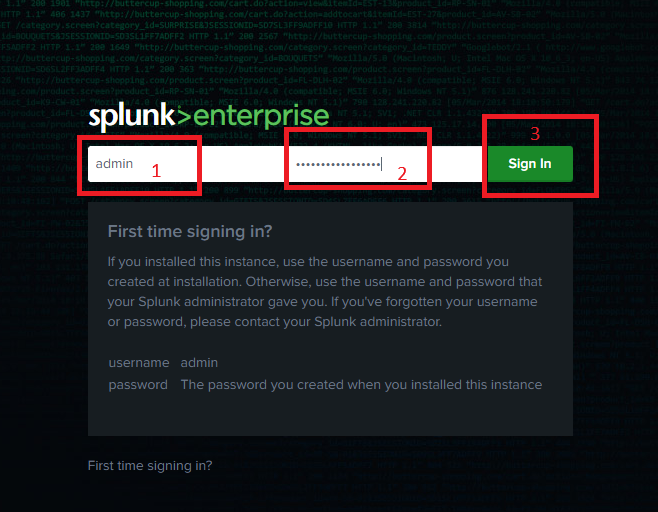

**3.** Click **Settings** in the top-right menu, then under **Users and Authentication**, click **Users**.

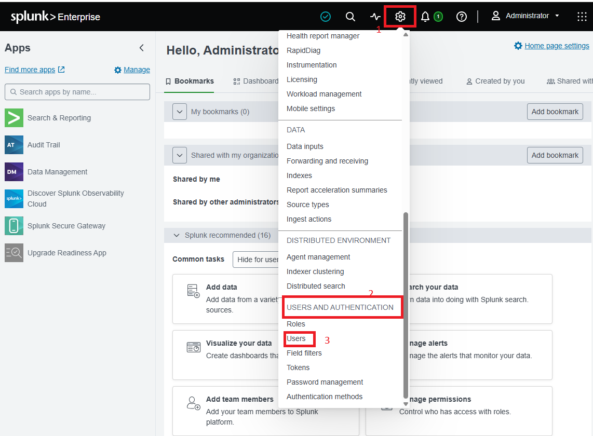

**4.** The User Management page lists all existing users. Click the green **New User** button (top-right).

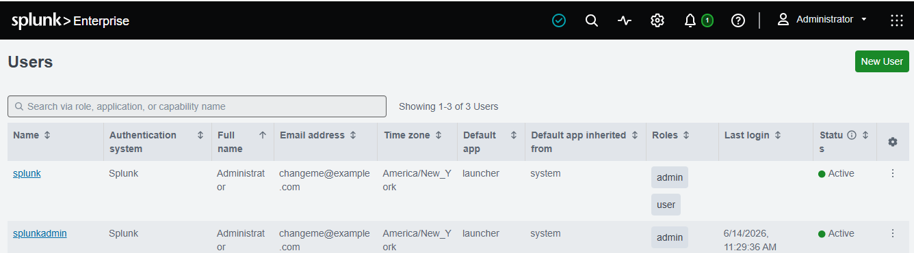

**5.** Fill in the form:

| Field | Example | Notes |
|---|---|---|
| Full Name | Jane Smith | The person's real name |
| Username | jane.smith | Login ID — lowercase, no spaces |
| Email | jane@company.com | Work email |
| Password | *(strong password)* | 8+ characters, numbers and symbols |
| Confirm Password | *(repeat)* | Must match |
| Assign to Role(s) | user | Start with `user` for basic access |
| Default App | search | First page shown after login |
| Time Zone | *(your local)* | Controls timestamp display |

**6.** Click **Save**.

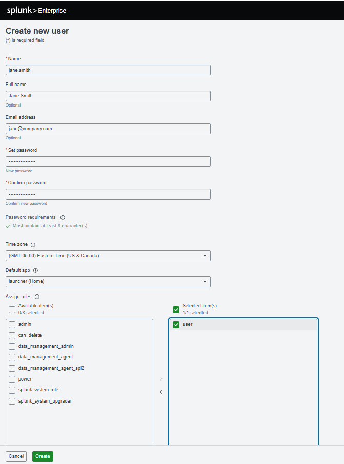

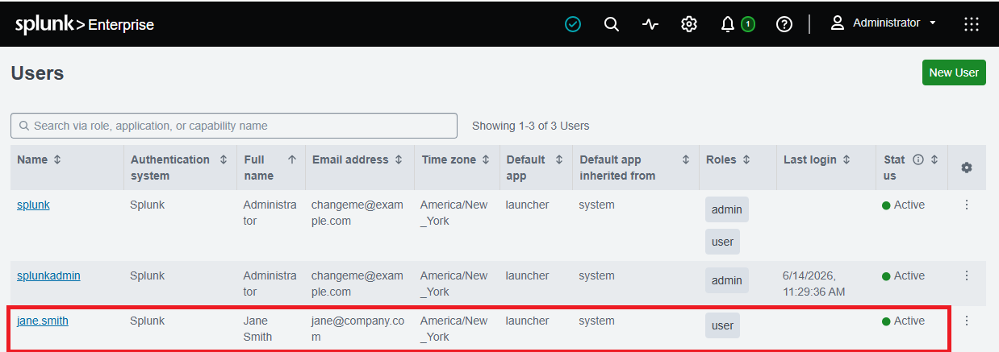

**✅ Checkpoint:** `jane.smith` appears in the Users list and can log in with the credentials you set.

---

## Task 2 — Edit / Update a User

**7.** Go to **Settings → Users**. Find `jane.smith` and click her username (the blue link) to open the Edit User page.

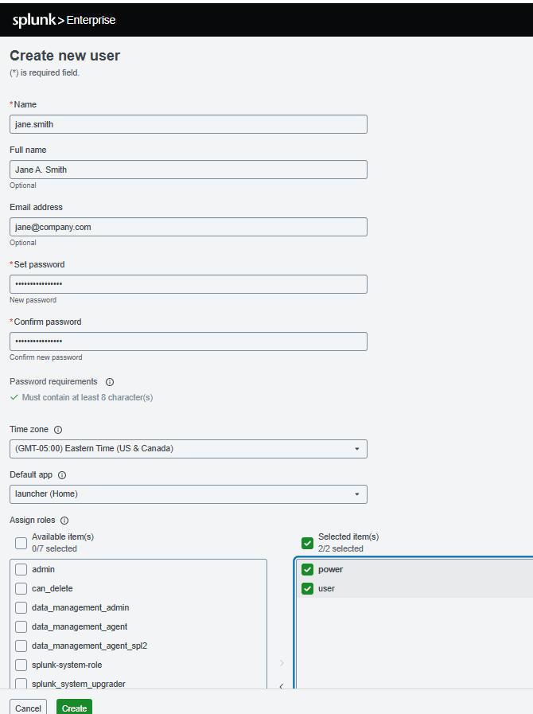

**8.** The form appears pre-filled. Make these changes:
- Full Name → `Jane A. Smith`
- Roles → add the `power` role alongside the existing `user` role

**9.** Click **Save**.

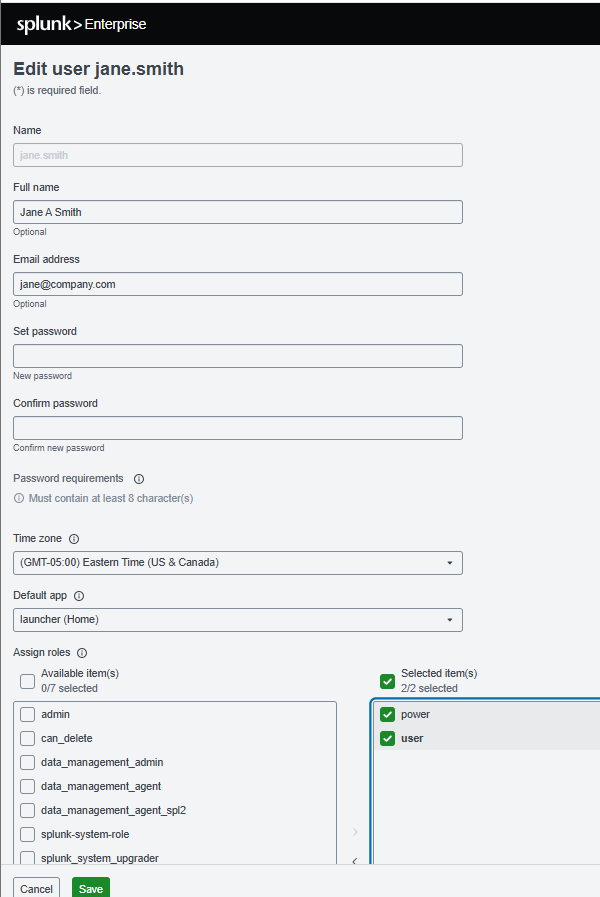

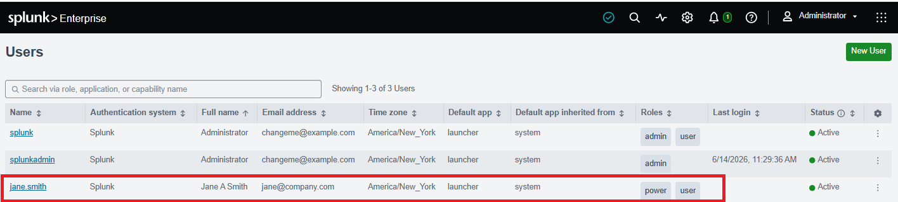

**✅ Checkpoint:** The Users list shows `Jane A. Smith` with both `user` and `power` roles.

---

## Task 3 — Clone a User

Cloning replicates an existing user's roles and settings — the fast way to onboard someone into an existing role template.

**10.** Go to **Settings → Users**. In the **Actions** column of `jane.smith`'s row, click **Clone**.

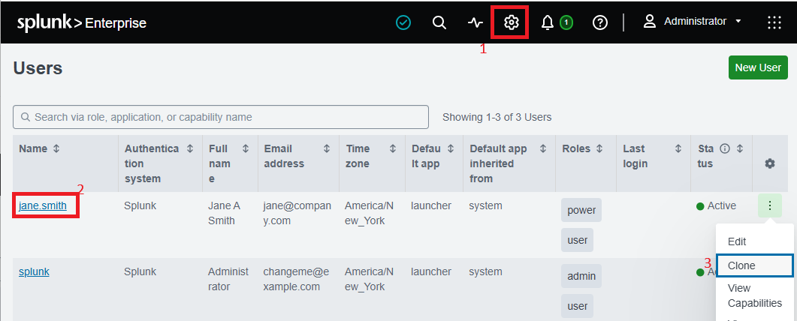

**11.** Splunk opens a new form pre-filled with jane.smith's settings (roles, default app, timezone). Fill in the new user's unique details:
- Full Name → `John Miller`
- Username → `john.miller`
- Email → `john@company.com`
- Password → *(new strong password)*

**12.** Leave the copied roles and settings as-is. Click **Save**.

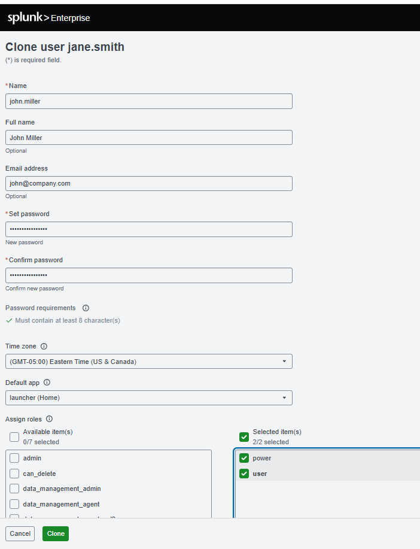

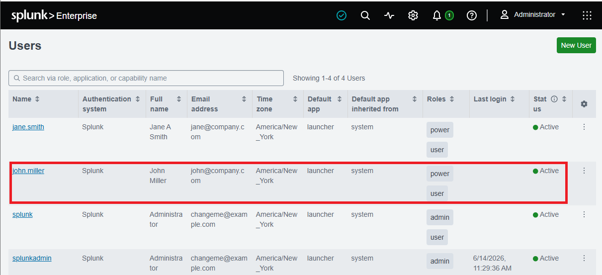

**✅ Checkpoint:** `john.miller` appears in the list with the same roles and settings as jane.smith, and can log in.

---

## Task 4 — Delete a User

> ⚠️ **Account Lifecycle Management:** NIST and CIS Controls require disabling or deleting accounts within 24 hours of an employee's departure. Dormant accounts are a documented breach vector.

**13.** Go to **Settings → Users**. Find `john.miller` and click **Delete** in the Actions column.

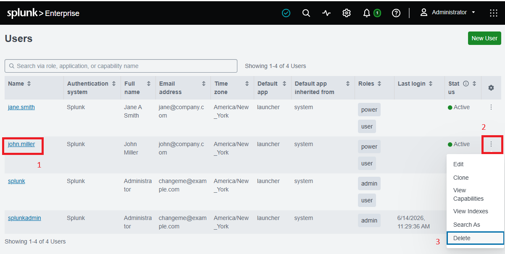

**14.** A confirmation dialog appears. Click **OK** to permanently delete.

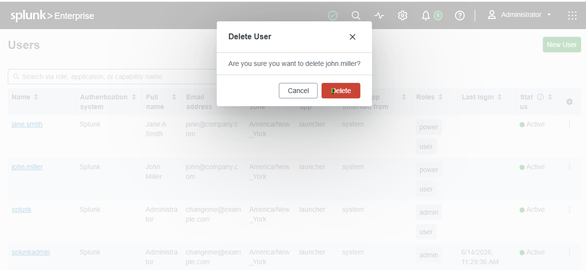

**15.** Verify `john.miller` no longer appears in the Users list.

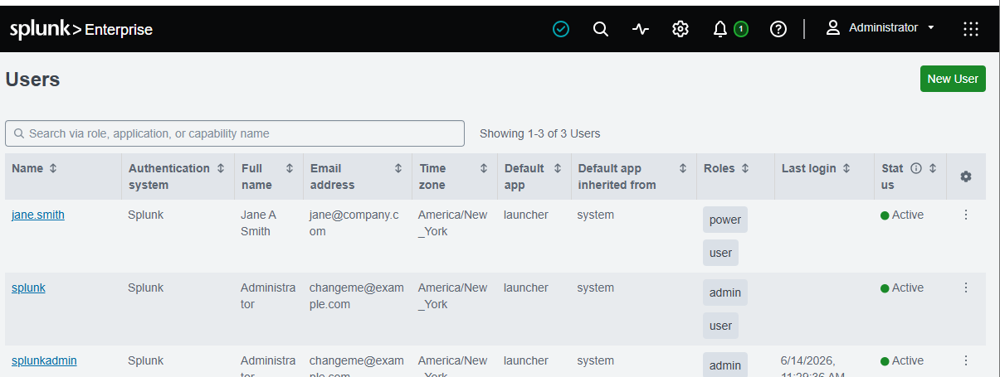

**✅ Checkpoint:** `john.miller` is gone from the list, login as that user fails, and no errors occurred.

---

## 🛠️ Troubleshooting

| Problem | Cause | Solution |
|---|---|---|
| Can't find "Users" in Settings | Insufficient privileges | Log in with an admin account; verify your account has the `admin` role |
| Save button greyed out | A required field is empty or invalid | Check all `*` fields; usernames can't contain spaces or special characters |
| "Username already exists" | The username is taken | Choose a unique username — they're system-wide |
| Delete button missing | Built-in system account | `admin` and `splunk-system-user` can't be deleted |
| Cloned settings differ from original | Personal preferences don't clone | Roles clone correctly; personal preferences must be set manually |

---

## 🧠 Key Learnings

**Access Control & Governance**
- Role-Based Access Control (RBAC) as the enforcement of least privilege
- Mapping job function to Splunk roles (`user`, `power`, `admin`)
- Account Lifecycle Management aligned to NIST and CIS Controls

**Splunk Administration**
- Full user lifecycle through the web console: create, edit, clone, delete
- Why cloning replicates roles but not personal preferences
- Why built-in system accounts are protected from deletion

**Security Operations Context**
- Why dormant accounts are a real breach vector
- The 24-hour deprovisioning standard and where it comes from

---

## ✅ Verify Before Moving On

- [ ] `jane.smith` exists with `user` + `power` roles
- [ ] Cloning successfully replicated roles to a new user
- [ ] `john.miller` was deleted and can no longer log in
- [ ] You understand which accounts cannot be deleted and why

---

**Next:** [Lab 05 →](../lab-05/)

[← Back to lab index](../README.md)

---

## 👤 Author

**Nasrin Ismet**
SOC Analyst & GRC Consultant | M.S. Cybersecurity

*"Find it, prove it, govern it."*

[](https://www.linkedin.com/in/kismetara/)
[](https://github.com/ismet60)

⭐ *Star this repo if it helped*
