# 🔑 Lab 05 — Splunk Role Management


> **Building the permission groups that control what users can do.** In Lab 4 you created users and gave them roles. This lab is about the roles themselves — how to build a custom role, change its permissions, copy it, and remove it. This is the heart of access control in Splunk.

---

## 🎯 Introduction — What Are Roles?

In Lab 4, you gave roles to users. But what is a role?

A **role** is a group of permissions. It decides what a user can see and what a user can do.

Without roles, you would have to set permissions for every single user, one by one. That takes a very long time. With roles, you set the permissions **once**, save them as a role, and then give that same role to many users. It is faster, cleaner, and easier to manage.

> **💡 Real-World Example — SOC Tiers**
> A Security Operations Center (SOC) uses roles like this:
> - **Tier 1 Analyst** — can only search and view alerts. Cannot change settings.
> - **Tier 2 Analyst** — can search, create reports, and handle incidents.
> - **SOC Manager** — can do everything: dashboards, users, and system settings.
>
> You do not set permissions for each person. You make three roles, then give the right role to the right person.

---

## 🏗️ How Roles Work in Splunk

```
A ROLE is a group of permissions:

┌──────────────────────────────────────┐
│  Role: soc_tier1_analyst             │
│  ────────────────────────────────    │
│  Inherits from:  user                │
│  Capabilities:   search              │
│                  schedule_search     │
│                  list_inputs         │
│  Index access:   main                │
│  Search limits:  1 hour, quotas set  │
└──────────────────────────────────────┘
              │
              │  assign the role to many users
              ▼
     👤 analyst1   👤 analyst2   👤 analyst3
     (all get the same permissions at once)
```

---

## 🎓 Learning Objectives

After this lab, you will be able to:

- Explain what a Splunk role is and how it controls access
- Open the Role Management section in Splunk
- Create a custom role with chosen capabilities and index access
- Edit a role to change its capabilities and limits
- Clone a role to make a similar one quickly
- Delete a role safely when it is no longer needed

**⏱️ Duration:** 45–60 minutes · **Builds on:** [Lab 04 — User Management](../lab-04-user-management/)

---

## Task 1 — Create a Role

1. Log into Splunk as an administrator.
2. Click **Settings** in the top menu.
3. Under **Users and Authentication**, click **Roles**.

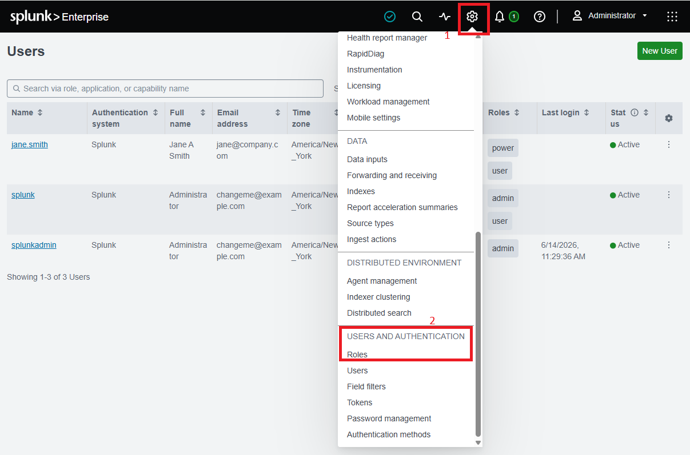

4. The Roles Management page lists all built-in roles. Click **New Role** (green button, top-right).

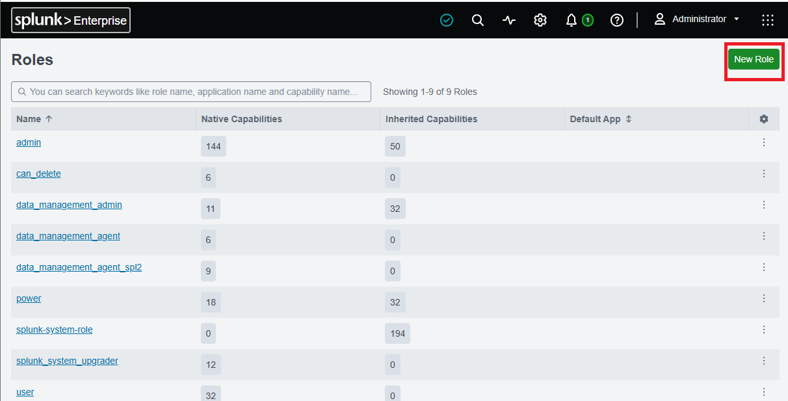

5. The New Role form opens. Fill in each section:

**Section A — Basic Information**
- Role Name: `soc_tier1_analyst` (no spaces — use underscores)
- Default App: `search`
- Imported Roles (Inheritance): select `user` — your new role inherits basic user permissions

**Section B — Capabilities** (individual permissions — enable these):
- `search` — run searches
- `schedule_search` — set up scheduled searches
- `list_inputs` — see data input sources

> **ℹ️ How to enable a capability:** The Capabilities section has two columns — **Available** and **Selected**. Click a capability in Available to move it to Selected (or drag it). To remove one, move it back.

**Section C — Indexes**
- Under **Indexes searched by default**: select `main`
- Confirm `main` is in the Selected Indexes column

**Section D — Search Restrictions**
- Search time limit: `3600` (1 hour = 3,600 seconds)
- Realtime search jobs quota: `6`
- Scheduled search jobs quota: `3`

6. Click **Save**.

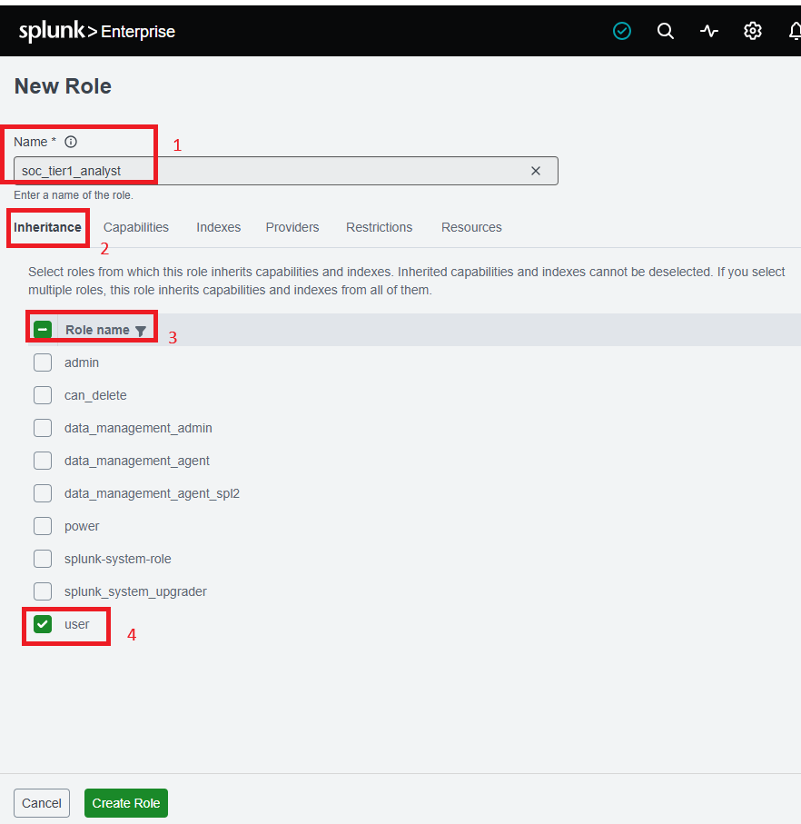

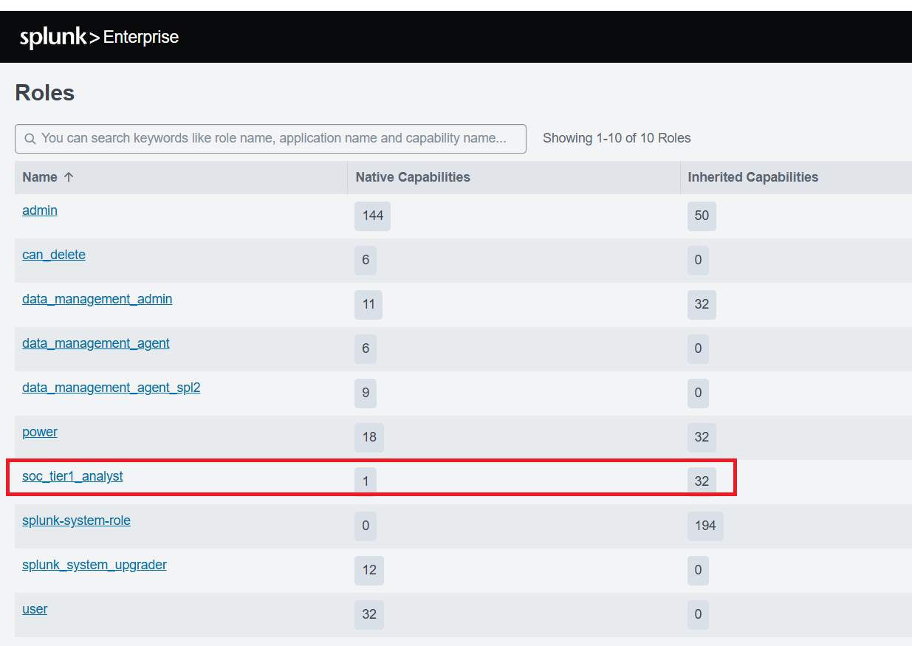

**✅ Checkpoint:** `soc_tier1_analyst` appears in the Roles list.

---

## Task 2 — Edit / Update a Role

7. Go to **Settings → Roles**. Find `soc_tier1_analyst` and click its name to open the Edit Role page.

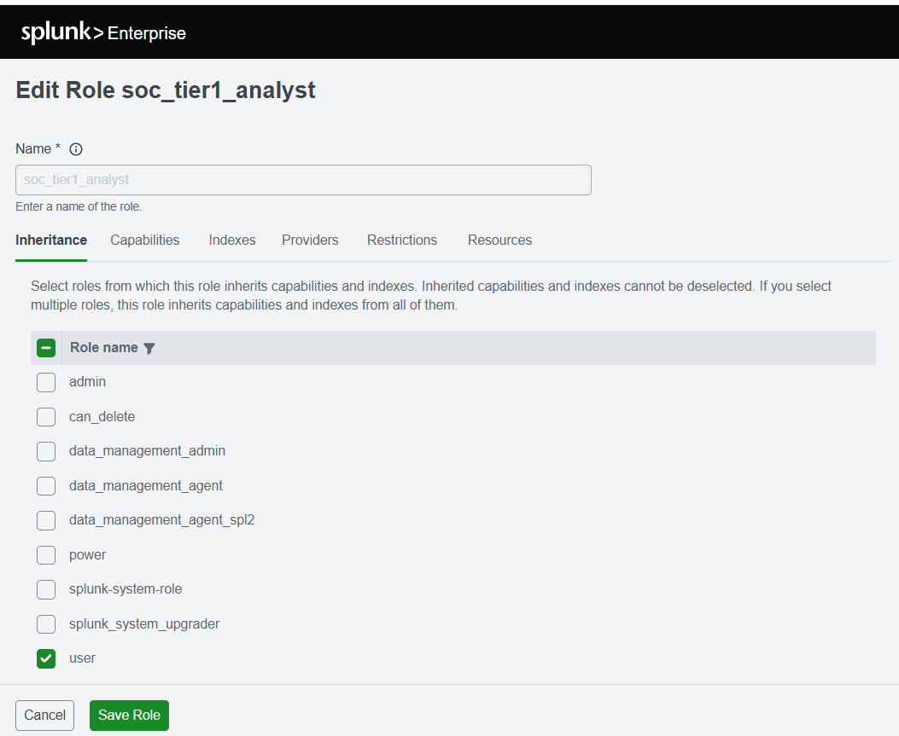

8. Make these changes:
- Add capability: `list_storage_passwords` — lets the user list credential *names* (but not see the actual passwords)
- Increase Search time limit to: `7200` (2 hours)

9. Click **Save**.

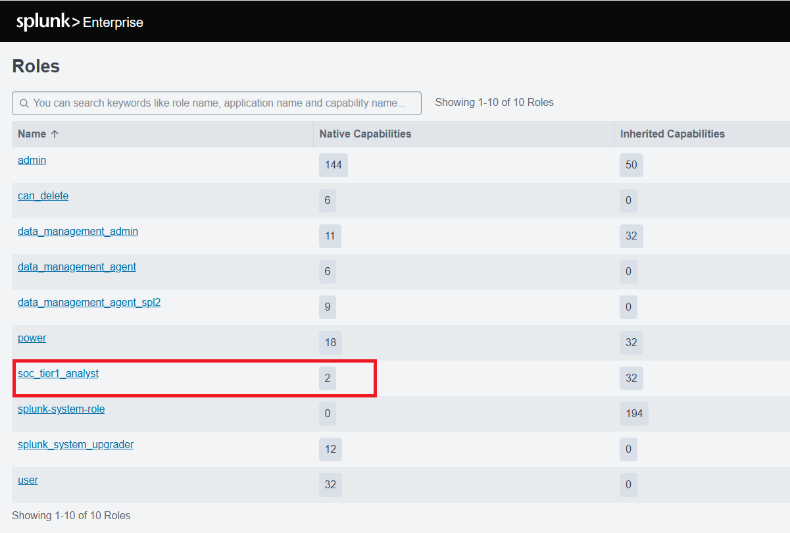

**✅ Checkpoint:** The role now has the new capability and a 2-hour search limit.

---

## Task 3 — Clone a Role

10. Go to **Settings → Roles**. Find `soc_tier1_analyst` and click **Clone** in the Actions column.

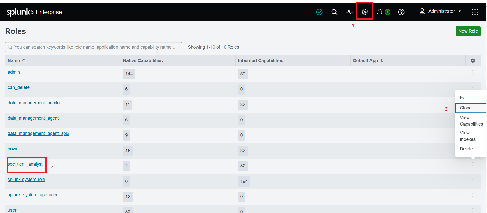

11. Splunk opens a new role form pre-filled with all settings from `soc_tier1_analyst`.

12. Change the Role Name to: `soc_tier2_analyst`

13. Add two more capabilities to make this a stronger role:
- `accelerate_datamodel` — allows creating data model accelerations
- `edit_own_objects` — allows editing the user's own saved searches and reports

14. Click **Save**.

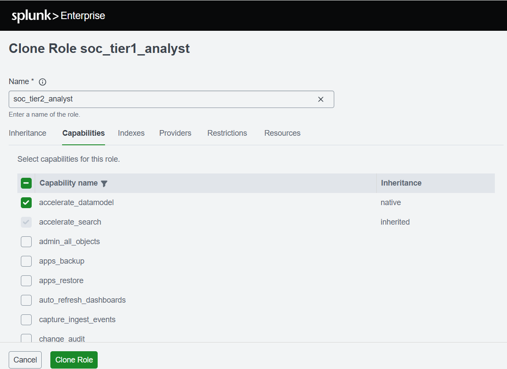

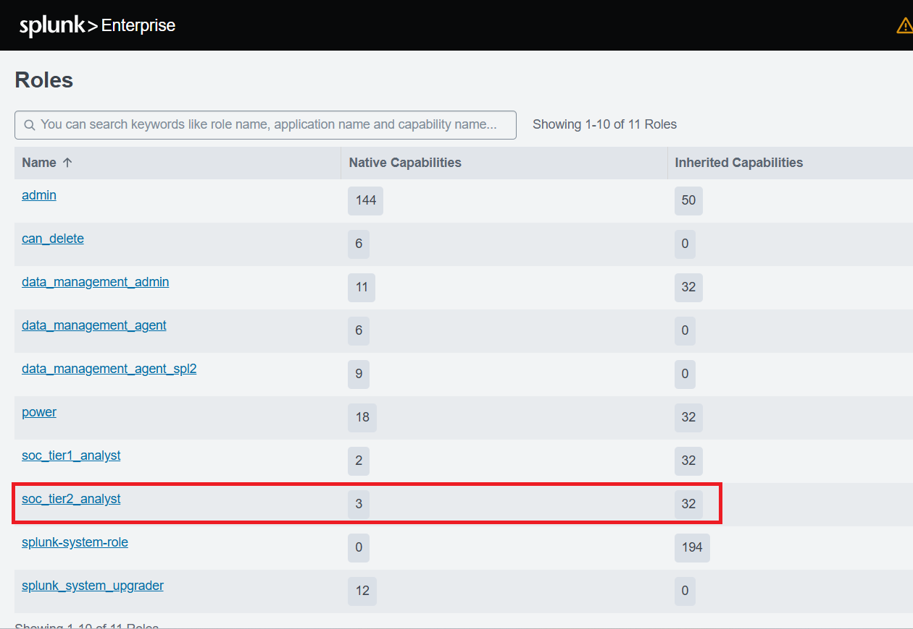

**✅ Checkpoint:** `soc_tier2_analyst` exists with all of Tier 1's settings plus the two new capabilities.

---

## Task 4 — Delete a Role

> ⚠️ **Before deleting a role:** Make sure no active users are assigned to it. Go to **Settings → Users** and check. Re-assign or update those users first — otherwise they lose access unexpectedly.

15. Go to **Settings → Roles**. Find `soc_tier2_analyst` and click **Delete** in the Actions column.

16. A confirmation dialog appears. Click **OK**.

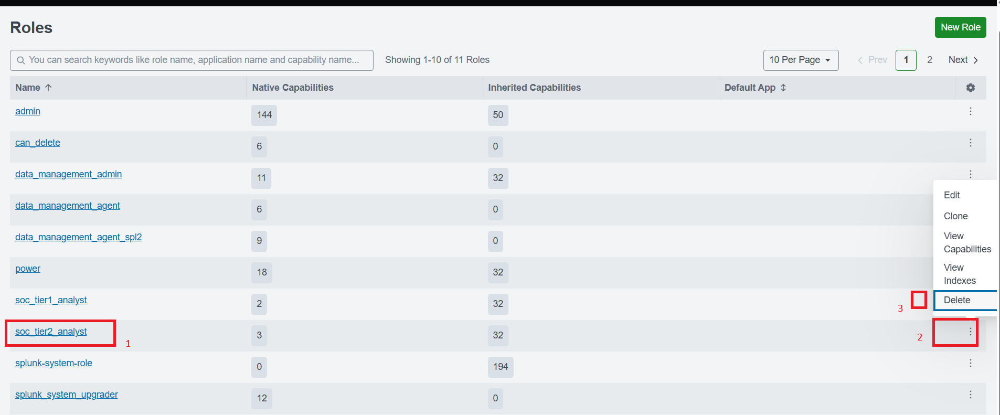

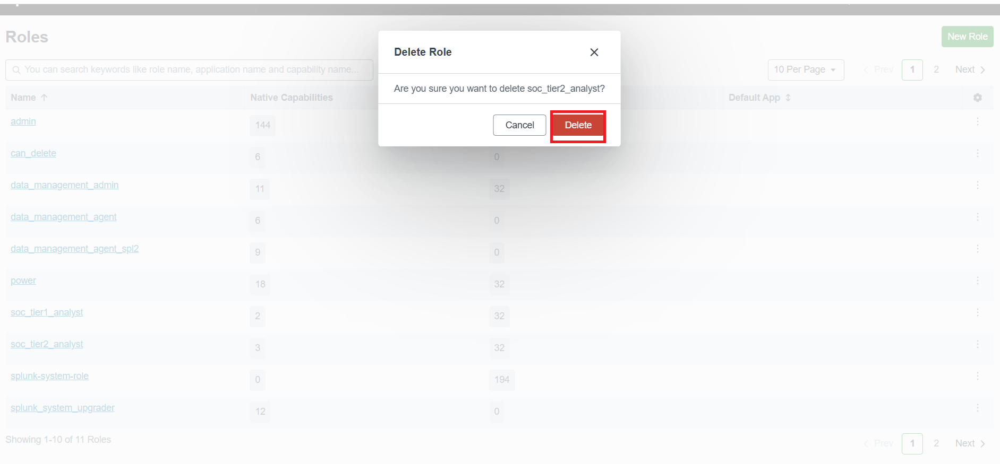

17. Confirm `soc_tier2_analyst` no longer appears in the Roles list.

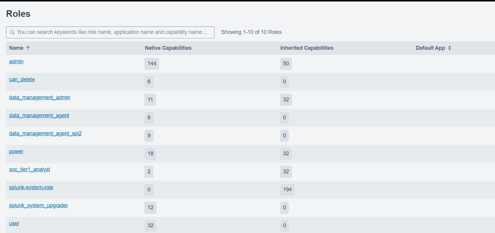

**✅ Checkpoint:** `soc_tier2_analyst` is removed and no errors occurred.

---

## 🛠️ Troubleshooting

| Problem | Cause | Solution |
|---|---|---|
| Role name field shows an error | Name has spaces or special characters | Use only letters, numbers, and underscores (e.g. `soc_analyst_role`) |
| Role not visible after creating | Page needs refreshing | Refresh the browser, or leave and return to the Roles page |
| User not getting the new role's permissions | Role wasn't assigned to the user | Go to Settings → Users, edit the user, add the role |
| Delete button missing | A user is still assigned, or it's a built-in role | Remove the role from all users first; built-in roles can't be deleted |
| Capabilities list is very long | There are hundreds of capabilities | Use browser **Ctrl+F** to find a capability by name |

---

## 🧠 Conclusion — What You Learned

In this lab, you worked with **roles**, the permission groups that sit behind every user account.

**About Roles and Access Control**
- A role is a group of permissions you build once and give to many users
- **Capabilities** are the individual permissions inside a role (like `search` or `schedule_search`)
- **Inheritance** lets a new role start from an existing one, so you don't rebuild from zero
- **Quotas and time limits** stop one user's searches from using up all system resources

**About Splunk Administration**
- The full role lifecycle: create, edit, clone, delete
- Why cloning is the fast way to build a Tier 2 role from a Tier 1 role
- Why you must check user assignments before deleting a role

**Why This Matters in a SOC**
- Roles are how a real SOC separates Tier 1, Tier 2, and manager access
- Good role design is the practical form of **least privilege** — people get exactly the access their job needs, no more

---

## ✅ Verify Before Moving On

- [ ] `soc_tier1_analyst` was created with the correct capabilities and limits
- [ ] Editing added a capability and changed the time limit
- [ ] Cloning built `soc_tier2_analyst` from Tier 1 quickly
- [ ] The cloned role was deleted cleanly
- [ ] You understand why built-in roles can't be deleted

---

**Next:** [Lab 06 →](../lab-06/)

[← Back to lab index](../README.md)

---

<sub>Author: Ismet Ara · All role and user names shown are examples created for this lab. No company data, credentials, or production infrastructure are represented.</sub>

