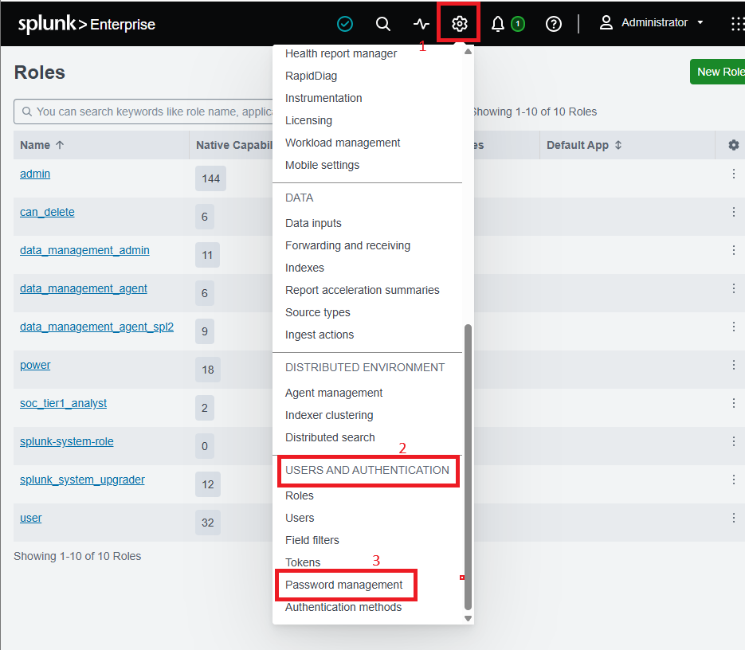
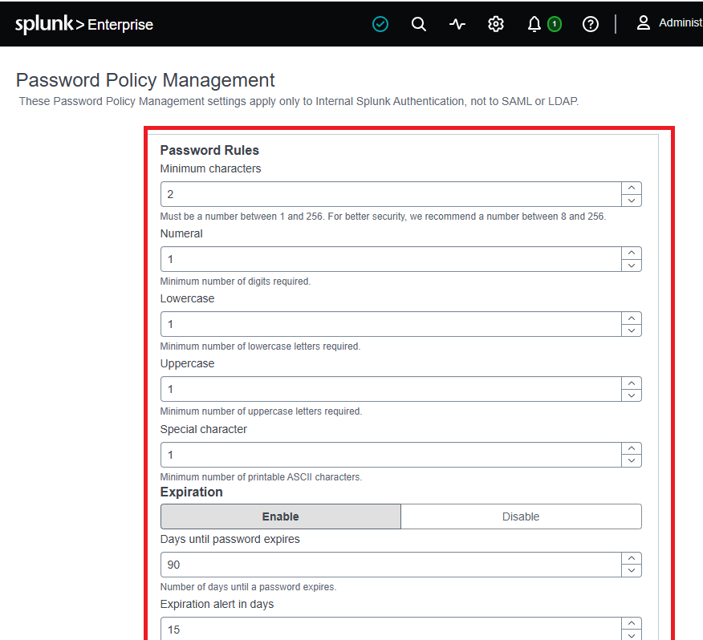
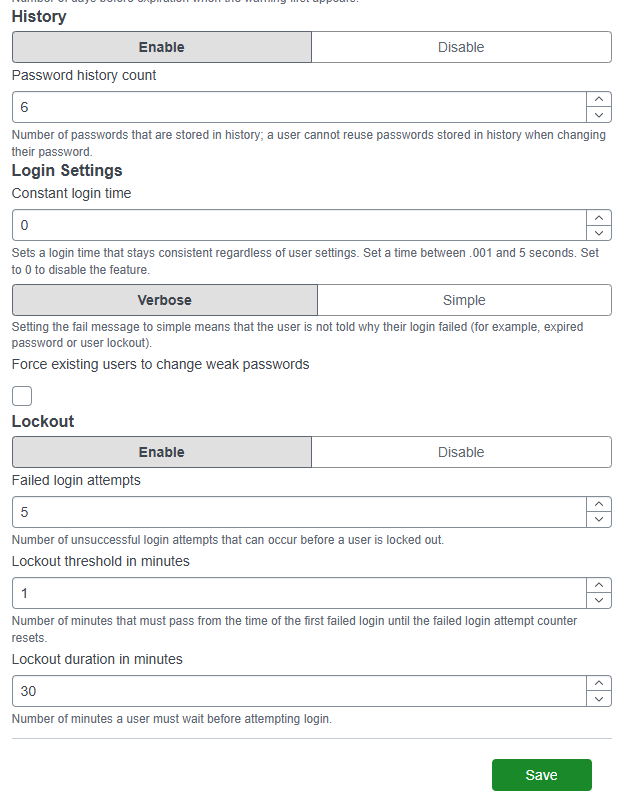
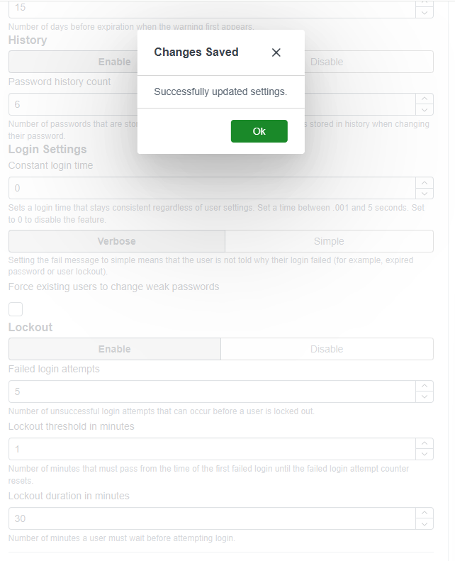
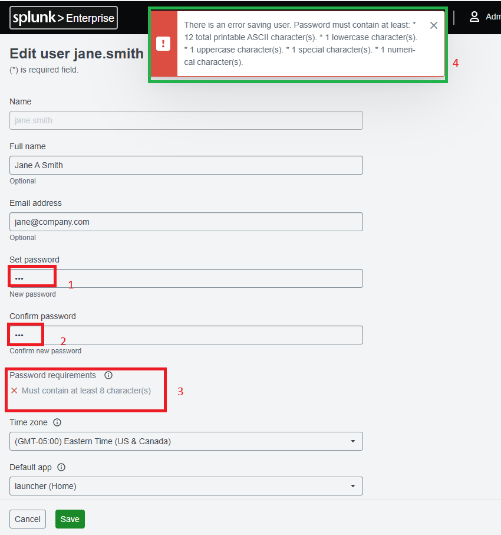

# 🔐 Lab 06 — Password Policy Management


> **Making Splunk enforce strong passwords for everyone.** A weak password is one of the easiest ways for an attacker to get in. This lab sets a password policy in Splunk — length, complexity, expiry, history, and lockout — then tests that Splunk actually blocks a weak password.

---

## 🎯 Introduction — Why Do Password Policies Matter?

Passwords are usually the first line of defense. A weak password like `123456` can be guessed in seconds. A password policy makes sure every user follows the same rules, so it is much harder for an attacker to break in.

Splunk holds your organization's security data. If Splunk itself has weak passwords, everything it protects is at risk. So Splunk must be locked down with strong password rules.

> **⚠️ Why This Is Worth Doing**
> More than 80% of hacking-related breaches involve weak or stolen passwords (Verizon DBIR). Setting a password policy is one of the simplest and most powerful security wins you can get.

---

## 🏗️ What a Password Policy Controls

```
   A user tries to set a password
                │
                ▼
   ┌─────────────────────────────┐
   │   Splunk Password Policy    │
   │  ─────────────────────────  │
   │  ✓ At least 12 characters   │
   │  ✓ Upper + lower + number   │
   │  ✓ A special character      │
   │  ✓ Not one of last 6 used   │
   │  ✓ Expires every 90 days    │
   └─────────────────────────────┘
                │
        ┌───────┴────────┐
        ▼                ▼
    ✅ Accepted      ❌ Rejected
   (meets rules)   (too weak — try again)

   Too many failed logins? → 🔒 Account locked 30 min
```

---

## 🎓 Learning Objectives

After this lab, you will be able to:

- Explain why password policies are important for security
- Open the Password Policy settings in Splunk
- Set a minimum password length and complexity rules
- Set password expiry and password history
- Set account lockout to stop brute-force attacks
- Test that the policy is actually being enforced

---

## Task 1 — Configure the Password Policy

1. Log into Splunk as an administrator.
2. Click **Settings** in the top menu.
3. Under **Users and Authentication**, click **Password Management**. *(In some versions: Settings → Access Controls → Password Policy.)*



4. The Password Management page opens. Configure each setting:

**Setting 1 — Minimum Password Length**
- Set **Minimum characters** to `12`
- *Why 12?* NIST and most enterprise frameworks recommend at least 12 characters.

**Setting 2 — Complexity Requirements**
- Require uppercase letter: **Yes**
- Require lowercase letter: **Yes**
- Require digit: **Yes**
- Require special character: **Yes** (e.g. `! @ # $ % & *`)

**Setting 3 — Password Expiration**
- Set **Expiration in days** to `90` (users change password every 90 days)

**Setting 4 — Password History**
- Set **Password history count** to `6` (Splunk blocks reuse of the last 6 passwords)

**Setting 5 — Account Lockout**
- Failed login attempts before lockout: `5`
- Lockout duration (minutes): `30`

5. Review everything, then click **Save**. The policy applies to all accounts immediately.







**✅ Checkpoint:** The password policy is saved and active for all users.

---

## Task 2 — Test the Policy

A policy is only useful if it actually blocks weak passwords. Let's prove it works.

6. Go to **Settings → Users**. Click any user to edit their account.

7. In the password field, type a weak password: `abc` (3 characters, no complexity).

8. Click **Save**. Splunk should **reject** it and show an error explaining why it fails the policy.



**✅ Checkpoint:** Splunk refuses the weak password and displays a clear error. The policy is working.

---

## 🛠️ Troubleshooting

| Problem | Cause | Solution |
|---|---|---|
| Can't find Password Management | Location varies by Splunk version | Try Settings → Access Controls → Password Policy, or type "password" in the Settings search bar |
| Policy doesn't apply to admin | The admin account may be exempt | Test with a regular user account — admin can bypass some restrictions |
| Users can't log in after the change | Their old password no longer complies | Have them reset via the admin interface or password reset workflow |
| Lockout is blocking valid users | Threshold too low | Raise failed attempts from 5 to 10 for less strict environments |

---

## 🧠 Conclusion — What You Learned

In this lab, you turned Splunk's password rules from weak defaults into a strong, enforced policy.

**About Password Security**
- Length and complexity make passwords much harder to guess or crack
- Expiry and history stop users from keeping or reusing the same password forever
- Account lockout blocks brute-force attacks by stopping repeated guessing

**About Splunk Administration**
- Where password policy lives and how to configure each setting
- How to test a control instead of assuming it works — set a weak password and confirm it's rejected

**Why This Matters**
- Passwords protect the tool that protects everything else
- This is one of the highest-impact, lowest-effort security controls you can apply — aligned with NIST guidance and the Verizon DBIR findings

---

## ✅ Verify Before Moving On

- [ ] Minimum length is set to 12
- [ ] All four complexity rules are enabled
- [ ] Expiry (90 days) and history (6) are set
- [ ] Lockout (5 attempts / 30 min) is set
- [ ] A weak password was rejected when you tested it

---

**Next:** [Lab 07 →](../lab-07/)

[← Back to lab index](../README.md)

---

## 👤 Author

**Nasrin Ismet**
SOC Analyst & GRC Consultant | M.S. Cybersecurity

*"Find it, prove it, govern it."*

[](https://www.linkedin.com/in/kismetara/)
[](https://github.com/ismet60)

⭐ *Star this repo if it helped*
