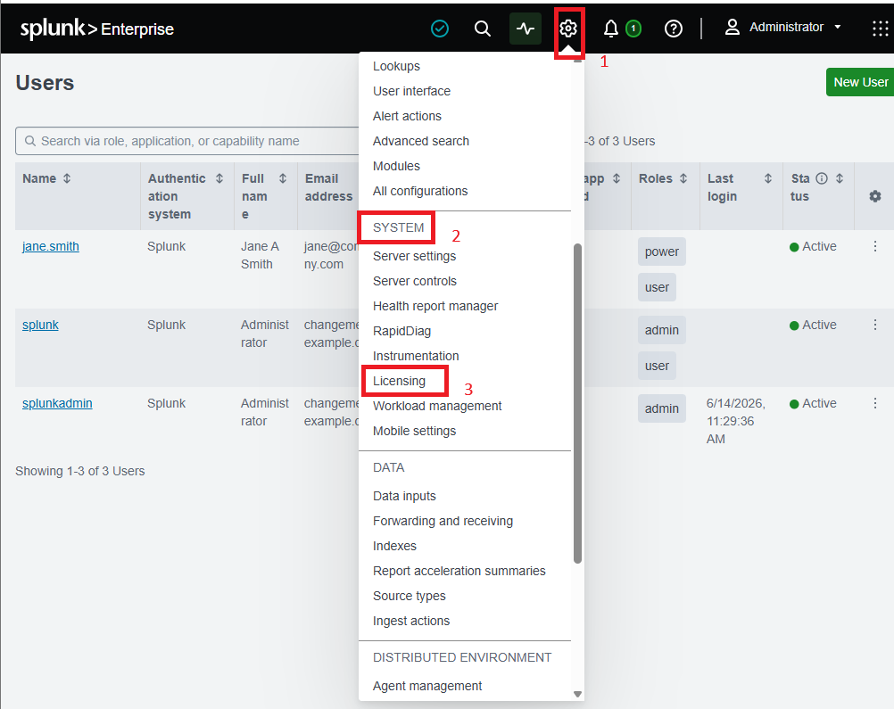
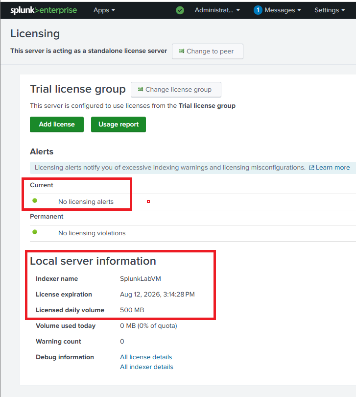

# 📜 Lab 07 — Splunk License Installation


> **Moving Splunk from its 500 MB trial limit to a full license.** By default Splunk only indexes 500 MB of data per day. This lab installs a proper license, checks it applied correctly, and explains what happens if you go over your daily limit.

---

## 🎯 Introduction — What Is a Splunk License?

When you install Splunk, it starts in **Trial / Free** mode. In this mode, Splunk can only take in **500 MB of data per day**. That is fine for learning, but a real company produces far more data than that.

A Splunk license is like a subscription. Without one, you get limited access. With a paid license, you unlock a much larger daily data limit and full enterprise features.

---

## 🏗️ How Splunk Licensing Works

```
   No license (default)
   ┌──────────────────────────┐
   │  Trial / Free mode       │
   │  Limit: 500 MB per day   │
   └──────────────────────────┘
                │
                │  install a .lic file
                ▼
   ┌──────────────────────────┐
   │  Enterprise license       │
   │  Limit: e.g. 100 GB/day   │
   │  + full features          │
   └──────────────────────────┘

   Go over the limit too often?
   ┌──────────────────────────┐
   │  ⚠️ License violation     │
   │  (search gets restricted) │
   └──────────────────────────┘
```

---

## 🎓 Learning Objectives

After this lab, you will be able to:

- Explain what a Splunk license is and why it is needed
- Find the License Management section in Splunk
- Upload and install a Splunk Enterprise license file (`.lic`)
- Confirm the license installed correctly
- Understand what happens if a license expires or is exceeded

**⏱️ Duration:** 30 minutes · **Builds on:** [Lab 02 — Installing Splunk](../lab-02-installing-splunk/)

**Prerequisite:** A Splunk Enterprise license file (`.lic`) — from your instructor, or a free Developer License from [dev.splunk.com](https://dev.splunk.com). You must be logged in as an administrator.

---

## Task 1 — Install the License

1. Log into Splunk as an administrator.
2. Click **Settings** in the top menu.
3. Under the **System** section, click **Licensing**.



4. The Licensing page shows your current status: license type (Free, Trial, or Enterprise), daily volume quota, and expiration date.



5. Click **Add License**.
6. Click **Browse** (or **Choose File**), find your `.lic` file, select it, and click **Open**.
7. Splunk shows the license details. Check the license type, expiration date, and daily indexing volume (e.g. 100 GB/day).
8. Click **Install**. Splunk applies the license file.
9. Splunk asks you to restart. Click **OK**, or restart the Splunk service manually.
10. After the restart, go back to **Settings → Licensing** to confirm the new license shows correctly.

**✅ Checkpoint:** The Licensing page shows your new license type and higher daily volume.

---

## 📖 Understanding License Violations

A **license violation** happens when Splunk indexes more data than your license allows in a 24-hour period. Key points:

- Splunk tracks your daily data usage over a rolling 30-day window.
- Going over your daily limit on more than **5 days** within any 30-day period triggers a **violation** state.
- In violation mode, Splunk **restricts search** until the issue is resolved.
- Watching your daily indexing volume is an ongoing operational task — not a one-time setup.

> **💡 Real-world tip:** In a SOC, license violations usually mean a new noisy data source was added without planning. Monitoring daily volume helps you catch a misconfigured input before it breaks search for the whole team.

---

## 🛠️ Troubleshooting

| Problem | Cause | Solution |
|---|---|---|
| "Invalid License File" on upload | The `.lic` file is corrupted or was renamed | Download the complete file again without modifying it |
| License uploaded but quota unchanged | Splunk needs a restart | Settings → Server Controls → Restart Splunk |
| Can't find Licensing in Settings | Not an admin account | Only admins can access Licensing — check your account has the `admin` role |
| License shows expired right after install | The file is from another environment or already expired | Get a valid license file with a future expiration date |

---

## 🧠 Conclusion — What You Learned

In this lab, you moved Splunk beyond its trial limit and learned how licensing controls data capacity.

**About Splunk Licensing**
- The 500 MB free limit vs. a full Enterprise license
- How to install and verify a `.lic` file
- What a license violation is and how the rolling 30-day window works

**Why This Matters**
- Data capacity is a real operational limit — you can't monitor what you can't index
- License violations restrict search, so tracking daily volume protects your whole SOC's ability to work
- Understanding licensing is part of running Splunk responsibly at enterprise scale

---

## ✅ Verify Before Moving On

- [ ] The new license appears under Settings → Licensing
- [ ] The daily volume quota increased from 500 MB
- [ ] You understand what triggers a license violation
- [ ] You know violations restrict search until resolved

---

**Next:** [Lab 08 →](../lab-08/)

[← Back to lab index](../README.md)

---

## 👤 Author

**Nasrin Ismet**
SOC Analyst & GRC Consultant | M.S. Cybersecurity

*"Find it, prove it, govern it."*

[](https://www.linkedin.com/in/kismetara/)
[](https://github.com/ismet60)

⭐ *Star this repo if it helped*
