# 🔌 Lab 08 — Configure Splunk Receiving Port (9997)


> **Opening the door that lets data flow into Splunk.** Forwarders send log data to Splunk over port 9997. This lab turns on receiving in Splunk, then opens that port through *both* firewalls that stand in the way — the Windows host firewall and the Azure cloud firewall.

---

## 🎯 Introduction — How Does Data Get Into Splunk?

Splunk collects logs from many places: servers, firewalls, applications, and databases. But how does that data actually travel into Splunk?

The answer is **network ports**. Think of a port like a numbered door in a building — different doors are used for different things. **Port 9997** is the special door Splunk uses to receive forwarded log data.

For data to reach Splunk, that door has to be open in three places: inside Splunk, in the Windows firewall, and in the Azure firewall.

---

## 🏗️ The Path Data Takes to Reach Splunk

```
   Forwarder (another server sending logs)
                │
                │  sends data on port 9997
                ▼
   ┌──────────────────────────────────┐
   │  1️⃣ Azure NSG (cloud firewall)    │  ← Task 3
   │     must allow 9997               │
   └──────────────────────────────────┘
                │
                ▼
   ┌──────────────────────────────────┐
   │  2️⃣ Windows Firewall (host)       │  ← Task 2
   │     must allow 9997               │
   └──────────────────────────────────┘
                │
                ▼
   ┌──────────────────────────────────┐
   │  3️⃣ Splunk listening on 9997      │  ← Task 1
   │     receiving turned on           │
   └──────────────────────────────────┘
                │
                ▼
        ✅ Data indexed in Splunk

   All THREE must be open — one closed door blocks everything.
```

---

## 🎓 Learning Objectives

After this lab, you will be able to:

- Explain why port 9997 is needed and what it does in Splunk
- Turn on Splunk's data receiving on port 9997
- Open port 9997 through the Windows host firewall (GUI and PowerShell)
- Open port 9997 through the Azure Network Security Group (NSG)

**⏱️ Builds on:** [Lab 02 — Installing Splunk](../lab-02-installing-splunk/)

---

## Task 1 — Turn On Receiving in Splunk

1. Log into Splunk as an administrator.
2. Click **Settings** in the top menu.
3. Under the **Data** section, click **Forwarding and receiving**.

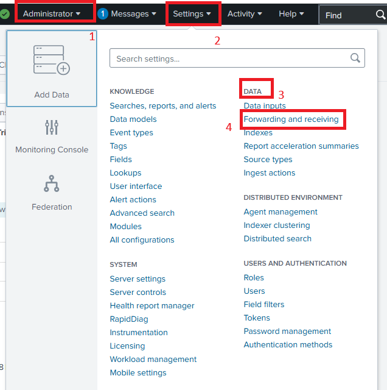

4. Click **Configure Receiving** (the right-side section).

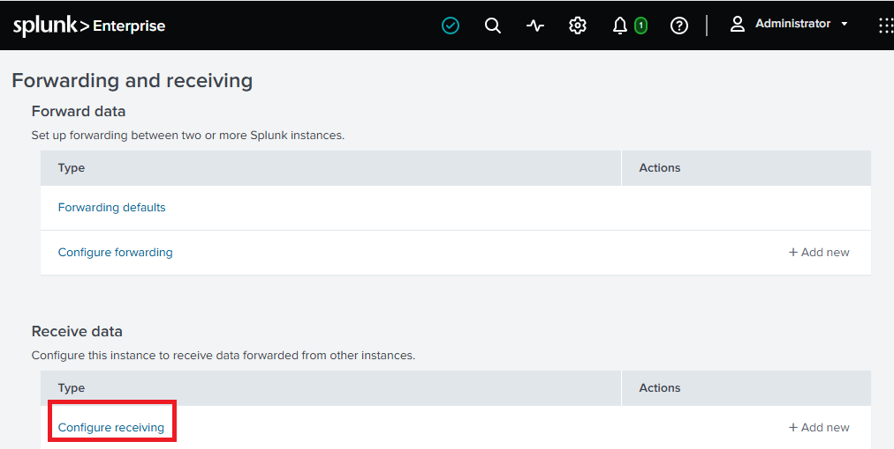

5. Click **New Receiving Port**. In the **Listen on this port** field, type `9997`. Click **Save**.

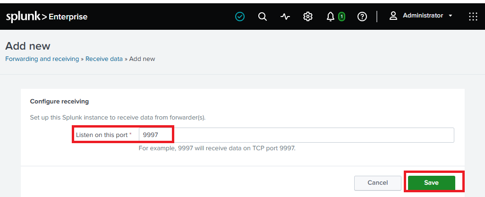

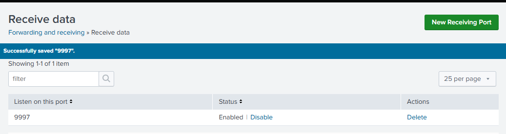

**✅ Checkpoint:** Port 9997 is listed as an active receiving port in Splunk.

---

## Task 2 — Open Port 9997 in the Windows Firewall

Splunk is now listening on 9997, but the Windows firewall may still block incoming connections. You need a rule that allows them.

> ⚠️ **Two firewalls to open:** Your Splunk server has TWO firewalls that can block 9997 — the **Windows host firewall** (this task) and the **Azure NSG** (Task 3). Both must be open, or data won't flow.

### Method A — Windows Firewall GUI

6. Press the Windows key, search for **Windows Defender Firewall with Advanced Security**, and open it.

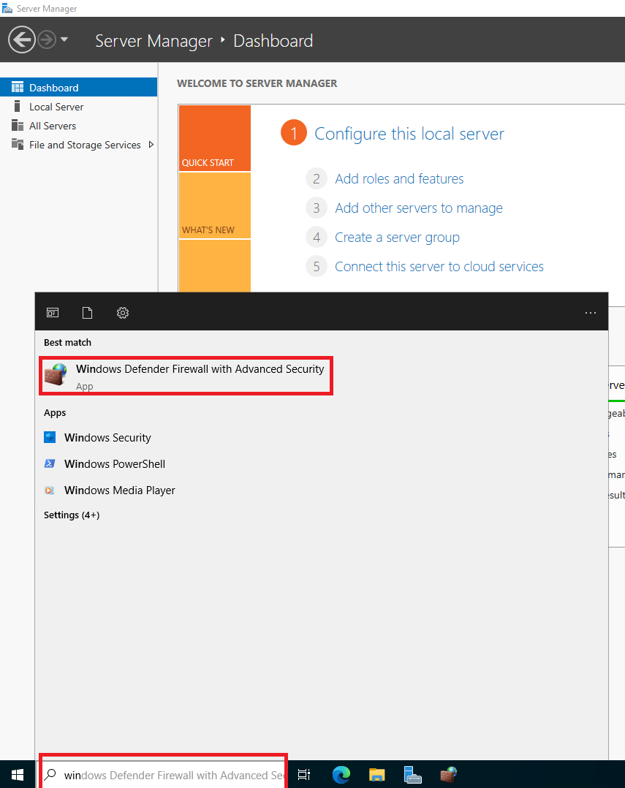

7. In the left panel click **Inbound Rules**, then in the right panel click **New Rule**.

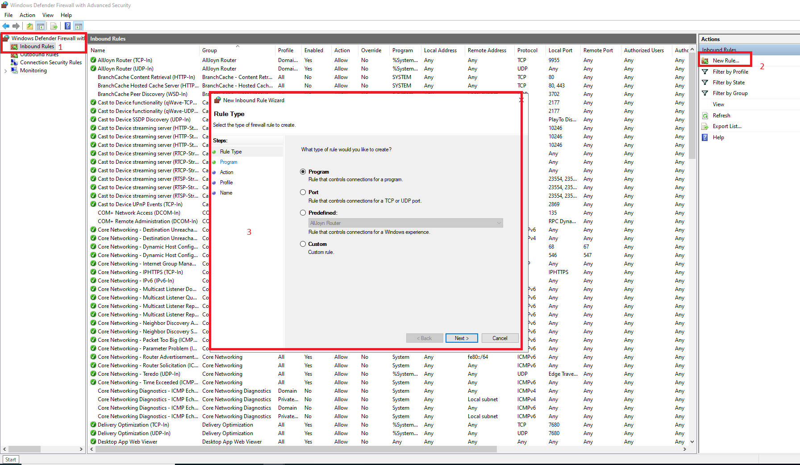

8. Select **Port** → Next.
9. Select **TCP**, and in **Specific local ports** type `9997` → Next.
10. Select **Allow the connection** → Next.
11. Leave all profiles checked (Domain, Private, Public) → Next.
12. Name it `Splunk Receiving Port 9997` → Finish.

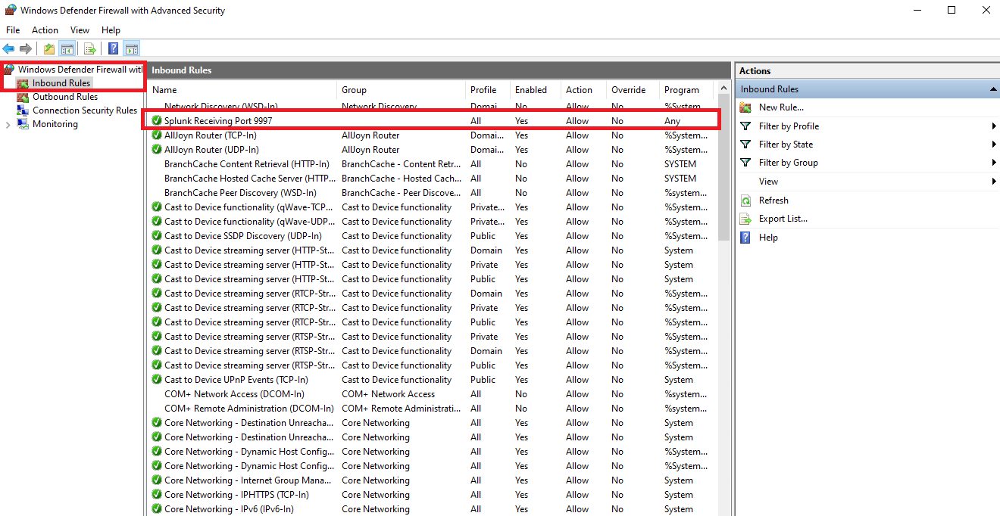

### Method B — PowerShell (faster)

Right-click **Start → Windows PowerShell (Admin)** and run:

```powershell
New-NetFirewallRule -DisplayName "Splunk Receiving Port 9997" -Direction Inbound -Protocol TCP -LocalPort 9997 -Action Allow
```

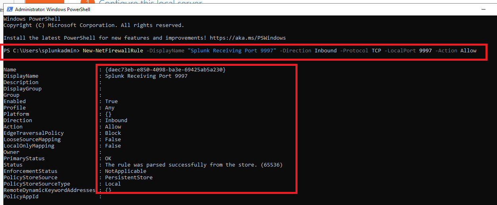

**✅ Checkpoint:** An inbound rule for TCP 9997 exists in the Windows firewall.

---

## Task 3 — Open Port 9997 on the Azure NSG

13. Go to the [Azure Portal](https://portal.azure.com) and log in.

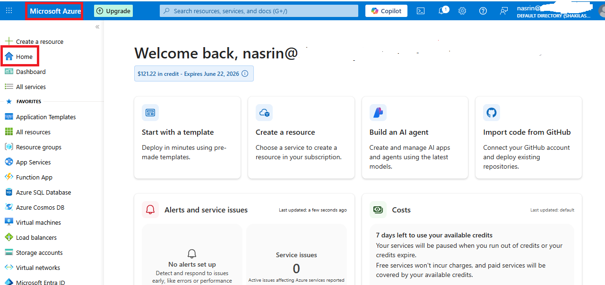

14. In the search bar, type **Network Security Groups** and open it.

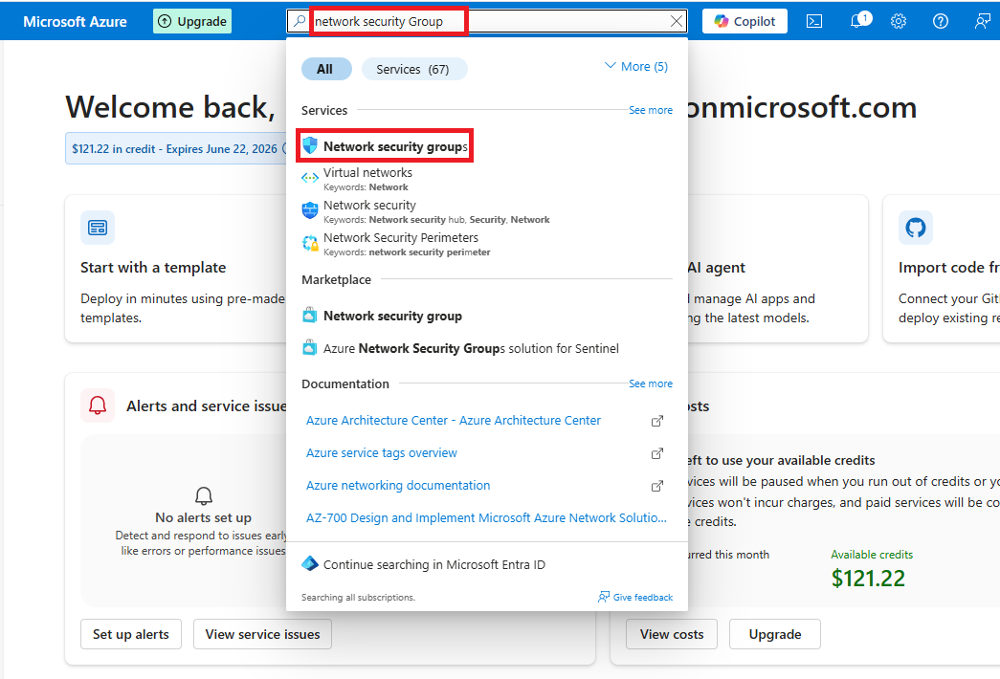

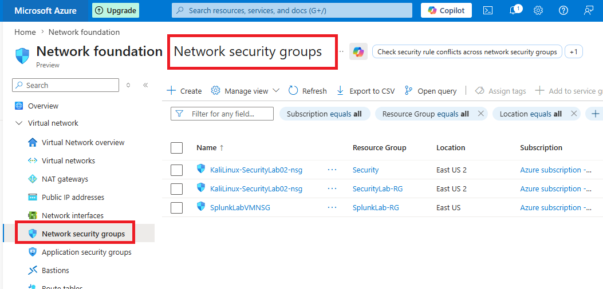

15. Find the NSG for your Splunk server VM and click its name.
16. In the left menu, click **Inbound security rules**, then **+ Add**.

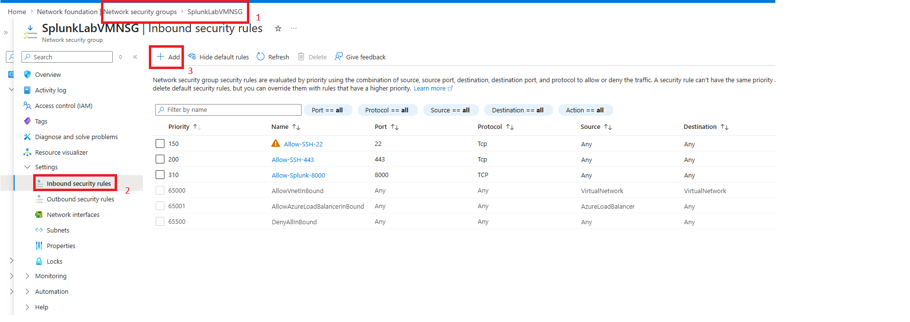

17. Fill in the form:

| Field | Value | Why |
|---|---|---|
| Source | *see note below* | Where traffic is allowed from |
| Source Port Ranges | `*` | Any source port |
| Destination | Any | All destination addresses |
| Destination Port Ranges | `9997` | Only open port 9997 |
| Protocol | TCP | Forwarder traffic uses TCP |
| Action | Allow | Permit the traffic |
| Priority | `1000` | Lower number = higher priority |
| Name | `Allow-Splunk-9997` | Descriptive rule name |

> 💡 **Best practice on Source:** This lab uses `Any` so it works in any setup. In production, you'd set Source to your forwarders' IP or subnet instead of `Any` — port 9997 shouldn't be reachable from the whole internet. Scoping the source is the difference between a receiving port and an exposed one.

18. Click **Add**. Azure applies the rule within seconds.

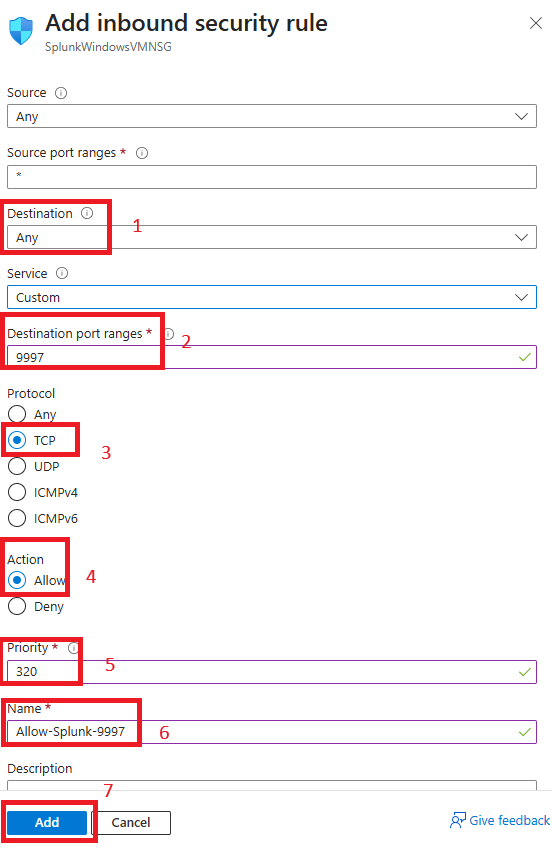

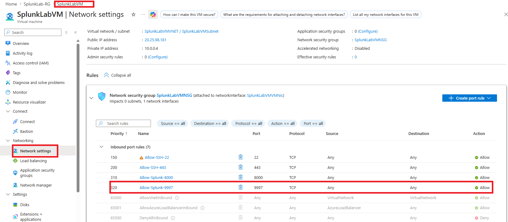

**✅ Checkpoint:** `Allow-Splunk-9997` appears in the NSG inbound rules.

---

## 🧠 Conclusion — What You Learned

In this lab, you opened the full path that lets forwarders send data into Splunk.

**About Data Ingestion**
- Port 9997 is the dedicated port for forwarder-to-indexer traffic
- Turning on receiving in Splunk is only step one — the data still has to pass two firewalls
- A single closed layer (Splunk, host firewall, or cloud firewall) blocks all incoming data

**About Firewall Management**
- Creating inbound rules in the Windows firewall, by GUI and by PowerShell
- Adding an inbound rule to an Azure NSG
- Why scoping the source IP matters — an open receiving port shouldn't accept traffic from anywhere

**Why This Matters**
- Data ingestion is the foundation of a SIEM — without it, Splunk has nothing to search
- Understanding the full network path is what lets you troubleshoot "my forwarder isn't sending data" quickly

---

## ✅ Verify Before Moving On

- [ ] Splunk shows 9997 as an active receiving port
- [ ] The Windows firewall has an inbound rule for TCP 9997
- [ ] The Azure NSG has the `Allow-Splunk-9997` rule
- [ ] You understand why all three layers must be open
- [ ] You understand why `Source: Any` is a lab choice, not a production one

---

**Next:** [Lab 09 →](../lab-09/)

[← Back to lab index](../README.md)

---

## 👤 Author

**Nasrin Ismet**
SOC Analyst & GRC Consultant | M.S. Cybersecurity

*"Find it, prove it, govern it."*

[](https://www.linkedin.com/in/kismetara/)
[](https://github.com/ismet60)

⭐ *Star this repo if it helped*

