# 🪟 Lab 09 — Collecting Windows Logs with the Splunk Universal Forwarder


> **The first real end-to-end pipeline.** A Windows Server sends its Event Logs to Splunk through the Universal Forwarder. This is the moment Splunk becomes a working SIEM — real logs from a real machine, searchable in one place.

---

## 🎯 Introduction — What Is Log Collection?

Every computer creates logs — records of who logged in, what ran, what failed, and any security events like failed logins. These logs are gold for investigations, but logs stuck on one machine are hard to manage and easy for an attacker to tamper with.

Splunk fixes this by pulling logs from many machines into one central place. The tool that sends logs from a Windows machine to Splunk is the **Universal Forwarder** — a small, lightweight agent.

---

## 🏗️ The Pipeline You'll Build

```
   ┌─────────────────────────┐         ┌──────────────────────┐
   │  Windows Server 2022    │         │   Splunk Indexer     │
   │  ─────────────────────  │  9997   │  ──────────────────  │
   │  Universal Forwarder    │ ──────▶ │  Receiving on 9997   │
   │  reads Event Logs:      │  (TCP)  │  Indexes the logs    │
   │  • Security             │         │  → searchable        │
   │  • System               │         │                      │
   │  • Application          │         │                      │
   └─────────────────────────┘         └──────────────────────┘
        (outbound 9997                    (inbound 9997 open —
         open in Windows FW)               Lab 08)
```

---

## 🎓 Learning Objectives

After this lab, you will be able to:

- Provision a Windows VM in Azure with a script
- Connect to it remotely using RDP
- Install and configure the Splunk Universal Forwarder
- Tell the forwarder which Windows logs to collect (`inputs.conf`)
- Test connectivity and confirm logs are arriving in Splunk

**Builds on:** [Lab 08 — Receiving Port](../lab-08-receiving-port/) (port 9997 must already be open on the Splunk side)

---

## Task 1 — Provision a Windows VM in Azure

1. Log into the [Azure Portal](https://portal.azure.com).
2. Click the **Cloud Shell** icon (`>_`) at the top and choose **Bash**.

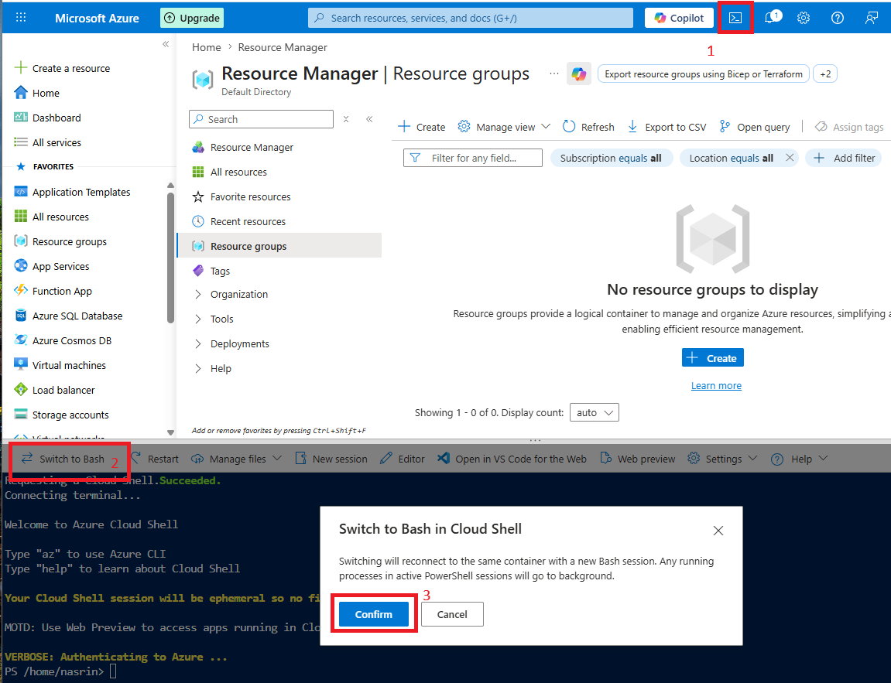

3. Upload your provisioning script using Cloud Shell's **Upload** button.
4. Run it:

```bash
bash windows-vm-provision.sh
```

5. The script creates a Windows Server 2022 VM. Note the **public IP** and the **admin username and password** from the output.

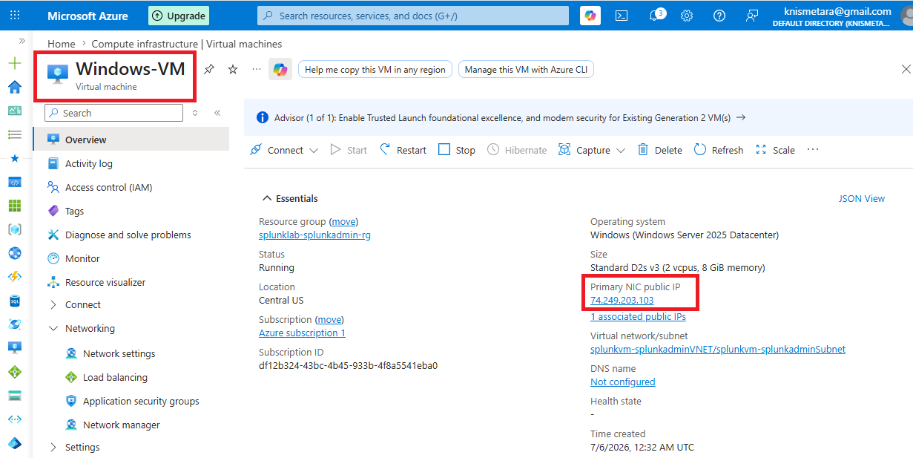

**✅ Checkpoint:** A Windows Server 2022 VM exists, and you have its IP and credentials.

---

## Task 2 — Connect via RDP

6. On your computer, press **Windows + R**, type `mstsc`, and press Enter.
7. Enter the Windows VM's public IP and click **Connect**.

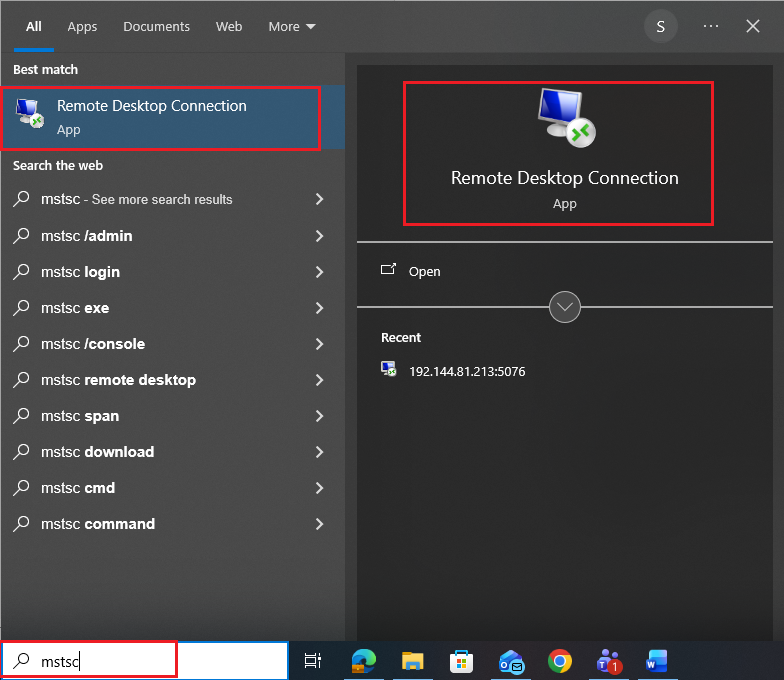

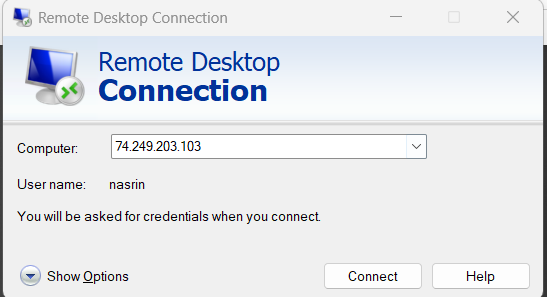

8. If a security warning appears, click **Yes** (normal in labs).
9. Enter the VM credentials and click **OK**.

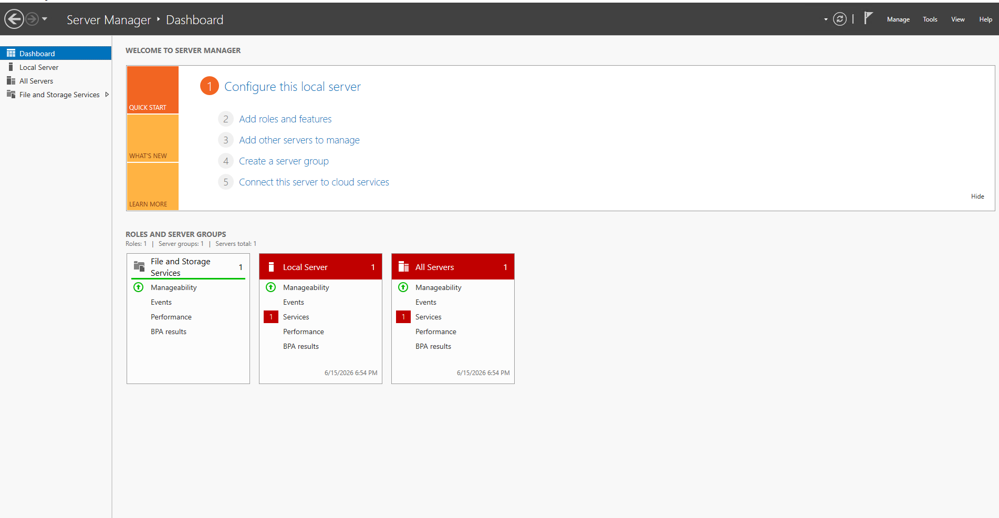

**✅ Checkpoint:** The Windows Server desktop appears in your RDP window.

---

## Task 3 — Download the Universal Forwarder

*Do these steps inside the RDP session.*

10. Open Microsoft Edge and go to [splunk.com/en_us/download/universal-forwarder.html](https://www.splunk.com/en_us/download/universal-forwarder.html).
11. Log in, select the **Windows** tab, and download the **64-bit `.msi`** installer.
12. Save it to the Desktop.

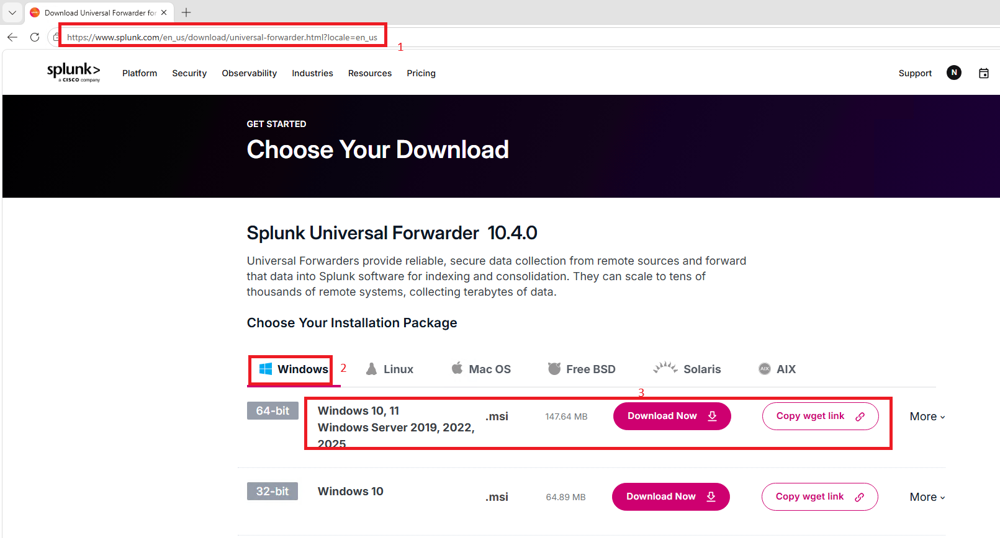

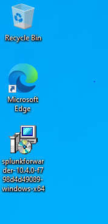

**✅ Checkpoint:** The `.msi` (about 40–60 MB) is on the Windows VM.

---

## Task 4 — Install and Configure the Forwarder

13. Double-click the `.msi` to start the Setup Wizard. Accept the UAC prompt.

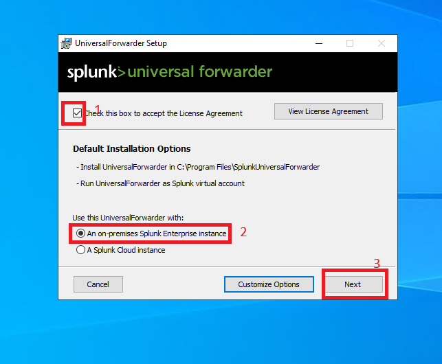

14. **Welcome** → Next. **License** → accept → Next. **Destination** → keep the default → Next. **Deployment Server** → leave BLANK (standalone mode) → Next.

15. **Receiving Indexer — the key step:** enter your Splunk server's IP and port:

```
<your-splunk-ip>:9997
```

> 💡 Use the **private IP** if both VMs are in the same Azure VNet. Use the **public IP** only for cross-network, and make sure the NSG allows it (Lab 08).

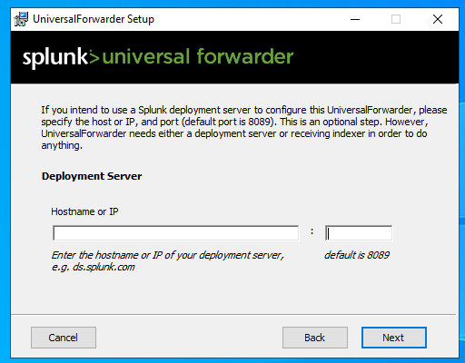

16. Set the forwarder admin credentials (username `admin`, a strong password) → Next → Install → Finish.

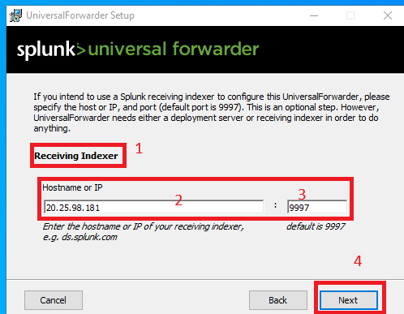

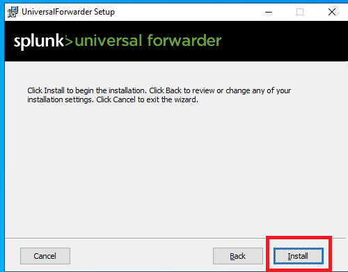

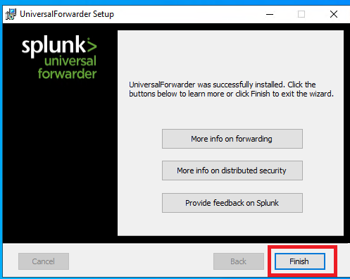

### Tell the Forwarder Which Logs to Collect

17. Open **Notepad as Administrator**, then open (or create) this file:

```
C:\Program Files\SplunkUniversalForwarder\etc\system\local\inputs.conf
```

18. Add:

```ini
[WinEventLog://Security]
index = main
disabled = 0

[WinEventLog://System]
index = main
disabled = 0

[WinEventLog://Application]
index = main
disabled = 0
```

What this means: collect the **Security** (logins, privilege use, account changes), **System** (services, hardware, OS errors), and **Application** (app errors) event logs, send them to the `main` index, and `disabled = 0` means active.

19. Save (Ctrl+S).

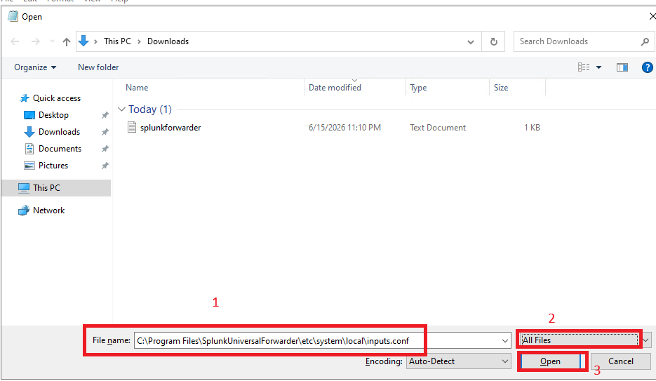

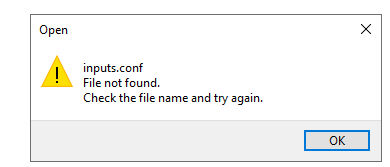

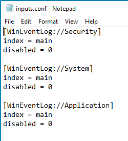

**✅ Checkpoint:** The forwarder is installed and `inputs.conf` lists the three event logs.

---

## Task 5 — Allow Outbound 9997 in the Windows Firewall

The forwarder sends data **out** to Splunk on port 9997, so the Windows firewall must allow that outbound connection.

20. Open **Windows Defender Firewall with Advanced Security** → **Outbound Rules** → **New Rule**.
21. **Port** → Next. **TCP**, remote port `9997` → Next. **Allow the connection** → Next. All profiles → Next.
22. Name it `Splunk Forwarder Outbound 9997` → Finish.

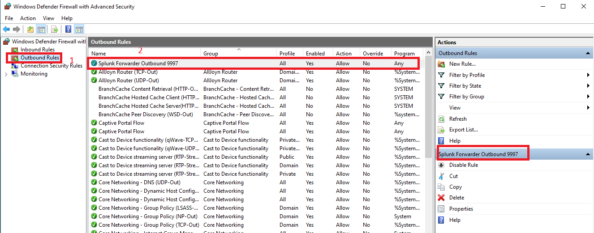

**✅ Checkpoint:** An outbound rule for TCP 9997 exists.

---

## Task 6 — Confirm the Forwarder Service Is Running

23. Press **Windows + R**, type `services.msc`, Enter.
24. Find **SplunkForwarder**. The Status should say **Running**. If stopped, right-click → Start. If you edited `inputs.conf`, right-click → Restart.

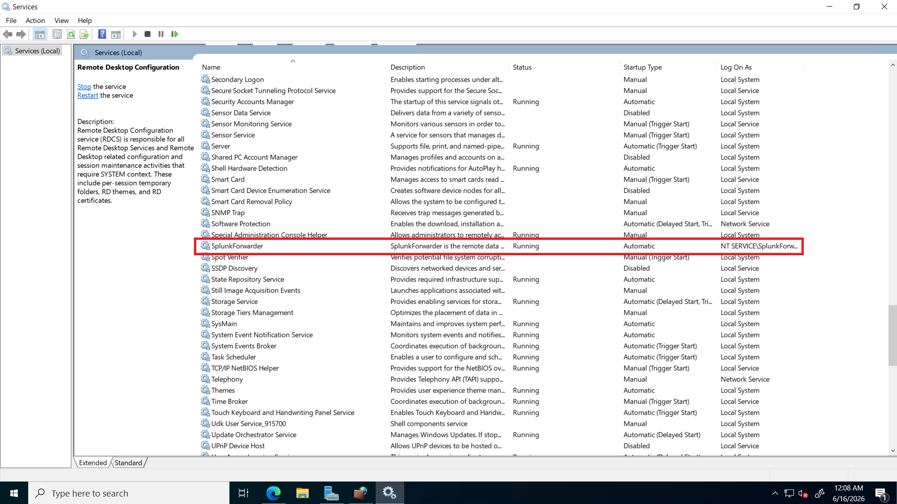

PowerShell alternatives:

```powershell
Restart-Service SplunkForwarder
sc query SplunkForwarder      # look for STATE : 4 RUNNING
```

**✅ Checkpoint:** SplunkForwarder shows **Running**.

---

## Task 7 — Test Connectivity to Splunk

25. On the Windows VM, open **PowerShell as Administrator** and run (use your Splunk IP):

```powershell
Test-NetConnection -ComputerName <your-splunk-ip> -Port 9997
```

- `TcpTestSucceeded : True` → the path is open, data can flow.
- `TcpTestSucceeded : False` → something is blocking it (check firewalls and NSG).

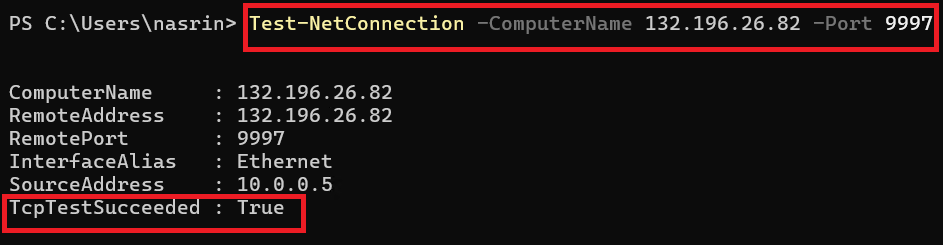

**✅ Checkpoint:** `TcpTestSucceeded : True`.

---

## Task 8 — Confirm Logs Are Arriving in Splunk

26. On your computer, open the Splunk web interface and log in.
27. Go to **Search & Reporting** and run (find your VM's name with the `hostname` command on the Windows VM):

```
index=main host=<your-windows-vm-hostname> | head 20
```

To see everything arriving without a filter: `index=main | head 50`

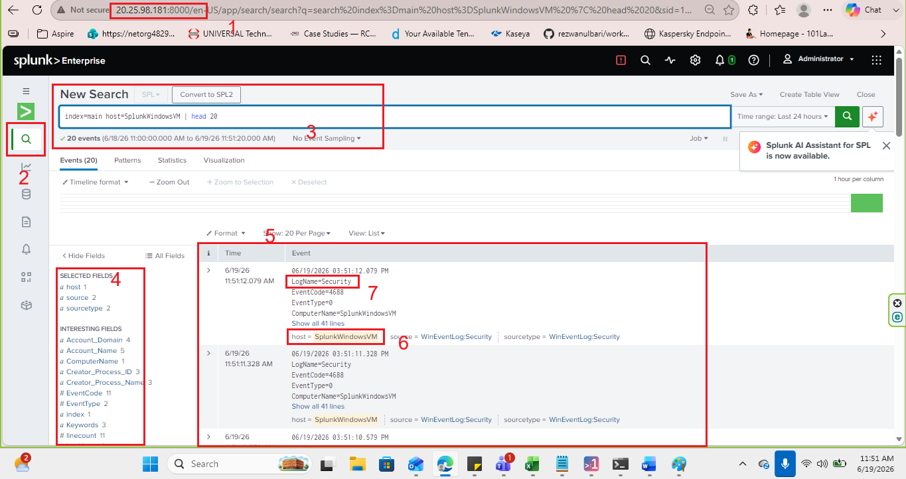

28. Search specifically for Security events:

```
index=main sourcetype="WinEventLog:Security" | head 20
```

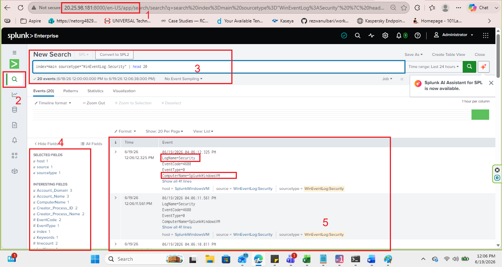

> **If no data appears:** wait 2–3 minutes, confirm the SplunkForwarder service is Running (Task 6), re-check `Test-NetConnection` (Task 7), look for typos in `inputs.conf`, and confirm 9997 is open on both the Windows firewall and the Azure NSG.

**✅ Checkpoint:** Windows event logs appear in Splunk, with the `host` field showing your VM and `sourcetype` showing `WinEventLog:Security`.

---

## 🛠️ Troubleshooting

| Problem | Cause | Solution |
|---|---|---|
| RDP fails or times out | NSG blocks port 3389 | Add an inbound NSG rule allowing TCP 3389 |
| SplunkForwarder won't start | Syntax error in `inputs.conf` | Check for typos; review Windows Event Viewer → Application log |
| `TcpTestSucceeded: False` | Port 9997 blocked somewhere | Verify: Splunk listens on 9997, Windows allows outbound 9997, NSG allows inbound 9997 |
| No events after 5+ minutes | Forwarder not sending, or wrong index | Check `index = main` in inputs.conf and the indexer IP; restart the service |
| Sourcetype shows "Unknown" | Sourcetype not mapped | Add `sourcetype = WinEventLog:Security` under each stanza |

---

## 🧠 Conclusion — What You Learned

This lab connected the whole pipeline: a real Windows machine now sends its logs to Splunk automatically.

**About Log Collection**
- The Universal Forwarder is the lightweight agent that ships Windows logs to Splunk
- `inputs.conf` decides which logs are collected and where they go
- Data flows outbound on 9997 from the forwarder and inbound on 9997 to the indexer

**About Troubleshooting a Pipeline**
- `Test-NetConnection` is the fastest way to prove the network path works
- When logs don't arrive, the failure is almost always one of: service stopped, firewall/NSG closed, or a typo in `inputs.conf`

**Why This Matters**
- This is the foundation of a SIEM — no collected logs means nothing to detect on
- Every detection lab that follows depends on this pipeline working

---

## ✅ Verify Before Moving On

- [ ] SplunkForwarder service is Running on the Windows VM
- [ ] `Test-NetConnection` to Splunk on 9997 returns True
- [ ] Splunk search shows events with `host` = your Windows VM
- [ ] `sourcetype` values like `WinEventLog:Security` appear
- [ ] You understand the full path a log takes from Windows to Splunk

---

**Next:** [Lab 10 →](../lab-10/)

[← Back to lab index](../README.md)

---

## 👤 Author

**Nasrin Ismet**
SOC Analyst & GRC Consultant | M.S. Cybersecurity

*"Find it, prove it, govern it."*

[](https://www.linkedin.com/in/kismetara/)
[](https://github.com/ismet60)

⭐ *Star this repo if it helped*
