# 🐧 Lab 10 — Collecting Linux Logs with the Splunk Universal Forwarder


> **The Linux half of the pipeline.** In Lab 9 you collected Windows logs. This lab does the same for Linux — the operating system most servers, databases, and cloud infrastructure run on. Same idea, command-line tools, different log paths.

---

## 🎯 Introduction — Linux and Log Collection

Linux is the most common operating system for servers. Web servers, databases, security appliances, and most cloud infrastructure run on it. So collecting Linux logs is essential for real security monitoring.

Linux log collection with Splunk works just like Windows, but everything happens on the command line and the logs live in different files. The **Universal Forwarder** is again the small agent that ships those logs to Splunk.

---

## 🏗️ The Pipeline You'll Build

```
   ┌──────────────────────────┐         ┌──────────────────────┐
   │  Ubuntu Linux VM         │         │   Splunk Indexer     │
   │  ──────────────────────  │  9997   │  ──────────────────  │
   │  Universal Forwarder     │ ──────▶ │  Receiving on 9997   │
   │  monitors log files:     │  (TCP)  │  Indexes the logs    │
   │  • /var/log/syslog       │         │  → searchable        │
   │  • /var/log/auth.log     │         │                      │
   │  • /var/log/kern.log     │         │                      │
   └──────────────────────────┘         └──────────────────────┘
        (ufw allows                        (inbound 9997 open —
         outbound 9997)                     Lab 08)
```

---

## 🎓 Learning Objectives

After this lab, you will be able to:

- Provision an Ubuntu VM in Azure with a script
- Connect to it using SSH
- Install and configure the Universal Forwarder on Linux
- Choose which Linux log files to collect (`inputs.conf`)
- Test connectivity and confirm Linux logs are arriving in Splunk

**Builds on:** [Lab 08 — Receiving Port](../lab-08-receiving-port/) and [Lab 09 — Windows Log Collection](../lab-09-windows-log-collection/)

---

## Task 1 — Provision an Ubuntu VM in Azure

1. Log into the [Azure Portal](https://portal.azure.com).
2. Open **Cloud Shell** (`>_` icon) and choose **Bash**.
3. Upload your Ubuntu provisioning script.
4. Run it:

```bash
bash ubuntu-vm-provision.sh
```

5. When it finishes, note the **public IP**, **SSH username**, and **password / key** from the output.

**✅ Checkpoint:** The Ubuntu VM shows "Running" in Azure, and you have its IP and credentials.

---

## Task 2 — Connect via SSH

6. On your computer, open PowerShell (or a terminal).
7. Connect (use your VM's username and IP):

```bash
ssh <username>@<your-vm-ip>
```

8. First time, you'll be asked to confirm the host key — type `yes`.
9. Enter the password (the characters won't show — that's normal).
10. Success looks like a prompt such as `azureuser@splunk-ubuntu-vm:~$`.

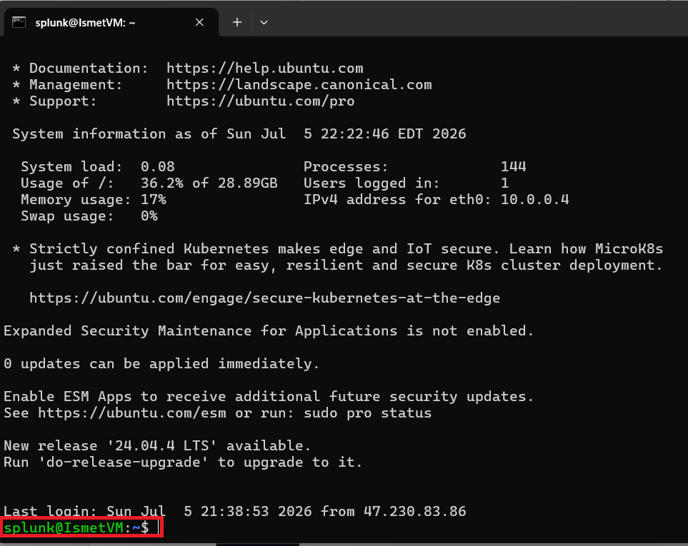

**✅ Checkpoint:** You have an active SSH session, and the prompt shows the VM's hostname.

---

## Task 3 — Download the Universal Forwarder

*Do all steps inside the SSH session.*

11. Create a working directory:

```bash
mkdir -p /tmp/splunk-install && cd /tmp/splunk-install
```

12. Download the Linux 64-bit `.tgz`. Get the exact URL from the [Splunk download page](https://www.splunk.com/en_us/download/universal-forwarder.html) (Linux tab → right-click the `.tgz` → Copy Link Address), then:

```bash
wget -O splunkforwarder-linux-amd64.tgz "<paste-the-splunk-url-here>"
```

13. Verify the file downloaded (about 40–60 MB):

```bash
ls -lh
```

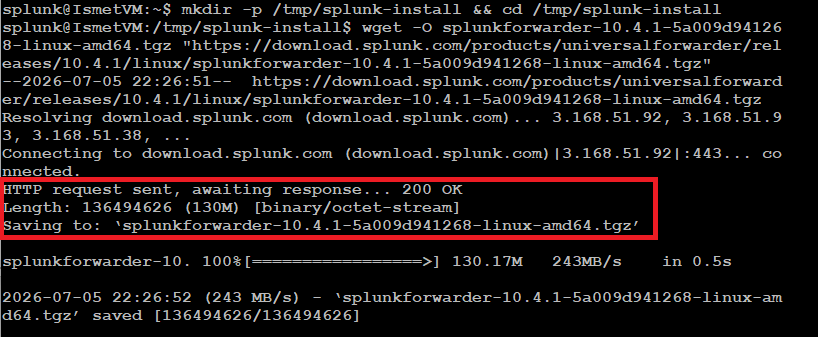

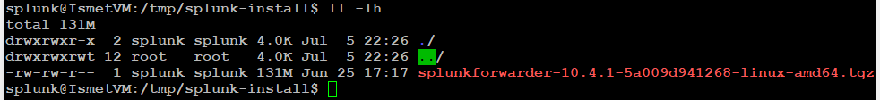

**✅ Checkpoint:** The `.tgz` file is present.

---

## Task 4 — Install and Configure the Forwarder

14. Extract to `/opt` (the standard place for optional software):

```bash
sudo tar -xvzf /tmp/splunk-install/splunkforwarder-linux-amd64.tgz -C /opt/
```

Flags: `-x` extract, `-v` verbose, `-z` gunzip, `-f` from file, `-C /opt/` into /opt.

15. Confirm the `splunkforwarder` folder now exists:

```bash
ls /opt/
```

16. Start it for the first time (accepts license, sets admin credentials):

```bash
sudo /opt/splunkforwarder/bin/splunk start --accept-license
```

When prompted, create an admin username (`admin`) and a strong password.

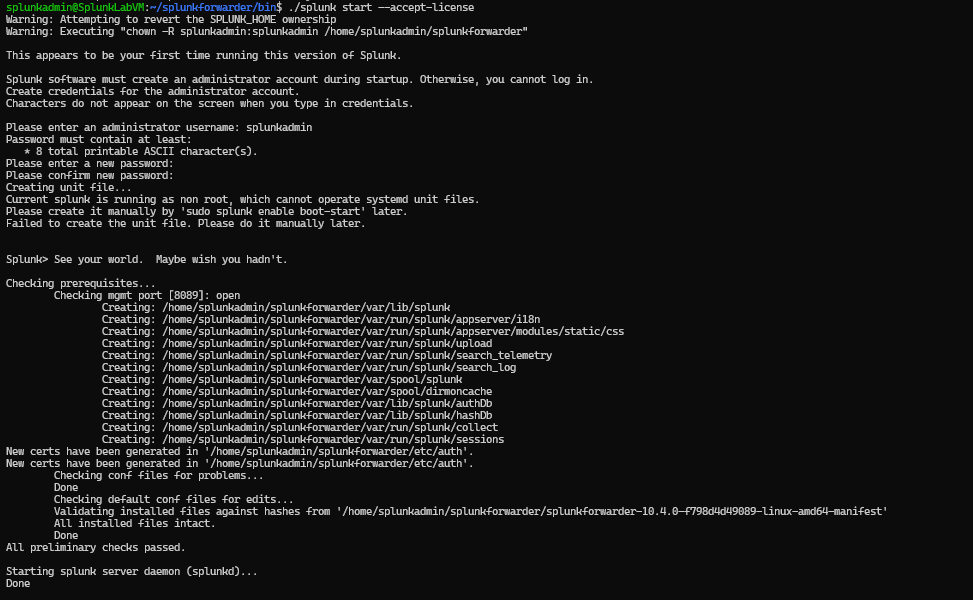

17. Enable start-on-boot:

```bash
sudo /opt/splunkforwarder/bin/splunk enable boot-start -user root
```

18. Point the forwarder at your Splunk server (replace IP and password):

```bash
sudo /opt/splunkforwarder/bin/splunk add forward-server <your-splunk-ip>:9997 -auth admin:<your-password>
```

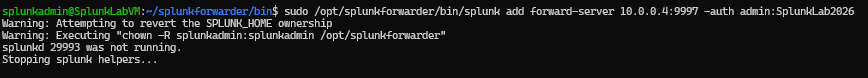

### Choose Which Logs to Collect

19. Create the config file:

```bash
sudo mkdir -p /opt/splunkforwarder/etc/system/local
sudo nano /opt/splunkforwarder/etc/system/local/inputs.conf
```

20. Enter this (one clean version):

```ini
[monitor:///var/log/syslog]
index = main
sourcetype = linux_syslog
disabled = 0

[monitor:///var/log/auth.log]
index = main
sourcetype = linux_secure
disabled = 0

[monitor:///var/log/kern.log]
index = main
sourcetype = linux_syslog
disabled = 0
```

What these files are: **syslog** = general system messages, **auth.log** = SSH logins, sudo, and authentication, **kern.log** = kernel and hardware messages. These three are the most useful Linux logs for security monitoring.

21. Save in nano: **Ctrl+O**, Enter, then **Ctrl+X**.

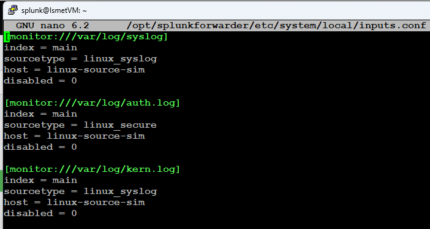

22. Restart the forwarder to apply:

```bash
sudo /opt/splunkforwarder/bin/splunk restart
```

**✅ Checkpoint:** The forwarder is installed, pointed at your Splunk server, and `inputs.conf` lists the three log files.

---

## Task 5 — Allow Outbound 9997 in the Firewall (ufw)

23. Check whether ufw is active:

```bash
sudo ufw status
```

If it says `inactive`, the firewall is off and no rules are needed. If `active`, continue:

```bash
sudo ufw allow out 9997/tcp      # forwarder sends data out on 9997
sudo ufw allow 22/tcp            # keep SSH open so you don't lock yourself out
sudo ufw reload
sudo ufw status verbose
```

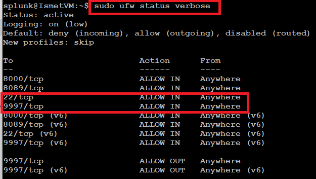

**✅ Checkpoint:** ufw allows outbound 9997 (or is inactive), and SSH stays open.

---

## Task 6 — Confirm the Forwarder Is Running

24. Check status:

```bash
sudo /opt/splunkforwarder/bin/splunk status
```

Expected: `splunkd is running (PID: ...)`. You can also use `sudo systemctl status SplunkForwarder` and look for `active (running)`.

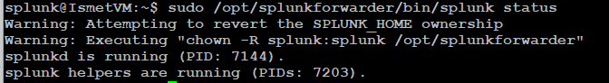

25. If it's not running:

```bash
sudo /opt/splunkforwarder/bin/splunk start
```

**✅ Checkpoint:** `splunkd is running`.

---

## Task 7 — Test Connectivity to Splunk

26. Use netcat to test the path to port 9997 (replace IP):

```bash
nc -vz <your-splunk-ip> 9997
```

Success: `Connection to <ip> 9997 port [tcp/*] succeeded!`

If `nc` isn't installed: `sudo apt install netcat -y`

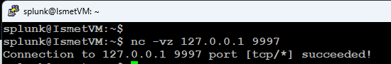

> **If it fails:** confirm Splunk is listening on 9997 (Lab 08), the Azure NSG allows inbound 9997, and your IP is correct.

**✅ Checkpoint:** netcat reports "succeeded."

---

## Task 8 — Confirm Logs Are Arriving in Splunk

27. Open the Splunk web interface, log in, go to **Search & Reporting**, and run:

```
index=main sourcetype=linux_syslog | head 20
```

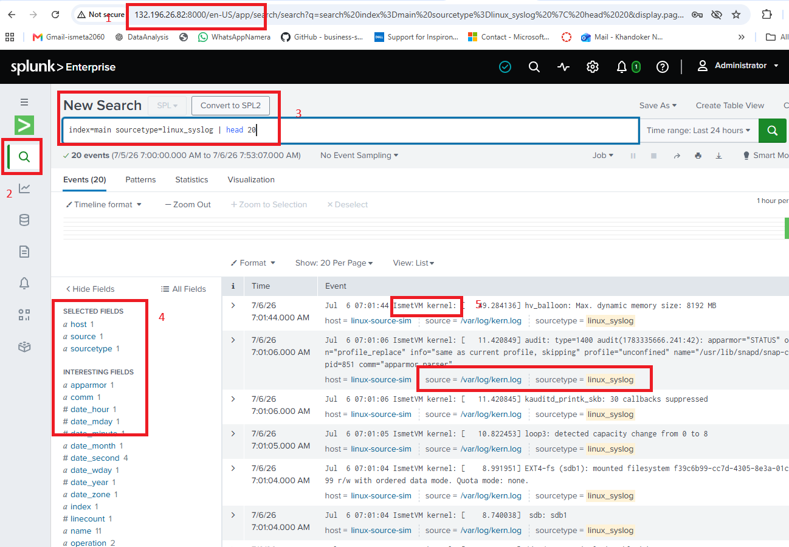

28. Check authentication events (SSH logins, sudo):

```
index=main sourcetype=linux_secure | head 20
```

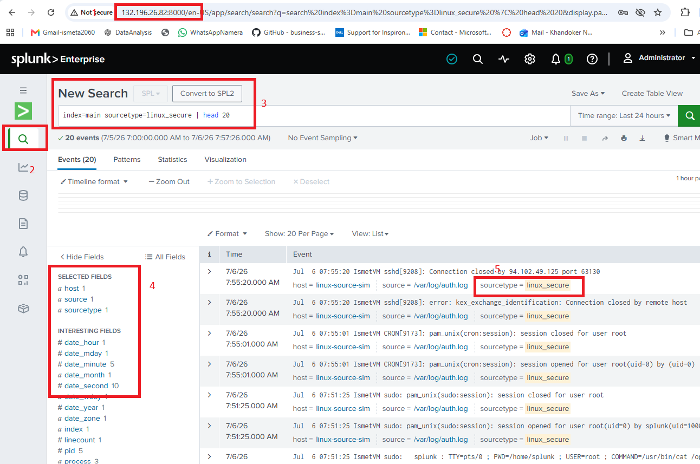

29. See every host sending data — your Ubuntu VM should appear:

```
index=main | stats count by host, sourcetype | sort -count
```

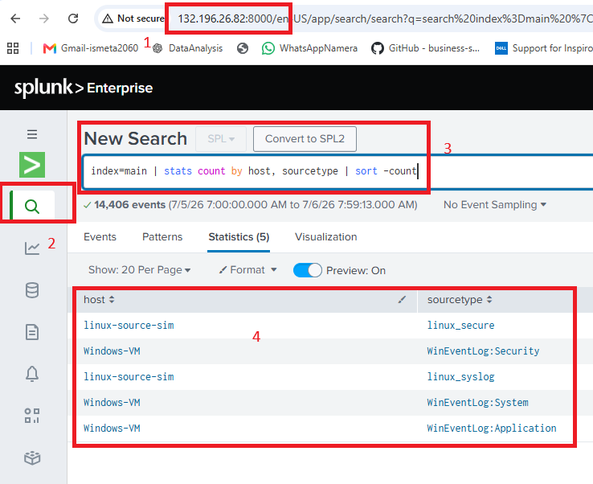

> **If no data appears:** wait 2–3 minutes, confirm the service is running (Task 6), re-check connectivity (Task 7), look at `/opt/splunkforwarder/var/log/splunk/splunkd.log`, and make sure the monitored log files exist.

**✅ Checkpoint:** Linux syslog and auth events appear in Splunk, and your Ubuntu VM shows in the hosts table.

---

## 🛠️ Troubleshooting

| Problem | Cause | Solution |
|---|---|---|
| SSH connection refused/timeout | NSG blocks port 22 | Add an inbound NSG rule for TCP 22 |
| Forwarder won't start | Syntax error in `inputs.conf` | Check the file; review `splunkd.log` |
| `nc` shows "Connection refused" | 9997 blocked somewhere | Confirm Splunk listens on 9997, NSG allows inbound 9997 |
| No events after 5+ minutes | Wrong index, or files unreadable | Check `index = main`; confirm the log files exist and are readable |
| Only some logs appear | A monitor stanza is disabled or misspelled | Verify each `[monitor://...]` path and `disabled = 0` |

---

## 🧠 Conclusion — What You Learned

With Labs 9 and 10 done, you can now collect logs from **both** Windows and Linux — the two operating systems every real SOC deals with.

**About Linux Log Collection**
- The forwarder monitors log *files* on Linux (`/var/log/...`) rather than Event Logs
- `syslog`, `auth.log`, and `kern.log` are the core files for security monitoring
- `add forward-server` on the CLI is the Linux equivalent of the Windows installer's "receiving indexer" screen

**About Troubleshooting**
- `nc -vz` is the quick way to prove the network path to Splunk works
- When logs don't arrive, it's almost always the service, the firewall/NSG, or a wrong path in `inputs.conf`

**Why This Matters**
- Covering both OS families is what makes monitoring "comprehensive" instead of partial
- Attackers move between Windows and Linux systems — your visibility has to as well

---

## ✅ Verify Before Moving On

- [ ] The forwarder service is running on the Ubuntu VM
- [ ] `nc -vz` to Splunk on 9997 succeeds
- [ ] Splunk shows `linux_syslog` and `linux_secure` events
- [ ] The Ubuntu VM appears in the hosts table
- [ ] You can explain how Linux collection differs from Windows collection

---

**Next:** [Lab 11 →](../lab-11/)

[← Back to lab index](../README.md)

---

## 👤 Author

**Nasrin Ismet**
SOC Analyst & GRC Consultant | M.S. Cybersecurity

*"Find it, prove it, govern it."*

[](https://www.linkedin.com/in/kismetara/)
[](https://github.com/ismet60)

⭐ *Star this repo if it helped*

