# 📦 Lab 11 — Splunk App Management


> **Extending Splunk with apps — four ways to install, plus managing and removing them.** Splunk apps add dashboards, data inputs, and field extractions for specific use cases like Windows or Linux monitoring. This lab covers every install method a Splunk admin uses.

---

## 🎯 Introduction — What Are Splunk Apps?

Splunk **apps** are pre-built packages that extend what Splunk can do. They add things like dashboards, data inputs, field extractions, and reports for a specific use case — Windows security, AWS, network traffic, and so on.

**Splunkbase** (splunkbase.splunk.com) is the official app store. It has thousands of free and paid apps from Splunk and its partners.

In this lab you learn every way to install an app: download from the Splunkbase website, upload through the web console, install from the command line, and install directly from inside Splunk. You'll also edit an app's properties and remove apps cleanly.

---

## 🏗️ Four Ways to Install an App

```
   ┌─────────────────────────────────────────────┐
   │              Getting an app in               │
   ├─────────────────────────────────────────────┤
   │  1️⃣ Web upload    → download .tgz, upload    │
   │                      via Manage Apps         │
   │  2️⃣ CLI install   → scp file, then           │
   │                      splunk install app      │
   │  3️⃣ Browse (direct) → install from Splunkbase │
   │                      inside Splunk (needs net)│
   │  4️⃣ Manage        → edit properties, disable, │
   │                      remove (web + CLI)       │
   └─────────────────────────────────────────────┘
```

---

## 🎓 Learning Objectives

After this lab, you will be able to:

- Download an app package from Splunkbase
- Install an app through the web console
- Install an app from the command line
- Install an app directly from Splunkbase inside Splunk
- View and edit an app's properties
- Uninstall an app from both the web console and the CLI

**Prerequisites:** Splunk running (Labs 1–3), web access at `http://<VM_IP>:8000`, a Splunk account, and SSH access to the Splunk VM.

---

## Task 1 — Download an App from Splunkbase

You'll download the **Splunk Add-on for Microsoft Windows**, a common app for collecting Windows Event Logs.

1. On your local computer, go to [splunkbase.splunk.com](https://splunkbase.splunk.com).
2. Log in with your Splunk account.
3. Search for **Splunk Add-on for Microsoft Windows**.

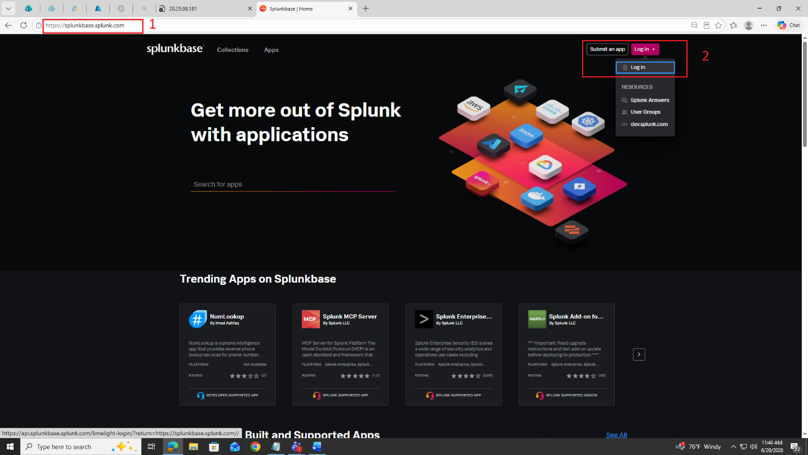

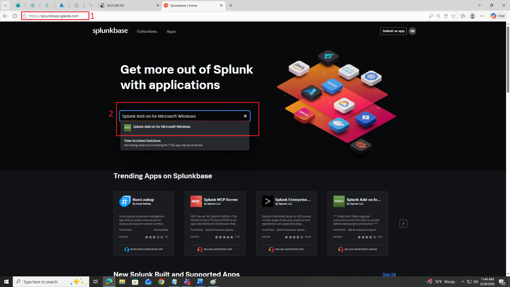

4. Open the app page and review the version and compatibility info.
5. Click the green **Download** button and accept the licence if asked.
6. Save the `.tgz` (or `.spl`) file to your Downloads folder.

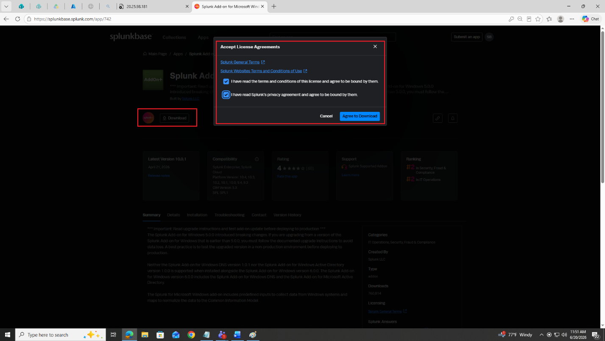

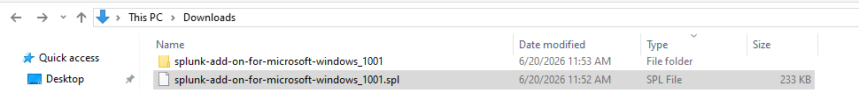

> 💡 A `.spl` file is just a renamed archive. If needed, unzip it with 7-Zip or WinZip to get the `.tgz`.

**✅ Checkpoint:** The app file is saved locally (name like `splunk-add-on-for-microsoft-windows_<version>.tgz`).

---

## Task 2 — Install via the Web Console

The simplest method — upload the file and Splunk handles the rest.

7. Log into Splunk Web at `http://<VM_IP>:8000`.
8. Click the gear icon (⚙) next to **Apps**, or go to **Apps → Manage Apps**.

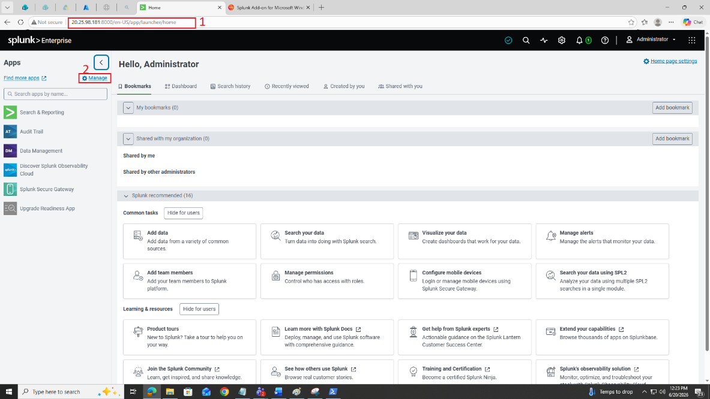

9. Click **Install app from file** (top right).

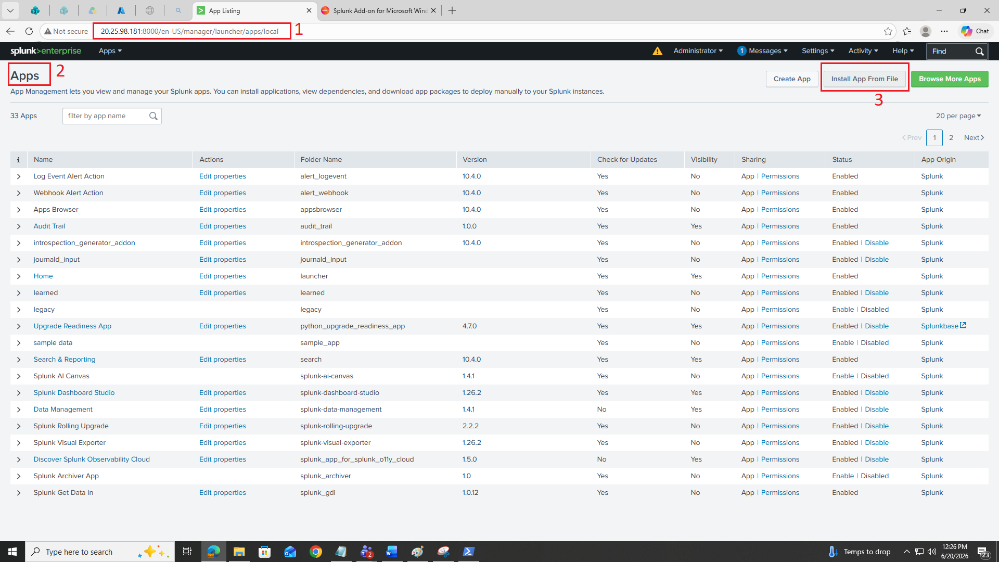

10. Click **Choose File**, select the `.tgz` from Task 1, leave "Upgrade app" unchecked, and click **Upload**.

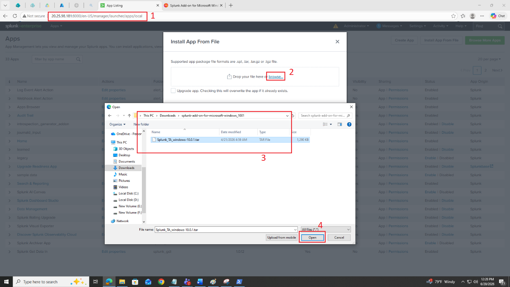

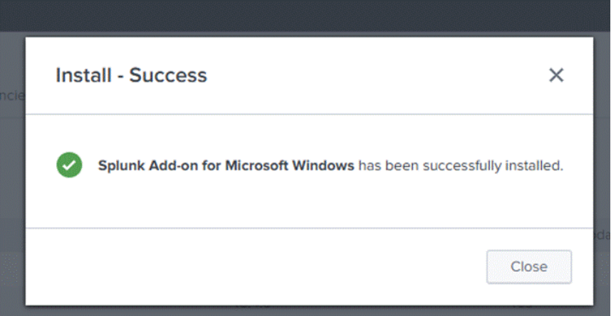

11. If asked to set up the app, click **Set up later**.
12. Back on Manage Apps, the app should show **Enabled**. If a yellow banner asks you to restart, click **Restart Splunk**.

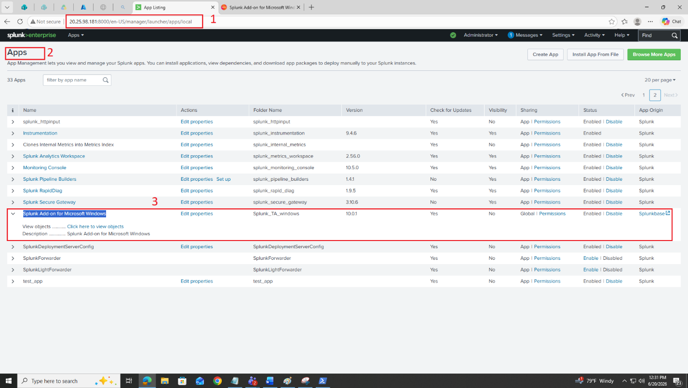

Verify on the server:

```bash
ls /opt/splunk/etc/apps/ | grep -i windows
```

**✅ Checkpoint:** The app shows Enabled and appears in `/opt/splunk/etc/apps/`.

---

## Task 3 — Install from the Command Line

13. Transfer the app file to the Splunk VM. From your local terminal:

```bash
scp <path-to>/splunk-add-on-for-microsoft-windows_*.tgz <user>@<VM_IP>:/tmp/
```

14. SSH into the VM and confirm the file arrived:

```bash
ssh <user>@<VM_IP>
ls -lh /tmp/*.tgz
```

15. Install with the Splunk CLI:

```bash
sudo /opt/splunk/bin/splunk install app /tmp/splunk-add-on-for-microsoft-windows_*.tgz -auth admin:<your-password>
```

Expected: `App '...' installed. You may need to restart Splunk Enterprise for the app to be activated.`

16. Restart Splunk (the indexer service — not the forwarder):

```bash
sudo systemctl restart Splunkd
```

17. Verify:

```bash
ls /opt/splunk/etc/apps/ | grep -i windows
```

You should see `Splunk_TA_windows`.

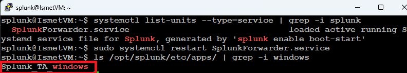

**✅ Checkpoint:** `Splunk_TA_windows` exists in the apps directory.

---

## Task 4 — Install Directly from Splunkbase (Browse More Apps)

Splunk's built-in browser installs apps straight from Splunkbase — no manual download. This needs the Splunk server to have internet access.

18. In Splunk Web, click **Apps** (top nav) → **Browse More Apps**.


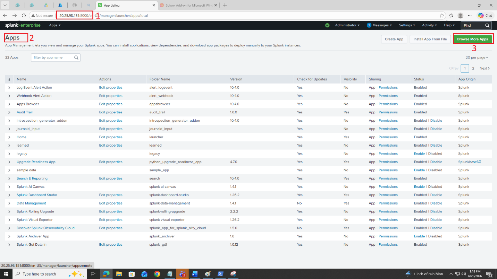

19. The App Browser opens. Search for **Splunk Add-on for Unix and Linux**.

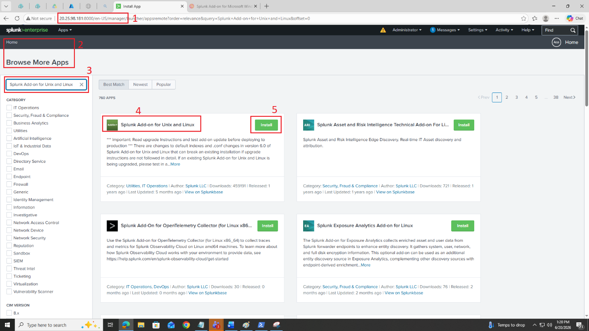

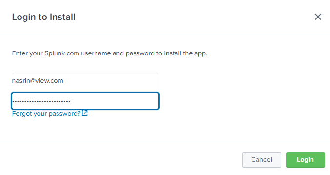

20. Open the result, click **Install**, enter your Splunkbase credentials, and click **Login and Install**.
21. When done, restart if prompted (`sudo systemctl restart Splunkd`).
22. Confirm **Splunk Add-on for Unix and Linux** (`Splunk_TA_nix`) appears in Manage Apps.

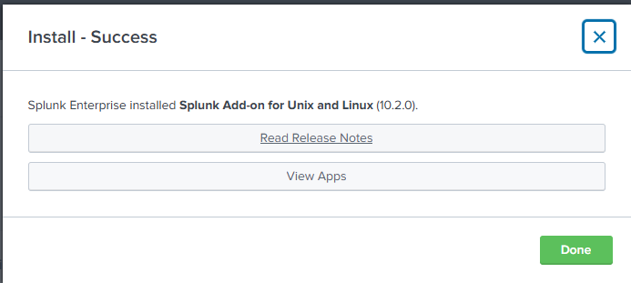

> 📌 If the server has no internet, this page shows an error — use the manual download + CLI method (Tasks 1 and 3) instead. The feature contacts Splunkbase directly from the server, which is why internet is required.

**✅ Checkpoint:** The Unix/Linux add-on installed without errors and shows Enabled.

---

## Task 5 — Edit an App's Properties

Each app has properties you can change: display name, visibility in the nav bar, and enabled/disabled state.

23. Go to **Apps → Manage Apps** and find the **Windows** add-on.
24. Click **Edit properties** in the Actions column.

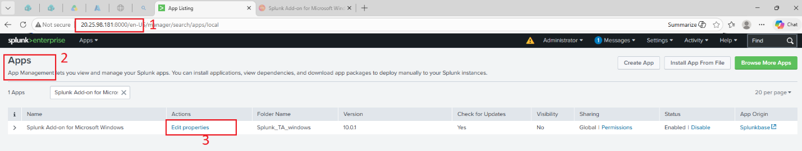

25. Set **Visible** to **No**. (Data-collection add-ons like this have no dashboards, so there's no reason for them to appear in the Apps menu.)
26. Click **Save**.

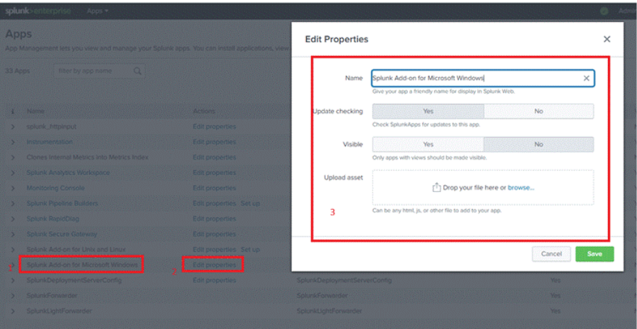

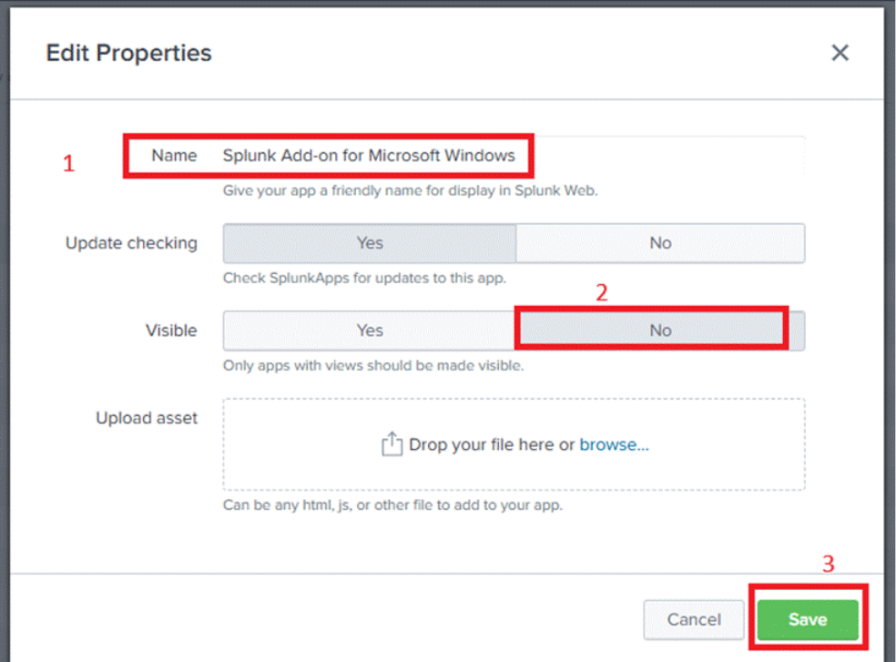

27. Back on Manage Apps, confirm the Visible column now shows **No**.

**✅ Checkpoint:** The property change saved and shows in the list.

---

## Task 6 — Uninstall from the Web Console

> ⚠️ For this lab, only **disable** the Windows add-on — you'll reinstall it in Lab 13. In production, back up any customizations before removing an app.

28. In **Manage Apps**, find the Windows add-on and click **Disable** in the Actions column.
29. Confirm in the dialog. Restart if prompted.
30. Verify it's gone from Manage Apps, and on the server:

```bash
ls /opt/splunk/etc/apps/ | grep -i windows
```

No output means it's removed.

**✅ Checkpoint:** The app no longer appears in Manage Apps or the apps directory.

---

## Task 7 — Uninstall from the CLI

31. SSH into the Splunk VM.
32. List installed apps:

```bash
/opt/splunk/bin/splunk display app -auth admin:<your-password>
```

33. Remove the Unix/Linux add-on:

```bash
/opt/splunk/bin/splunk remove app Splunk_TA_nix -auth admin:<your-password>
```

Expected: `App 'Splunk_TA_nix' removed.`

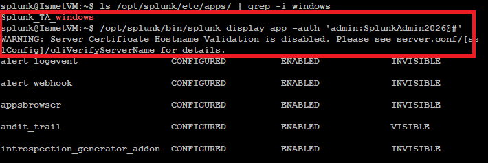

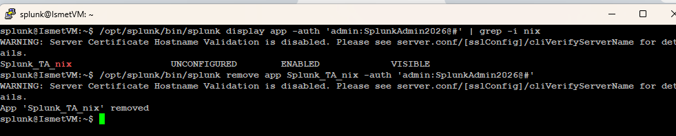

34. Restart and verify:

```bash
sudo systemctl restart Splunkd
ls /opt/splunk/etc/apps/ | grep -i nix
```

No output means success.

> 💡 To disable an app without removing it (useful for troubleshooting):
> `splunk disable app <appname> -auth admin:<password>` — and `splunk enable app <appname>` to turn it back on.

**✅ Checkpoint:** The remove command reports success and the app directory is gone.

---

## 🛠️ Troubleshooting

| Problem | Solution |
|---|---|
| Upload fails in web console | Confirm the file is a valid `.tgz`/`.spl`; check available disk space |
| "Browse More Apps" shows an error | The server has no internet — use manual download + CLI install |
| App installed but not visible | Check Edit Properties → Visible; data add-ons are often hidden by design |
| CLI install "auth failed" | Verify the admin username and password in the `-auth` flag |
| App still shows after removal | Restart Splunk (`systemctl restart Splunkd`) to finish the removal |

---

## 🧠 Conclusion — What You Learned

You now know every way to get an app into Splunk, and how to manage it afterward.

**About App Installation**
- Web upload, CLI install, and direct-from-Splunkbase — each fits a different situation
- Direct install is easiest but needs internet on the server; CLI works in air-gapped environments
- Apps live in `/opt/splunk/etc/apps/` — the CLI and web console are two views of the same thing

**About App Management**
- Editing properties (like Visible) keeps the Apps menu clean
- Disable vs. remove — disable for troubleshooting, remove to uninstall fully
- A restart is what actually finalizes install and removal

**Why This Matters**
- Add-ons are how Splunk understands specific data sources (Windows TA, *nix TA) — they provide the field extractions detection depends on
- Knowing multiple install methods means you can work in any environment, including locked-down ones with no internet

---

## ✅ Verify Before Moving On

- [ ] Installed an app via the web console
- [ ] Installed an app via the CLI
- [ ] Installed an app directly from Splunkbase
- [ ] Edited an app's Visible property
- [ ] Removed apps from both the web console and CLI

---

**Next:** [Lab 12 →](../lab-12/)

[← Back to lab index](../README.md)

---

## 👤 Author

**Nasrin Ismet**
SOC Analyst & GRC Consultant | M.S. Cybersecurity

*"Find it, prove it, govern it."*

[](https://www.linkedin.com/in/kismetara/)
[](https://github.com/ismet60)

⭐ *Star this repo if it helped*

