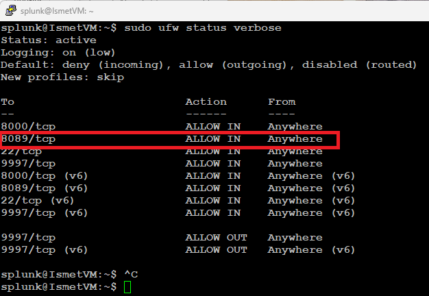
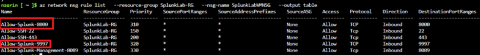
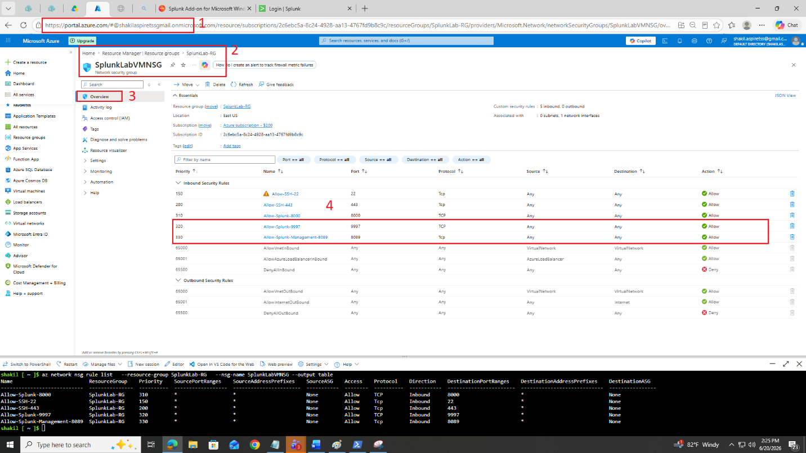
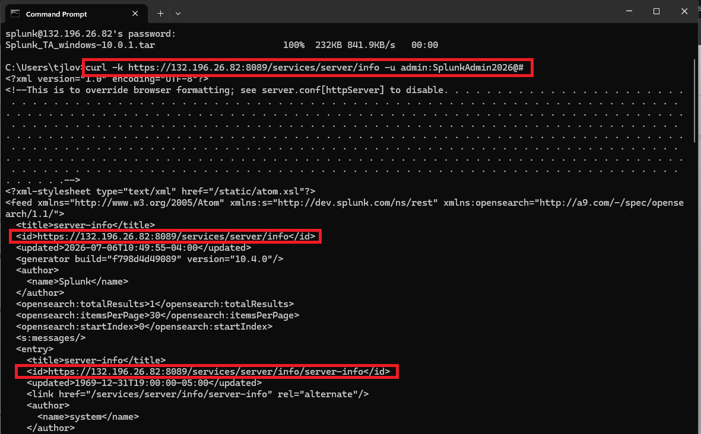

# 🛠️ Lab 12 — Configure the Splunk Management Port (8089)


> **Opening the door Splunk uses to manage itself.** Port 8089 is Splunk's management port — used by the REST API, the CLI, and most importantly for the Deployment Server to push configuration to forwarders. This lab opens 8089 on both firewalls, setting up the centralized management you'll build in Labs 13 and 14.

---

## 🎯 Introduction — What Is Port 8089?

Port **8089** is Splunk's **management port**. Three things use it: the REST API, remote CLI commands, and — most importantly — the link between the **Deployment Server** and the Universal Forwarders.

If 8089 is closed, forwarders can't receive configuration updates and the Deployment Server can't push apps out to them. So before you can manage forwarders centrally (Labs 13 and 14), this port has to be open on both firewalls.

---

## 🏗️ Why 8089 Matters

```
   ┌──────────────────┐    port 8089    ┌────────────────────┐
   │  Deployment      │ ──────────────▶ │  Universal         │
   │  Server (Splunk) │   pushes apps   │  Forwarders        │
   │                  │   & configs     │  (Windows / Linux) │
   └──────────────────┘                 └────────────────────┘
        REST API + CLI also use 8089

   Port closed → no config updates, no app pushes.
   Port open on BOTH firewalls → central management works.
```

---

## 🎓 Learning Objectives

After this lab, you will be able to:

- Open port 8089 on the Ubuntu host firewall (UFW)
- Open port 8089 on the Azure Network Security Group
- Confirm 8089 is reachable from outside the VM
- Explain why 8089 is essential for managing forwarders

**Prerequisites:** Splunk running on Ubuntu (Labs 1–3). This lab is a prerequisite for Labs 13 and 14.

---

## Task 1 — Allow Port 8089 on the Host Firewall (UFW)

The Ubuntu firewall must allow inbound 8089, or forwarders on other VMs can't reach the Deployment Server even if Azure allows it.

1. SSH into your Splunk Ubuntu VM.
2. Check the current firewall rules (you should already see 22 and 8000 from Lab 2):

```bash
sudo ufw status verbose
```

3. Allow port 8089:

```bash
sudo ufw allow 8089/tcp
```

4. Verify — you should now see `8089/tcp ALLOW IN`:

```bash
sudo ufw status verbose
```



5. Also allow port 9997 now (the forwarder data port, needed for Labs 13–14):

```bash
sudo ufw allow 9997/tcp
```

6. Confirm both:

```bash
sudo ufw status verbose | grep -E "8089|9997"
```

**✅ Checkpoint:** Both 8089/tcp and 9997/tcp show ALLOW IN.

---

## Task 2 — Allow Port 8089 on the Azure NSG

Even with UFW set, the Azure NSG is a second layer that must also allow the traffic.

7. Open Azure **Cloud Shell** (or use your Azure CLI session).
8. Add the NSG rule for 8089 (use your own resource group and NSG name):

```bash
az network nsg rule create \
  --resource-group <your-resource-group> \
  --nsg-name <your-nsg-name> \
  --name Allow-Splunk-Management-8089 \
  --protocol tcp \
  --priority 1020 \
  --destination-port-range 8089 \
  --access Allow \
  --direction Inbound
```

9. Add the rule for 9997:

```bash
az network nsg rule create \
  --resource-group <your-resource-group> \
  --nsg-name <your-nsg-name> \
  --name Allow-Splunk-Receiver-9997 \
  --protocol tcp \
  --priority 1030 \
  --destination-port-range 9997 \
  --access Allow \
  --direction Inbound
```

10. Verify both rules:

```bash
az network nsg rule list \
  --resource-group <your-resource-group> \
  --nsg-name <your-nsg-name> \
  --output table
```



11. Or check in the Portal: **Virtual Machines → your VM → Networking → Inbound port rules**. You should see both new rules.



> 💡 **Best practice:** These rules use open access for the lab. In production you'd scope the source to your forwarders' subnet — 8089 exposes the management API, so it shouldn't be reachable from the whole internet.

**✅ Checkpoint:** The NSG shows Allow rules for both 8089 and 9997.

---

## Task 3 — Test That 8089 Is Reachable

12. From your local computer, query the Splunk REST API (replace IP and password):

```bash
curl -k https://<VM_IP>:8089/services/server/info -u admin:<your-password>
```

If the port is open and Splunk is running, you'll get an XML response with server information — not "Connection refused."



**✅ Checkpoint:** The curl returns XML server info, confirming 8089 is open and the API is responding.

---

## 🛠️ Troubleshooting

| Problem | Cause | Solution |
|---|---|---|
| curl returns "Connection refused" | 8089 blocked or Splunk down | Confirm UFW and NSG both allow 8089; check Splunk is running |
| curl times out | NSG rule missing or wrong NSG | Verify the rule exists on the correct NSG for your VM |
| "401 Unauthorized" from curl | Wrong credentials | Check the admin username and password in `-u` |
| Rule created but still blocked | Priority conflict with a deny rule | Ensure your Allow rule has a lower priority number than any deny |

---

## 🧠 Conclusion — What You Learned

This short but important lab opened the management port that makes centralized forwarder control possible.

**About Port 8089**
- It's Splunk's management port: REST API, CLI, and Deployment Server ↔ forwarder communication
- Both the host firewall (UFW) and the cloud firewall (NSG) must allow it
- The REST API on 8089 is also how you'd script or automate Splunk

**Why This Matters**
- Without 8089, you can't push configuration to forwarders — no central management
- This is the setup step that makes Labs 13 and 14 (Deployment Server) possible
- Testing with `curl` proves the path works before you build on top of it

---

## ✅ Verify Before Moving On

- [ ] UFW allows 8089 and 9997
- [ ] The NSG has Allow rules for 8089 and 9997
- [ ] `curl` to port 8089 returns XML, not a refused/timeout error
- [ ] You can explain why 8089 is needed for forwarder management

---

**Next:** [Lab 13 →](../lab-13/)

[← Back to lab index](../README.md)

---

## 👤 Author

**Nasrin Ismet**
SOC Analyst & GRC Consultant | M.S. Cybersecurity

*"Find it, prove it, govern it."*

[](https://www.linkedin.com/in/kismetara/)
[](https://github.com/ismet60)

⭐ *Star this repo if it helped*

