# 🏢 Lab 13 — Centralized Windows Log Collection with a Deployment Server


> **This is how Splunk runs at real scale.** Instead of configuring each forwarder by hand, a central **Deployment Server** pushes configuration apps to groups of endpoints. This lab builds that architecture end to end: a dedicated index, a managed Windows forwarder, and server classes that control what data is collected and where it goes — the same model used to manage hundreds or thousands of endpoints.

---

## 🎯 Introduction — Centralized Log Collection

So far you've configured forwarders one at a time. That doesn't scale. In a real company with hundreds of Windows machines, you manage them from one place: the **Deployment Server**.

The Deployment Server runs on your existing Splunk instance. It groups endpoints into **server classes** and pushes **apps** to them — an **input app** that says *what* to collect, and an **output app** that says *where* to send it. Add a new Windows machine, and it automatically receives the same configuration. That's the enterprise standard, and it's what this lab builds.

---

## 🏗️ Architecture

```
   ┌──────────────────────────┐              ┌─────────────────────────────┐
   │   Windows Server 2022    │              │   Splunk Enterprise (Ubuntu)│
   │  ──────────────────────  │              │  ─────────────────────────  │
   │  Windows Event Logs      │              │  Deployment Server (8089)   │
   │         │                │ ◀── push ────│  pushes input + output apps │
   │         ▼                │    apps      │                             │
   │  Universal Forwarder     │              │  Indexer (9997)             │
   │         │                │ ── log data ─▶  stores in → index=windows  │
   └──────────────────────────┘   (9997)     └─────────────────────────────┘
```

**Key terms:** a **Universal Forwarder** is the lightweight agent on the endpoint. A **Deployment Server** centrally manages forwarder config. A **server class** maps a set of apps to a set of endpoints. An **input app** defines what to collect; an **output app** defines where to send it.

---

## 🎓 Learning Objectives

After this lab, you will be able to:

- Create a dedicated Splunk index for Windows logs
- Install the Universal Forwarder on Windows with Deployment Server settings
- Install the Splunk Add-on for Windows on the server
- Build a server class with input and output apps
- Verify Windows logs flow into the `windows` index

**Prerequisites:** Splunk running (Labs 1–3), ports 8089 and 9997 open on both firewalls (Lab 12), and your Splunk server's IP.

---

## Task 1 — Create a Dedicated `windows` Index

A dedicated index keeps Windows logs organized, allows separate retention, and makes searches faster. (By default everything goes to `main` — named indexes are the enterprise best practice.)

1. Log into Splunk Web and go to **Settings → Indexes**.

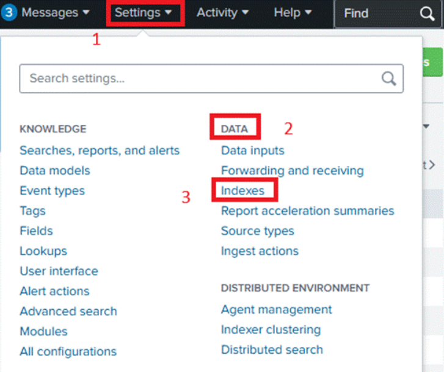

2. Click **New Index** and fill in:

| Field | Value |
|---|---|
| Index Name | `windows` |
| Index Data Type | Events |
| Max Size | `10240` MB (adjust for disk) |
| Other paths | leave default |

3. Click **Save**.

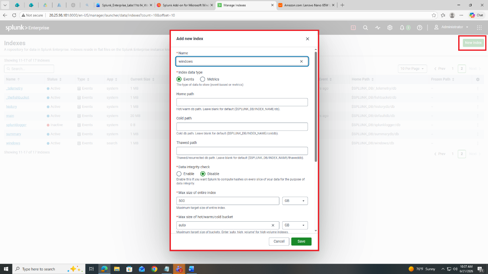

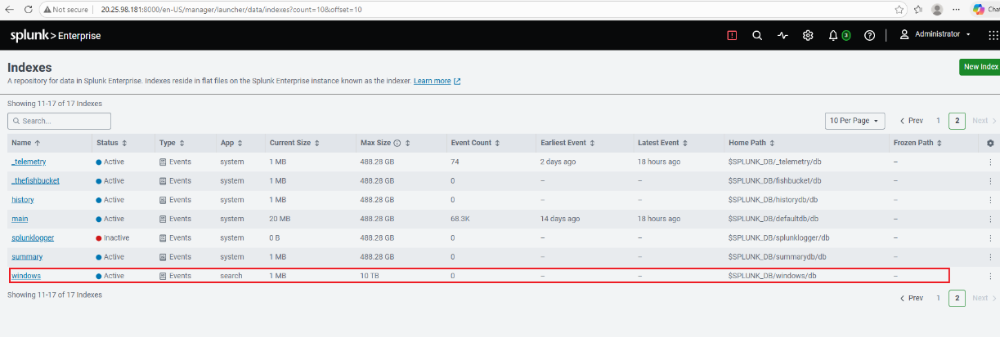

**✅ Checkpoint:** The `windows` index appears with Active status.

---

## Task 2 — Create and Connect to a Windows VM (RDP)

4. In Azure Cloud Shell, create a Windows Server 2022 VM (use your own resource group and a strong password):

```bash
az vm create \
  --resource-group <your-resource-group> \
  --name windows-log-source \
  --image Win2022Datacenter \
  --size Standard_B2s \
  --admin-username winadmin \
  --admin-password "<your-strong-password>" \
  --public-ip-sku Standard \
  --output table
```

5. Open RDP (port 3389):

```bash
az vm open-port --resource-group <your-resource-group> --name windows-log-source --port 3389
```

6. Connect via RDP (Windows: `Win+R` → `mstsc` → enter the VM's public IP). Log in with the credentials you set.

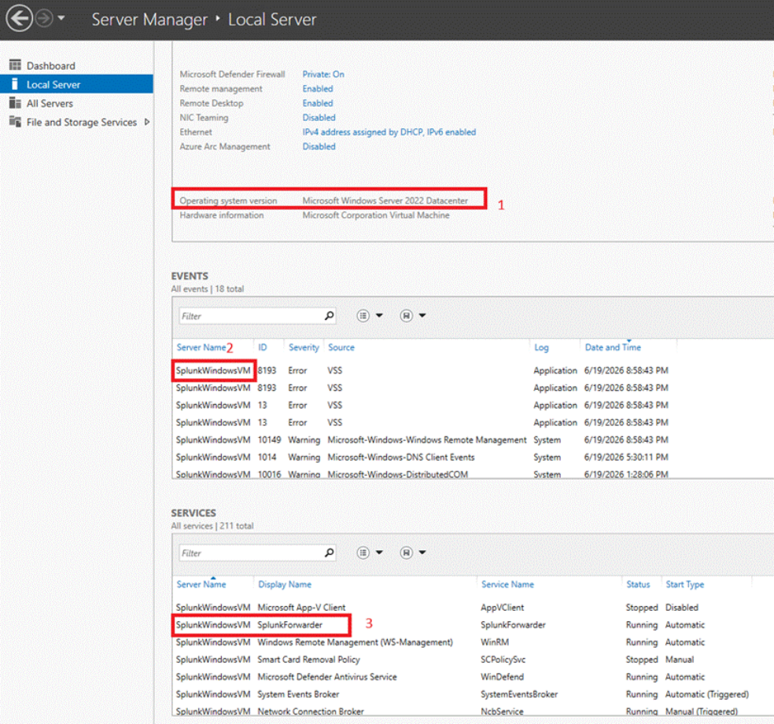

**✅ Checkpoint:** The Windows Server 2022 desktop appears in your RDP session.

---

## Task 3 — Download the Universal Forwarder

7. Inside the RDP session, open a browser and go to [splunk.com/en_us/download/universal-forwarder.html](https://www.splunk.com/en_us/download/universal-forwarder.html).
8. Log in, download the **Windows 64-bit MSI**, and save it to Downloads.

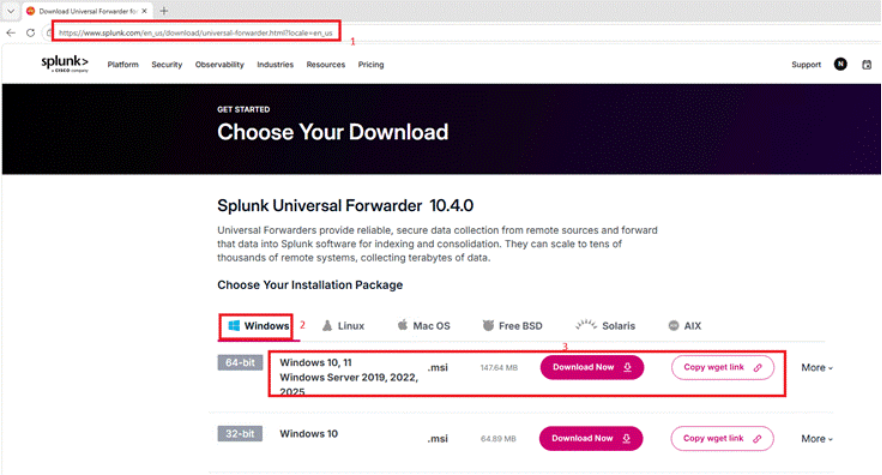

**✅ Checkpoint:** `splunkforwarder-9.x.x-windows-x64.msi` is in `C:\Users\winadmin\Downloads\`.

---

## Task 4 — Silent Install with Deployment Server Config

This installs the forwarder *and* points it at both the indexer and the Deployment Server in one command — the enterprise-standard automated method.

9. Open **Command Prompt as Administrator** and go to Downloads:

```cmd
cd %USERPROFILE%\Downloads
```

10. Run the silent install (replace `<SPLUNK_IP>` and the password):

```cmd
msiexec.exe /i splunkforwarder-9.*-x64-release.msi ^
  AGREETOLICENSE=Yes ^
  RECEIVING_INDEXER="<SPLUNK_IP>:9997" ^
  DEPLOYMENT_SERVER="<SPLUNK_IP>:8089" ^
  SPLUNKUSERNAME=admin ^
  SPLUNKPASSWORD=<your-password> ^
  LAUNCHSPLUNK=1 ^
  SERVICESTARTTYPE=auto ^
  /quiet
```

| Parameter | What it does |
|---|---|
| `RECEIVING_INDEXER` | Where log data goes (indexer:9997) |
| `DEPLOYMENT_SERVER` | Which server manages this forwarder (DS:8089) |
| `SERVICESTARTTYPE=auto` | Start on Windows boot |
| `/quiet` | No dialog boxes |

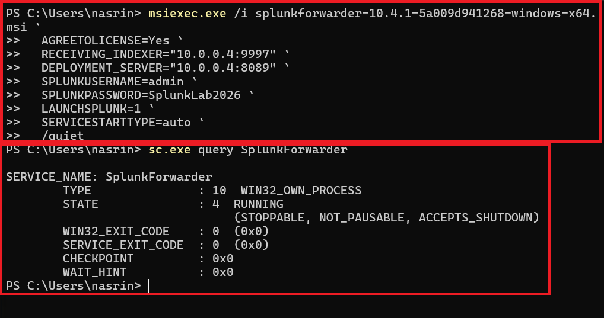

> 📌 The forwarder installs to `C:\Program Files\SplunkUniversalForwarder\`. The Deployment Server address is stored in `...\etc\system\local\deploymentclient.conf`.

**✅ Checkpoint:** The command completes and the SplunkForwarder service is running.

---

## Task 5 — Allow Outbound 8089 and 9997 in the Windows Firewall

The forwarder needs outbound 8089 (to the Deployment Server) and 9997 (to the indexer). The installer usually opens these, but verify:

11. In the Admin Command Prompt:

```cmd
netsh advfirewall firewall add rule name="Splunk UF to DS port 8089" dir=out protocol=tcp remoteport=8089 action=allow
netsh advfirewall firewall add rule name="Splunk UF to IDX port 9997" dir=out protocol=tcp remoteport=9997 action=allow
```

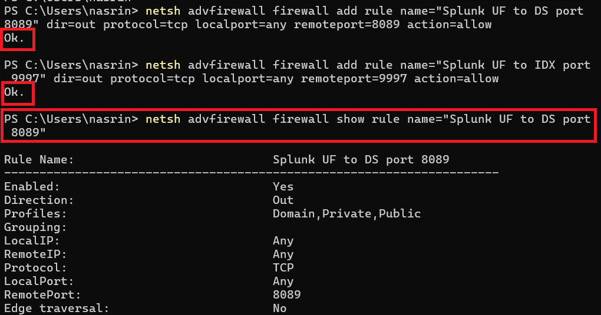

Or check in the GUI (`wf.msc` → Outbound Rules):

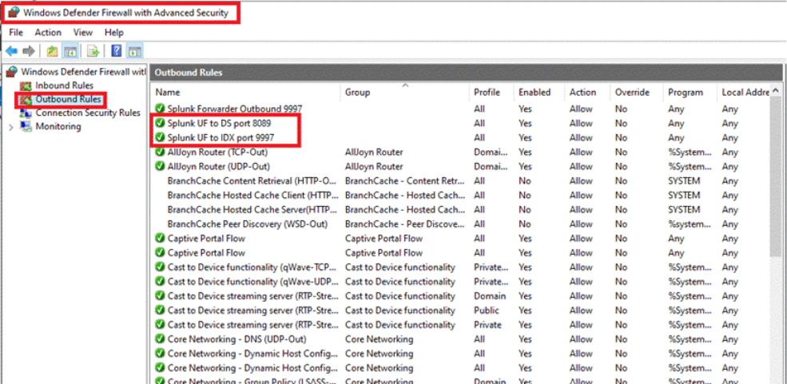

**✅ Checkpoint:** Both Splunk outbound rules show Allow.

---

## Task 6 — Confirm the Forwarder Service

12. Check the service:

```cmd
sc query SplunkForwarder
```

Look for `STATE : 4 RUNNING`. Or check `services.msc` — status Running, startup Automatic.

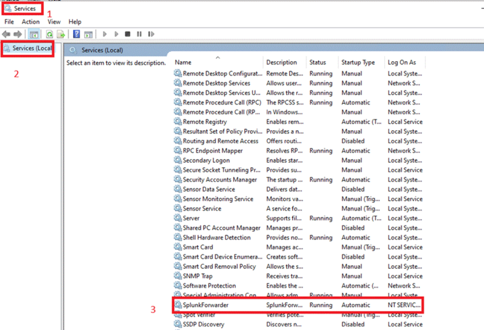

> 💡 If stopped: `sc start SplunkForwarder`. To restart: `sc stop SplunkForwarder && sc start SplunkForwarder`.

**✅ Checkpoint:** `SplunkForwarder` shows RUNNING.

---

## Task 7 — Test Connectivity to Splunk

13. From the Windows VM (PowerShell), test both ports (replace IP):

```powershell
Test-NetConnection -ComputerName <SPLUNK_IP> -Port 9997
Test-NetConnection -ComputerName <SPLUNK_IP> -Port 8089
```

Both should show `TcpTestSucceeded : True`.

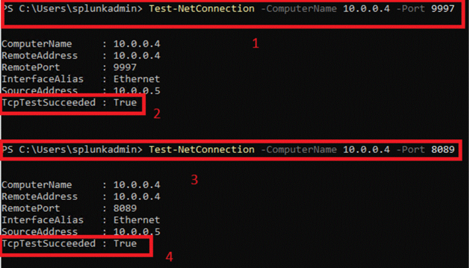

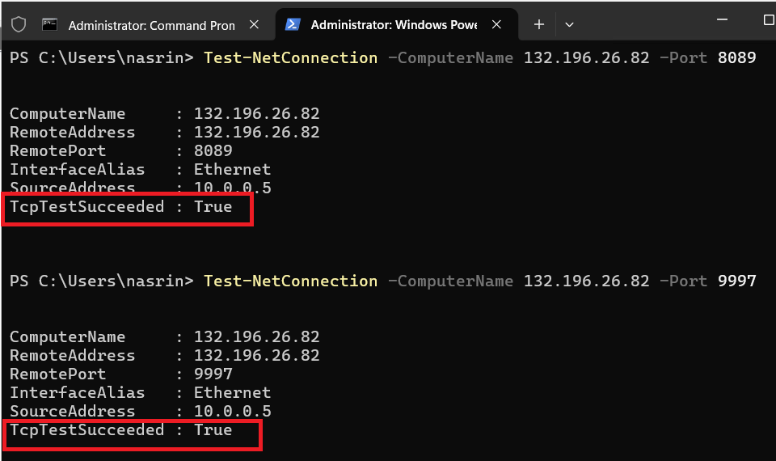

> ⚠️ If either shows False, stop and fix it first: check the Azure NSG allows 8089/9997 inbound, UFW allows them on the Splunk VM, and Splunk is running.

**✅ Checkpoint:** Both ports return `TcpTestSucceeded : True`.

---

## Task 8 — Install the Splunk Add-on for Windows (on the Server)

This add-on provides the field extractions that make Windows Event Log data properly parsed. Install it on the **Splunk server**, not the Windows VM.

14. In Splunk Web → **Apps → Find More Apps** → search **Splunk Add-on for Microsoft Windows** → Install. Don't restart yet.

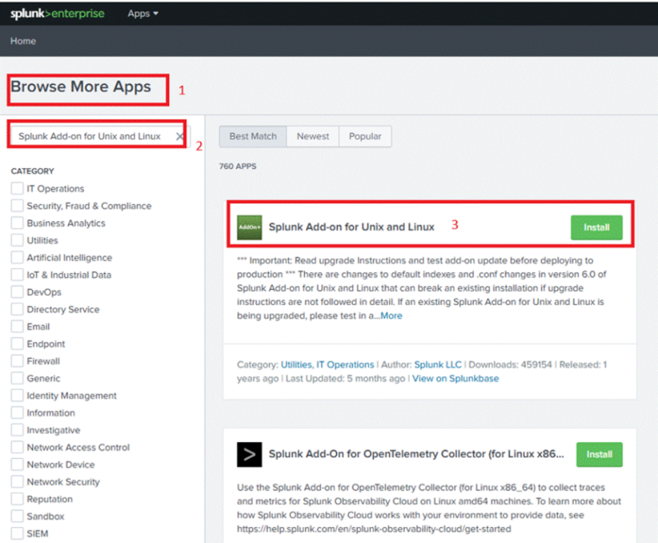

Or via CLI on the Splunk VM:

```bash
sudo /opt/splunk/bin/splunk install app /path/to/splunk-add-on-for-microsoft-windows_*.tgz -auth admin:<your-password>
```

**✅ Checkpoint:** `Splunk_TA_windows` appears in Manage Apps.

---

## Task 9 — Create a Server Class

A **server class** tells the Deployment Server which apps go to which forwarders.

15. **Settings → Deployment Server / Forwarder Management**. If prompted, click **Get Started**.

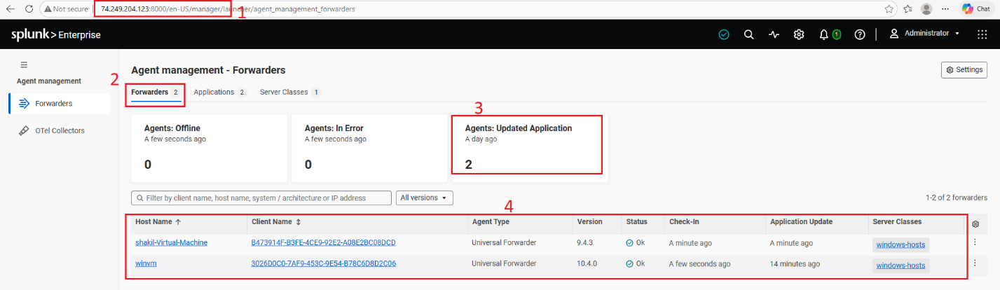

16. Click **New Server Class**:

| Field | Value |
|---|---|
| Name | `windows-hosts` |
| Description | Windows endpoints sending Event Log data |

17. Click **Save** (you'll add apps and clients in Task 12).

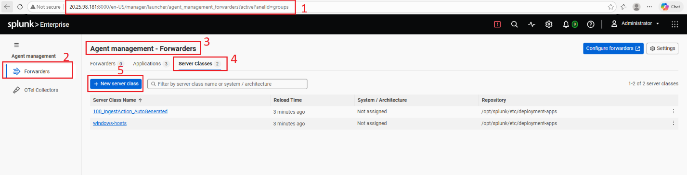

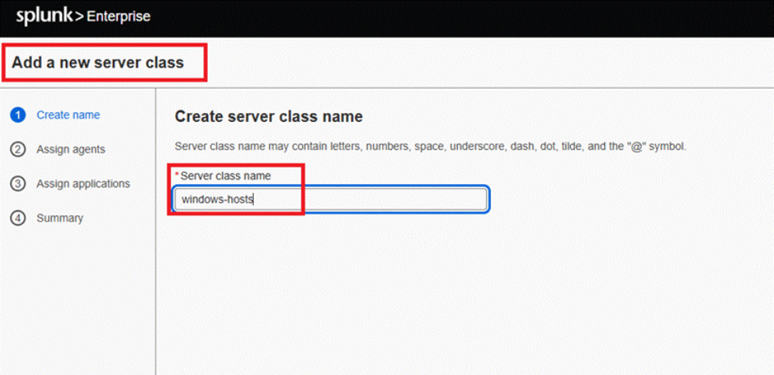

**✅ Checkpoint:** The `windows-hosts` server class appears.

---

## Task 10 — Create the Input App (what to collect)

An **input app** is a small app containing one `inputs.conf` — it tells forwarders which Windows Event Log channels to collect.

18. SSH into the Splunk Ubuntu VM and create the app structure:

```bash
sudo mkdir -p /opt/splunk/etc/deployment-apps/windows_inputs/default
sudo mkdir -p /opt/splunk/etc/deployment-apps/windows_inputs/metadata
```

19. Create `inputs.conf`:

```bash
sudo tee /opt/splunk/etc/deployment-apps/windows_inputs/default/inputs.conf << 'EOF'
[WinEventLog://Security]
disabled = false
index = windows
start_from = oldest
current_only = 0
checkpointInterval = 5

[WinEventLog://System]
disabled = false
index = windows
start_from = oldest
current_only = 0
checkpointInterval = 5

[WinEventLog://Application]
disabled = false
index = windows
start_from = oldest
current_only = 0
checkpointInterval = 5
EOF
```

Key settings: the three `[WinEventLog://...]` stanzas collect Security, System, and Application channels; `index = windows` sends them to your dedicated index; `checkpointInterval = 5` saves progress so events aren't re-read after a restart.

20. Create the metadata file and set ownership:

```bash
sudo tee /opt/splunk/etc/deployment-apps/windows_inputs/metadata/default.meta << 'EOF'
[]
access = read : [ * ], write : [ admin ]
export = system
EOF
sudo chown -R splunk:splunk /opt/splunk/etc/deployment-apps/windows_inputs
```

**✅ Checkpoint:** `windows_inputs/default/inputs.conf` exists.

---

## Task 11 — Create the Output App (where to send it)

The **output app** contains `outputs.conf` — it tells forwarders which indexer and port to send data to.

21. Create the structure and config (replace `<SPLUNK_IP>`):

```bash
sudo mkdir -p /opt/splunk/etc/deployment-apps/windows_outputs/default
sudo mkdir -p /opt/splunk/etc/deployment-apps/windows_outputs/metadata

sudo tee /opt/splunk/etc/deployment-apps/windows_outputs/default/outputs.conf << 'EOF'
[tcpout]
defaultGroup = splunk_indexer

[tcpout:splunk_indexer]
server = <SPLUNK_IP>:9997
EOF
```

22. Metadata and ownership:

```bash
sudo tee /opt/splunk/etc/deployment-apps/windows_outputs/metadata/default.meta << 'EOF'
[]
access = read : [ * ], write : [ admin ]
export = system
EOF
sudo chown -R splunk:splunk /opt/splunk/etc/deployment-apps/windows_outputs
```

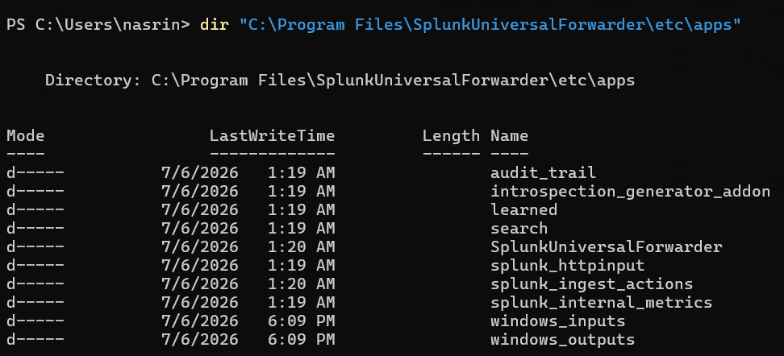

**✅ Checkpoint:** `windows_outputs/default/outputs.conf` exists with your Splunk IP.

---

## Task 12 — Assign Apps and Clients to the Server Class

23. In Splunk Web → **Deployment Server / Forwarder Management** → open the `windows-hosts` server class.
24. In the **Apps** tab, click **Add Apps** and add both `windows_inputs` and `windows_outputs`.

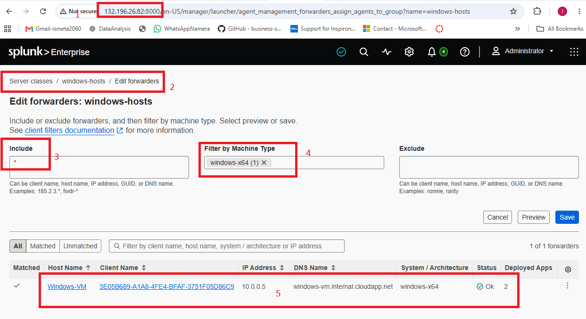

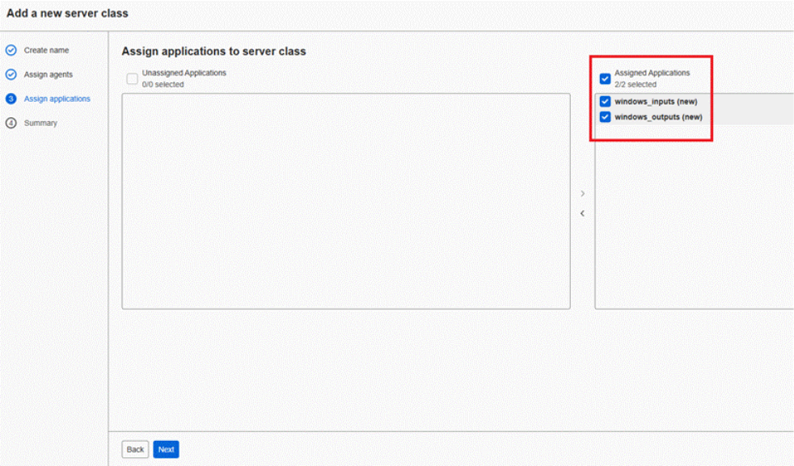

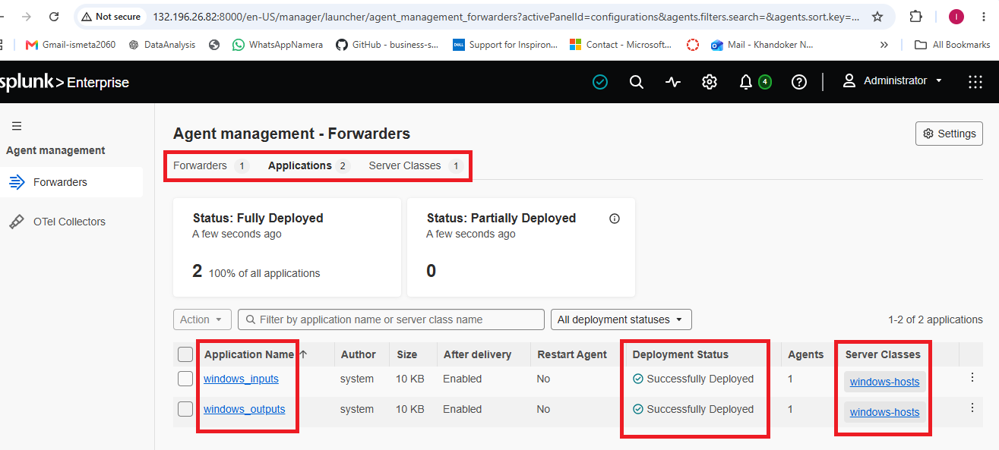

25. In the **Clients** tab, add a filter for which forwarders belong here:

| Field | Value |
|---|---|
| Filter Type | Hostname |
| Hostname Pattern | `*` (all) — or `win-*` to target only Windows |

> 💡 In production, use a specific pattern like `win-*` so Windows apps don't get pushed to Linux hosts.

26. Click **Save**, then **Push / Deploy to clients**.

**✅ Checkpoint:** Both apps are listed, the client filter is set, and the apps were pushed.

---

## Task 13 — Restart Splunk

27. **Settings → Server Controls → Restart Splunk** → OK. Wait 30–60 seconds and log back in.

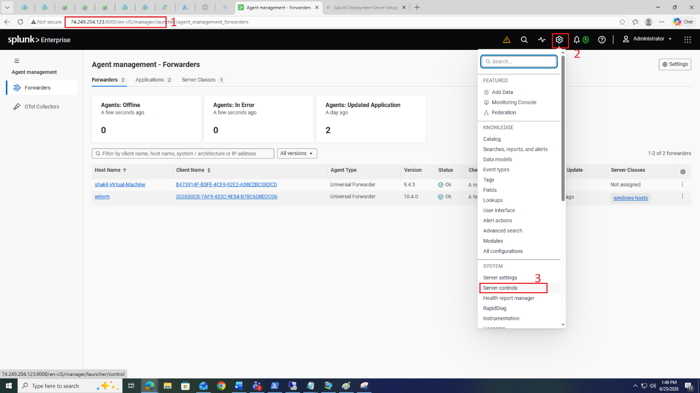

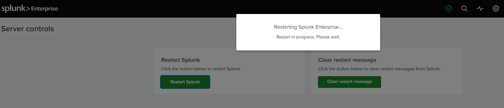

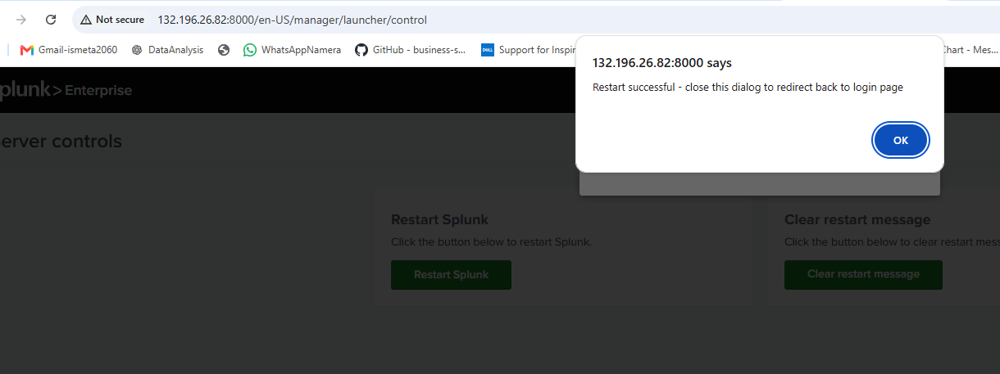

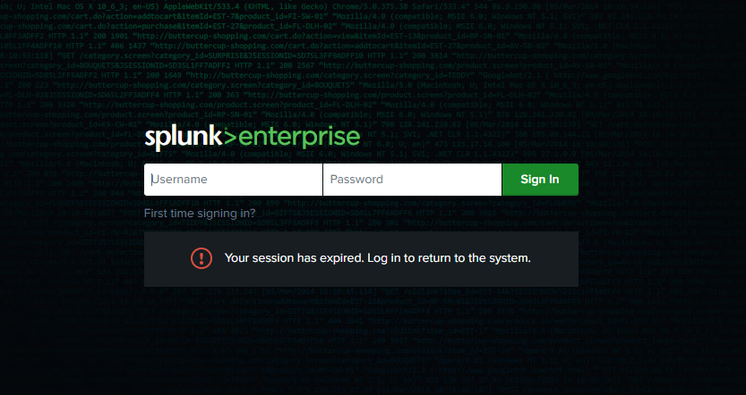

> 💡 Or from the CLI: `sudo systemctl restart Splunkd`.

**✅ Checkpoint:** Splunk restarts and you can log back in.

---

## Task 14 — Verify Logs in the `windows` Index

Give the forwarder 2–5 minutes to receive its config and start sending.

28. In **Search & Reporting**, run:

```
index=windows | head 20
```

Set the time range to Last 15 minutes.

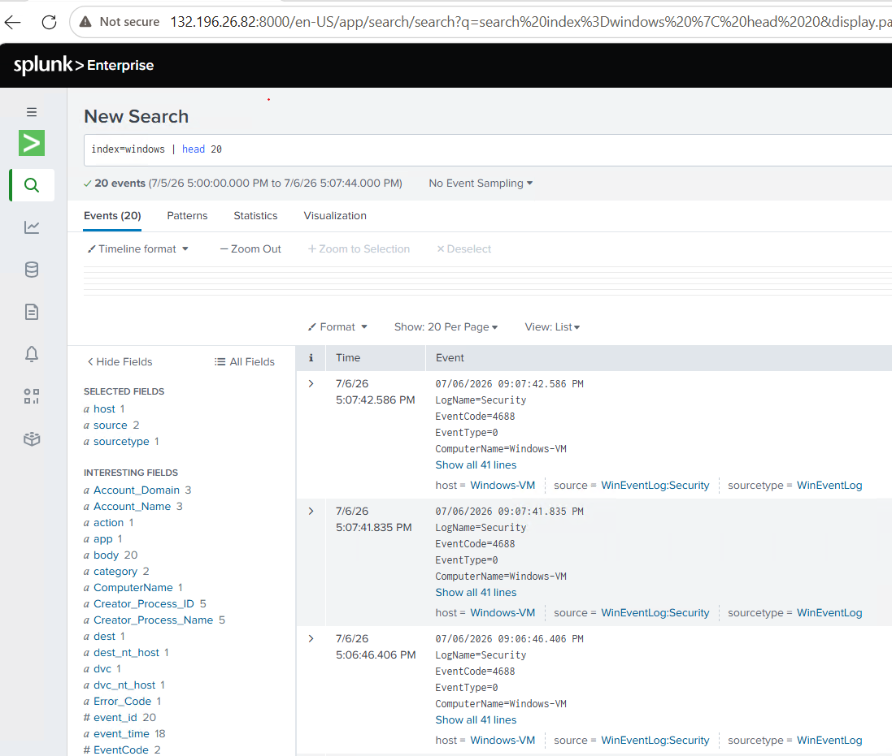

29. Check Security events specifically:

```
index=windows source="WinEventLog:Security" | head 10
```

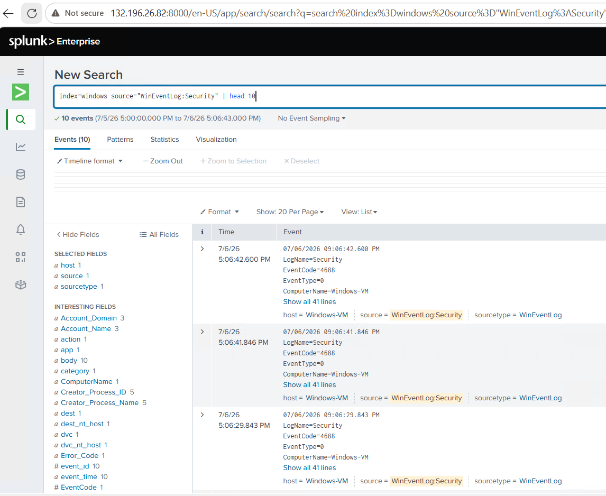

30. Count events per channel:

```
index=windows | stats count by sourcetype | sort -count
```

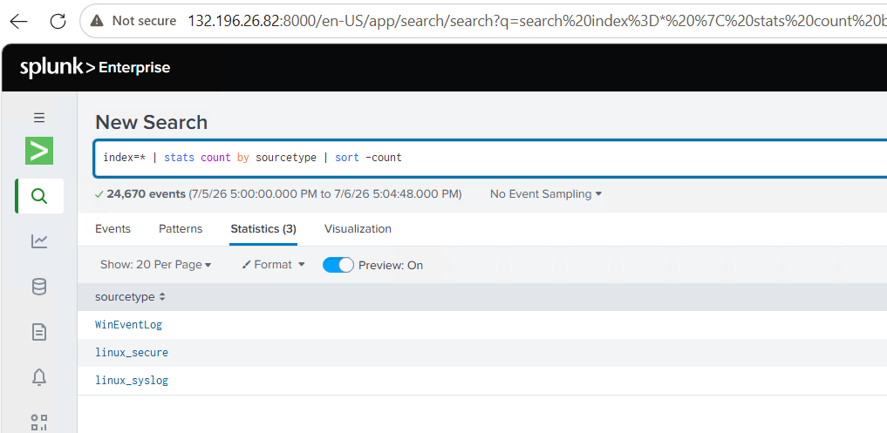

If nothing appears after 5 minutes, check the forwarder pipeline on the Splunk server:

```
index=_internal source="*splunkd.log" (TcpOutputProc OR TcpInputConfig) | head 20
```

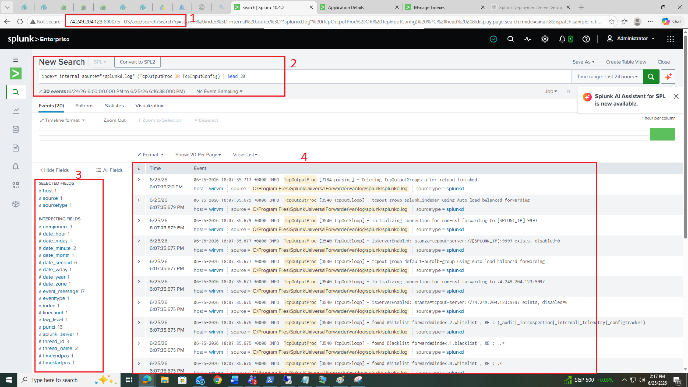

**✅ Checkpoint:** `index=windows` returns events with `sourcetype` = `WinEventLog:Security/System/Application` and the `host` field showing your Windows VM.

---

## 🛠️ Troubleshooting

| Problem | Fix |
|---|---|
| No events after 5 min | Check the forwarder service is running, the reachability test passes (Task 7), and the DS actually pushed the apps |
| Events in wrong index | Confirm `index = windows` in inputs.conf, then re-push from the Deployment Server |
| Only old events | Normal — `start_from = oldest` replays historical events first |
| Forwarder not getting apps | Confirm the client filter matches the forwarder's hostname |

---

## 🧠 Conclusion — What You Learned

This lab is the enterprise architecture the whole series was building toward.

**About Centralized Management**
- A Deployment Server manages forwarder config from one place — no per-machine editing
- Server classes map apps to groups of endpoints, like a policy
- Input apps (what to collect) and output apps (where to send) are pushed together

**About Enterprise Splunk**
- Dedicated indexes (`windows`) keep data organized and allow separate retention
- Silent MSI install with DS settings is how you'd deploy to many machines at once
- The same pattern scales from one forwarder to thousands

**Why This Matters**
- This is how Splunk is actually run in production — the single most job-relevant lab in the series
- Understanding server classes and deployment apps is a core Splunk admin skill interviewers ask about

---

## ✅ Verify Before Moving On

- [ ] The `windows` index exists and is Active
- [ ] The forwarder installed with DS + indexer settings and is Running
- [ ] Both connectivity tests (9997 and 8089) return True
- [ ] The server class has both input and output apps assigned and pushed
- [ ] `index=windows` shows live Windows Event Log events

---

**Next:** [Lab 14 →](../lab-14/)

[← Back to lab index](../README.md)

---

## 👤 Author

**Nasrin Ismet**
SOC Analyst & GRC Consultant | M.S. Cybersecurity

*"Find it, prove it, govern it."*

[](https://www.linkedin.com/in/kismetara/)
[](https://github.com/ismet60)

⭐ *Star this repo if it helped*

