# 🐧 Lab 14 — Centralized Linux Log Collection with a Deployment Server


> **The Linux half of centralized management.** Lab 13 did this for Windows; this lab does it for Linux — the OS most servers, databases, and web apps run on. A second server class on the same Deployment Server manages Linux forwarders, collecting `/var/log` files into a dedicated `linux` index. Together, Labs 13 and 14 manage a mixed Windows + Linux fleet from one place.

---

## 🎯 Introduction — Centralized Linux Collection

This lab mirrors Lab 13, but for Linux. It's one of the most common Splunk scenarios, because most web servers, databases, and application servers run on Linux.

The workflow is the same — a Deployment Server pushes input and output apps to forwarders in a server class. The **difference is the data source**: instead of Windows Event Log channels, Linux uses text log files in `/var/log/` (like `syslog` and `auth.log`), collected with **monitor** stanzas that watch a file for new lines.

---

## 🏗️ Architecture

```
   ┌──────────────────────────┐              ┌─────────────────────────────┐
   │   Ubuntu Linux VM        │              │   Splunk Enterprise (Ubuntu)│
   │  ──────────────────────  │              │  ─────────────────────────  │
   │  /var/log/syslog         │              │  Deployment Server (8089)   │
   │  /var/log/auth.log       │ ◀── push ────│  pushes input + output apps │
   │  /var/log/kern.log       │    apps      │                             │
   │         │                │              │  Indexer (9997)             │
   │  Universal Forwarder     │ ── log data ─▶  stores in → index=linux    │
   └──────────────────────────┘   (9997)     └─────────────────────────────┘

   Same Deployment Server as Lab 13 → now manages BOTH
   windows-hosts and linux-hosts server classes.
```

---

## 🎓 Learning Objectives

After this lab, you will be able to:

- Create a dedicated `linux` index
- Install the Universal Forwarder on a Linux endpoint with Deployment Server settings
- Install the Splunk Add-on for Unix and Linux on the server
- Build a Linux server class with input and output apps
- Verify Linux logs flow into the `linux` index — including a live login test

**Prerequisites:** Labs 1–3, Lab 12 (ports open), and Lab 13 (Deployment Server workflow).

---

## Task 1 — Create the `linux` Index

1. In Splunk Web → **Settings → Indexes → New Index**:

| Field | Value |
|---|---|
| Index Name | `linux` |
| Data Type | Events |
| Max Size | `10240` MB |

2. Save and confirm it shows Active.

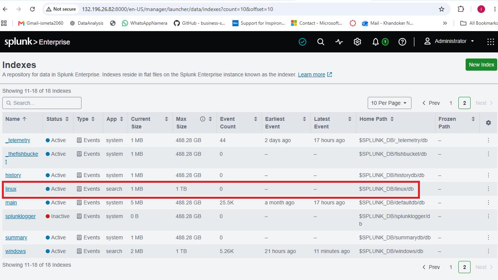

**✅ Checkpoint:** The `linux` index appears with Active status.

---

## Task 2 — Create and Connect to a Linux VM (SSH)

3. In Azure Cloud Shell, create a second Ubuntu VM as the log source:

```bash
az vm create \
  --resource-group <your-resource-group> \
  --name linux-log-source \
  --image Ubuntu2204 \
  --size Standard_B1s \
  --admin-username linuxadmin \
  --generate-ssh-keys \
  --public-ip-sku Standard \
  --output table
```

4. Open SSH (port 22):

```bash
az vm open-port --resource-group <your-resource-group> --name linux-log-source --port 22
```

5. SSH in and update:

```bash
ssh linuxadmin@<LINUX_VM_IP>
sudo apt update && sudo apt upgrade -y
```

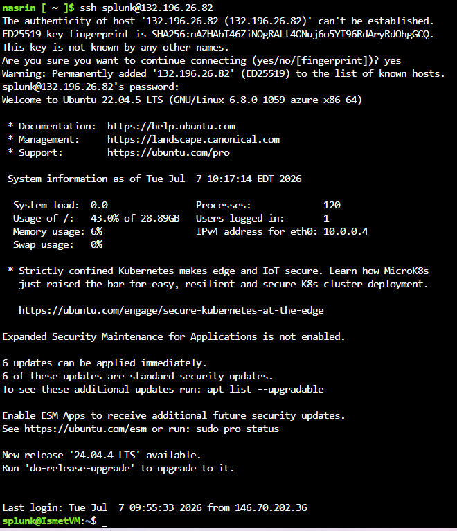

**✅ Checkpoint:** SSH connects and you have a shell prompt.

---

## Task 3 — Download the Universal Forwarder

6. On the Linux VM, download the Linux 64-bit `.tgz`. Get the exact URL (with your token) from the [Splunk download page](https://www.splunk.com/en_us/download/universal-forwarder.html) → "Download via Command Line (wget)":

```bash
wget -O /tmp/splunkforwarder-linux.tgz "<paste-splunk-url-here>"
ls -lh /tmp/splunkforwarder-linux.tgz
```

**✅ Checkpoint:** The `.tgz` (~20–30 MB) is in `/tmp/`.

---

## Task 4 — Install with Deployment Server Config

7. Create a dedicated forwarder user, extract, and set ownership:

```bash
sudo useradd -m -s /bin/bash splunkfwd
sudo tar -xvzf /tmp/splunkforwarder-linux.tgz -C /opt/
sudo chown -R splunkfwd:splunkfwd /opt/splunkforwarder
```

8. Switch to the forwarder user and start it (set admin credentials when prompted):

```bash
sudo su - splunkfwd
/opt/splunkforwarder/bin/splunk start --accept-license
```

9. Point it at the Deployment Server (replace IP and password):

```bash
/opt/splunkforwarder/bin/splunk set deploy-poll <SPLUNK_IP>:8089 -auth admin:<UF_ADMIN_PASSWORD>
/opt/splunkforwarder/bin/splunk restart
exit
```

10. Enable start-on-boot:

```bash
sudo /opt/splunkforwarder/bin/splunk enable boot-start -user splunkfwd --accept-license --answer-yes --no-prompt
```

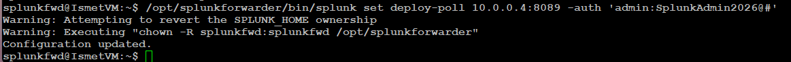

11. Verify the Deployment Server config was written:

```bash
cat /opt/splunkforwarder/etc/system/local/deploymentclient.conf
```

You should see `targetUri = <SPLUNK_IP>:8089`.

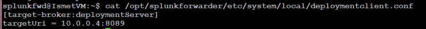

**✅ Checkpoint:** The forwarder starts, boot-start is enabled, and `deploymentclient.conf` points at your DS.

---

## Task 5 — Allow Outbound 8089 and 9997 (ufw)

12. The forwarder needs **outbound** rules (it initiates the connections):

```bash
sudo ufw allow out 8089/tcp
sudo ufw allow out 9997/tcp
```

If ufw isn't enabled (allow SSH first):

```bash
sudo ufw allow 22/tcp
sudo ufw enable
sudo ufw status verbose
```

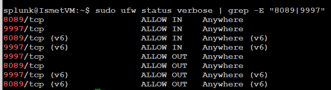

> 📌 Note: the Splunk server needed *inbound* rules on these ports; the forwarder needs *outbound*, because it's the one connecting out. In many environments outbound is already allowed, so no change is needed.

**✅ Checkpoint:** ufw shows outbound 8089 and 9997.

---

## Task 6 — Confirm the Forwarder Is Running

13. Check the service:

```bash
sudo systemctl status SplunkForwarder
sudo -u splunkfwd /opt/splunkforwarder/bin/splunk status
```

Look for `active (running)` and `splunkd is running`.

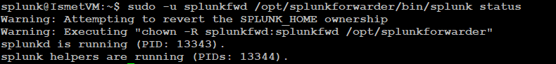

**✅ Checkpoint:** The forwarder shows active/running.

---

## Task 7 — Test Connectivity to Splunk

14. Test both ports (replace IP):

```bash
nc -zv <SPLUNK_IP> 9997
nc -zv <SPLUNK_IP> 8089
```

Both should say "succeeded." If `nc` is missing: `sudo apt install netcat-openbsd -y`.

An alternative check for 8089:

```bash
curl -sk https://<SPLUNK_IP>:8089/services/server/info -o /dev/null -w "%{http_code}"
```

`200` or `401` both mean the port is reachable (401 = auth required, which is fine).

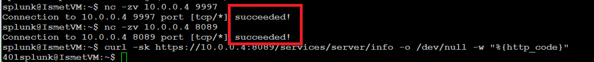

**✅ Checkpoint:** Both 9997 and 8089 report success.

---

## Task 8 — Install the Splunk Add-on for Unix and Linux (on the Server)

This add-on provides field extractions for Linux log formats. Install it on the **Splunk server**.

15. Splunk Web → **Apps → Find More Apps** → search **Splunk Add-on for Unix and Linux** → Install. Don't restart yet.

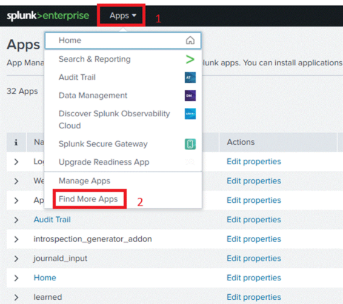

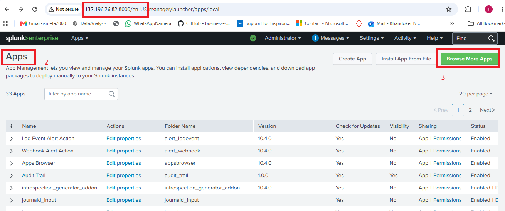

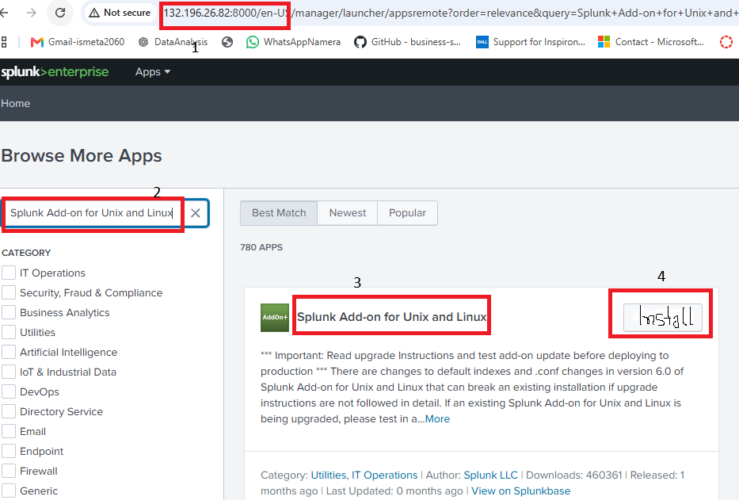

**✅ Checkpoint:** `Splunk_TA_nix` appears in Manage Apps.

---

## Task 9 — Create the `linux-hosts` Server Class

16. Splunk Web → **Settings → Deployment Server** → **New Server Class**:

| Field | Value |
|---|---|
| Name | `linux-hosts` |
| Description | Linux endpoints sending syslog and system logs |

17. Save.

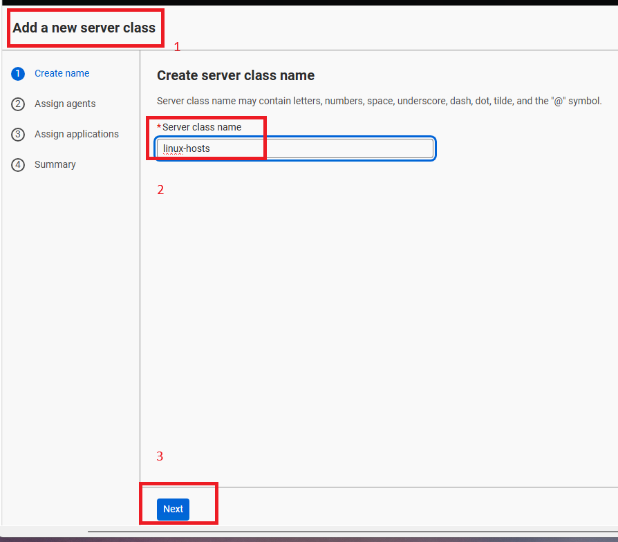

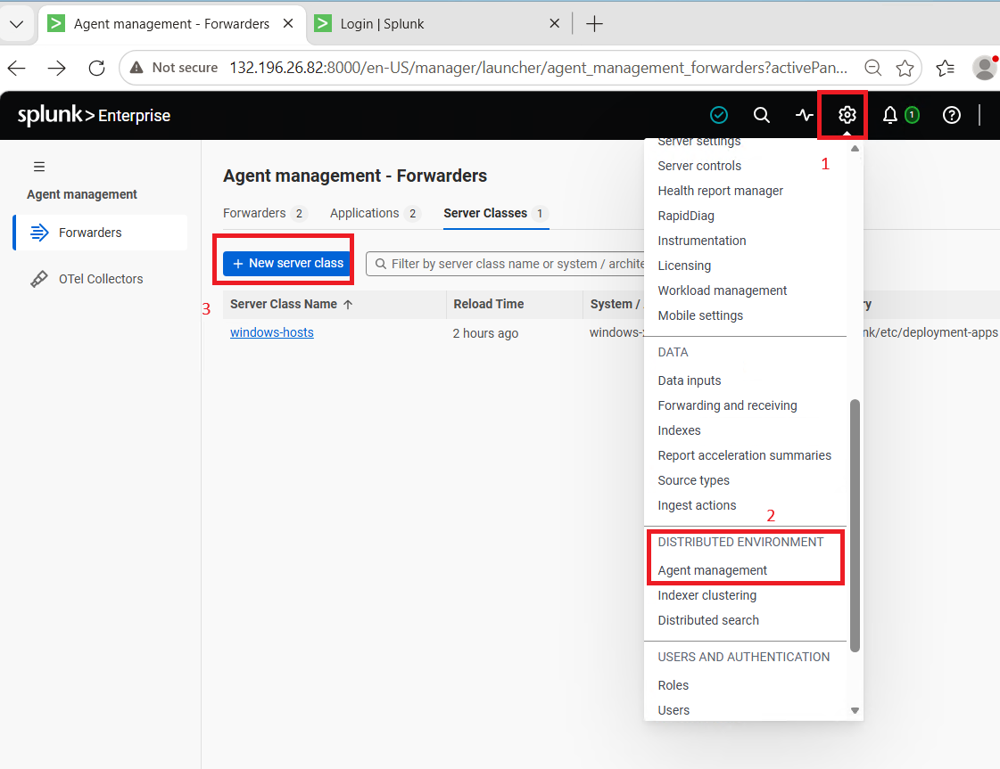

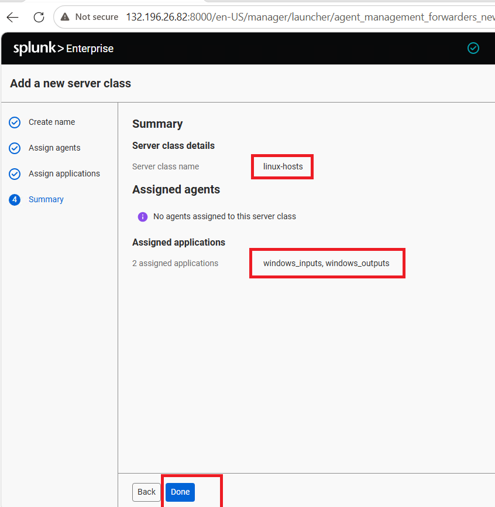

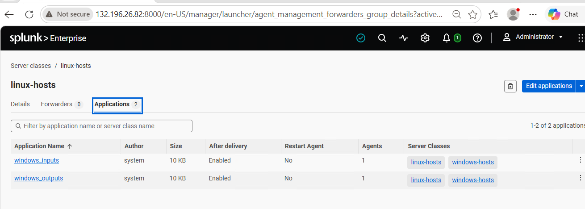

**✅ Checkpoint:** `linux-hosts` appears alongside `windows-hosts` from Lab 13.

---

## Task 10 — Create the Input App (what to collect)

18. SSH into the Splunk server and create the app:

```bash
sudo mkdir -p /opt/splunk/etc/deployment-apps/linux_inputs/default
sudo mkdir -p /opt/splunk/etc/deployment-apps/linux_inputs/metadata

sudo tee /opt/splunk/etc/deployment-apps/linux_inputs/default/inputs.conf << 'EOF'
[monitor:///var/log/syslog]
disabled = false
index = linux
sourcetype = syslog

[monitor:///var/log/auth.log]
disabled = false
index = linux
sourcetype = linux_secure

[monitor:///var/log/kern.log]
disabled = false
index = linux
sourcetype = linux_messages_syslog

[monitor:///var/log/dpkg.log]
disabled = false
index = linux
sourcetype = dpkg
EOF
```

What each monitors: **syslog** (general system messages), **auth.log** (SSH logins, sudo, PAM), **kern.log** (kernel/hardware), **dpkg.log** (software install/remove — a package audit trail). All route to `index = linux`.

19. Metadata and ownership:

```bash
sudo tee /opt/splunk/etc/deployment-apps/linux_inputs/metadata/default.meta << 'EOF'
[]
access = read : [ * ], write : [ admin ]
export = system
EOF
sudo chown -R splunk:splunk /opt/splunk/etc/deployment-apps/linux_inputs
```

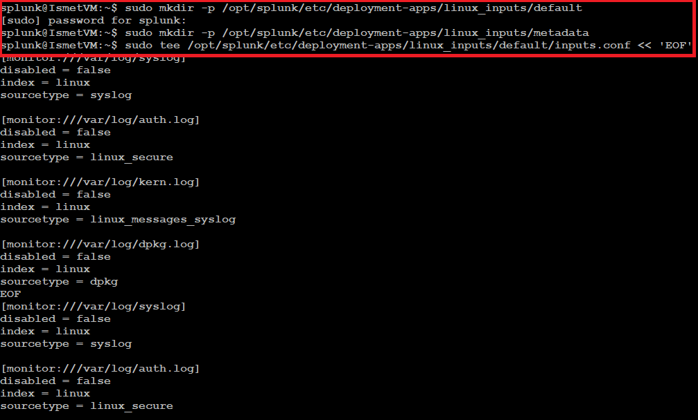

**✅ Checkpoint:** `linux_inputs/default/inputs.conf` exists.

---

## Task 11 — Create the Output App (where to send it)

20. Create the app (replace `<SPLUNK_IP>`):

```bash
sudo mkdir -p /opt/splunk/etc/deployment-apps/linux_outputs/default
sudo mkdir -p /opt/splunk/etc/deployment-apps/linux_outputs/metadata

sudo tee /opt/splunk/etc/deployment-apps/linux_outputs/default/outputs.conf << 'EOF'
[tcpout]
defaultGroup = splunk_indexer

[tcpout:splunk_indexer]
server = <SPLUNK_IP>:9997
EOF

sudo tee /opt/splunk/etc/deployment-apps/linux_outputs/metadata/default.meta << 'EOF'
[]
access = read : [ * ], write : [ admin ]
export = system
EOF
sudo chown -R splunk:splunk /opt/splunk/etc/deployment-apps/linux_outputs
```

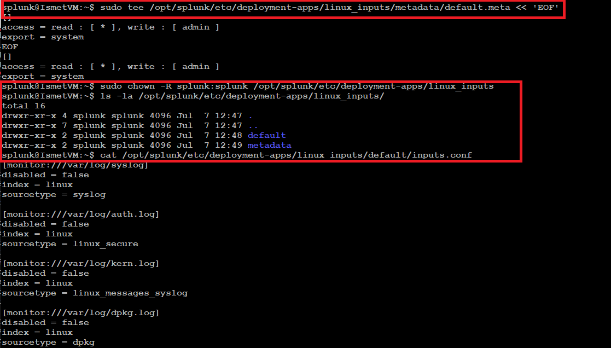

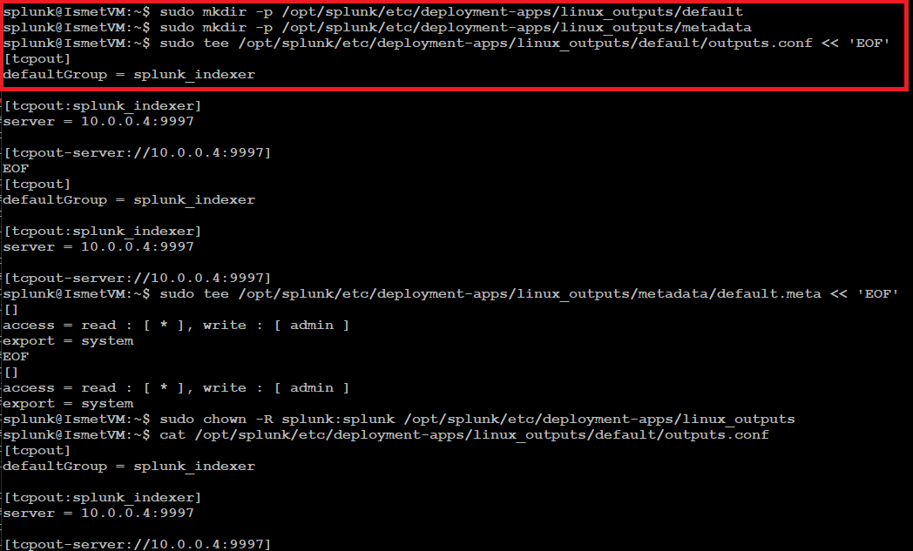

**✅ Checkpoint:** `linux_outputs/default/outputs.conf` exists with your Splunk IP.

---

## Task 12 — Assign Apps and Clients

21. Splunk Web → **Deployment Server** → open `linux-hosts`.
22. **Apps** tab → **Add Apps** → add `linux_inputs` and `linux_outputs`.
23. **Clients** tab → add a hostname filter: `*` (all) or `linux-log-source`.
24. **Save**, then **Deploy to clients**.

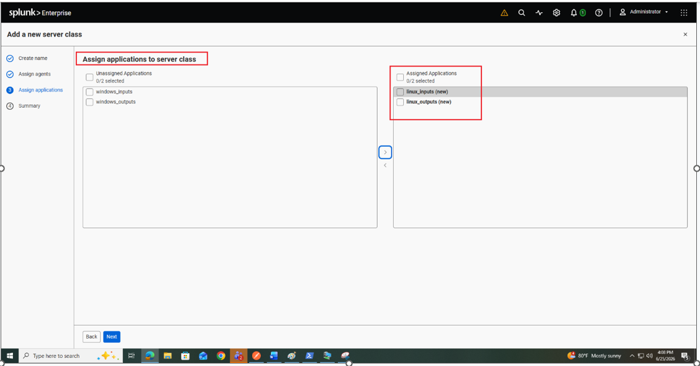

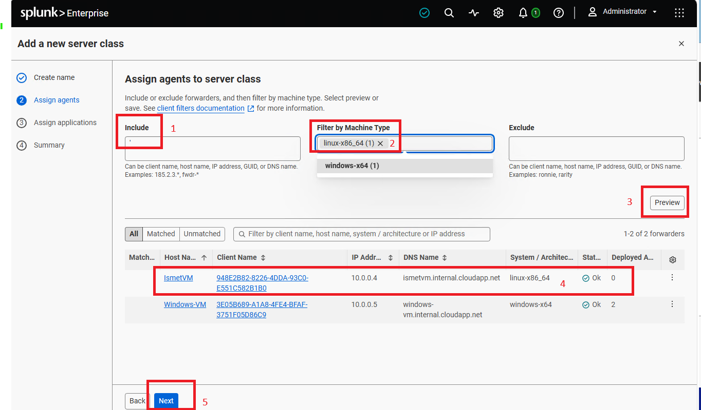

25. Verify on the Linux VM that the apps arrived (1–2 min):

```bash
ls /opt/splunkforwarder/etc/apps/
```

You should see `linux_inputs` and `linux_outputs`.

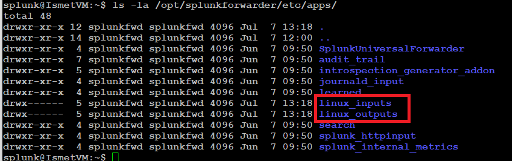

**✅ Checkpoint:** Both apps are assigned, pushed, and now present on the forwarder.

---

## Task 13 — Restart Splunk

26. **Settings → Server Controls → Restart Splunk** → OK. Wait 30–60 seconds and log back in.

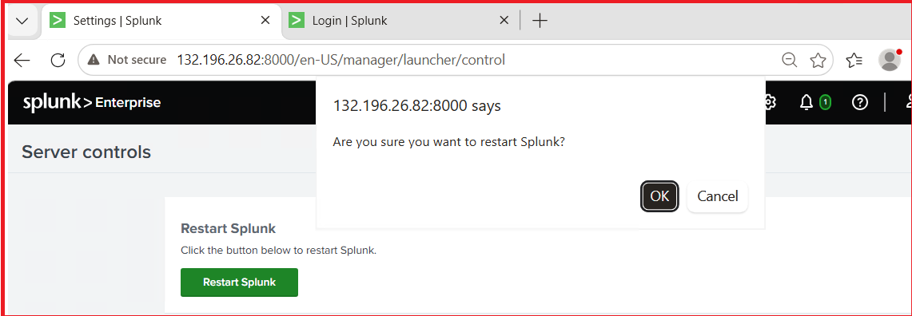

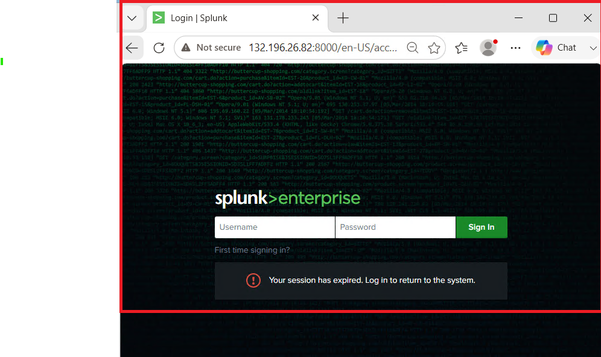

**✅ Checkpoint:** Splunk restarts and you can log in.

---

## Task 14 — Verify Logs in the `linux` Index

27. In **Search & Reporting** (set time range to Last 15 minutes):

```
index=linux | head 20
```

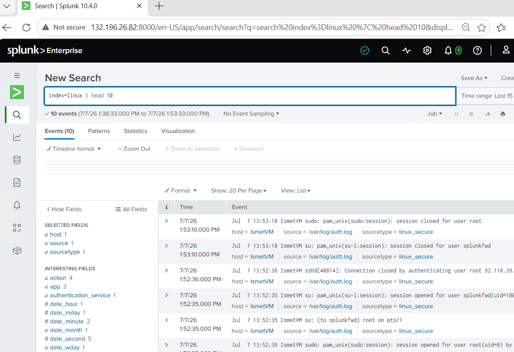

28. Check authentication events:

```
index=linux sourcetype=linux_secure | head 10
```

29. Count events per source:

```
index=linux | stats count by sourcetype | sort -count
```

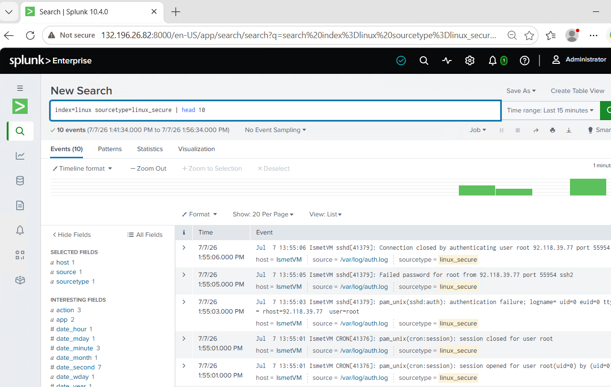

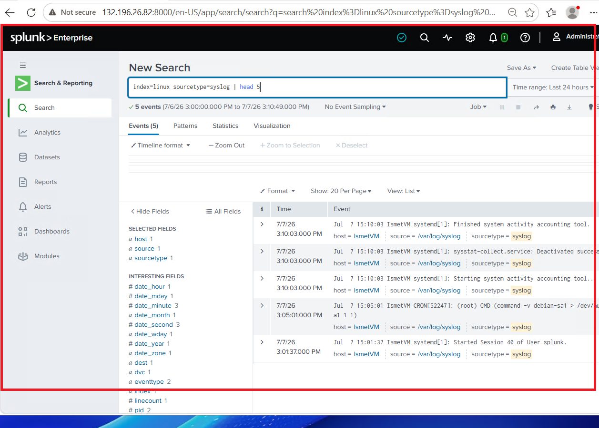

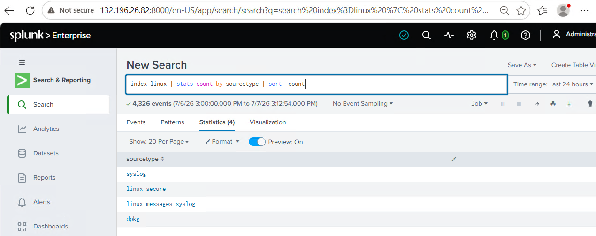

30. **Live test** — prove real-time collection. Open a new terminal, SSH into the Linux VM again (this creates an auth event), then in Splunk search for it:

```
index=linux sourcetype=linux_secure "Accepted" | head 5
```

You should see the event recording your SSH login — captured live.

**✅ Checkpoint:** `index=linux` shows events, `host` is your Linux VM, and your live SSH login appears in the results.

---

## 🛠️ Troubleshooting

| Problem | Fix |
|---|---|
| No events after 5 min | Check forwarder status and that apps deployed (`ls /opt/splunkforwarder/etc/apps/`) |
| Events in wrong index | Confirm `index = linux` in inputs.conf, re-push from the DS |
| "Could not connect to deployment server" | Verify reachability (Task 7) and that 8089 is open on both firewalls |
| Forwarder can't read `/var/log` files | Grant read access: `sudo chmod o+r /var/log/syslog /var/log/auth.log` |

---

## 🧠 Conclusion — What You Learned

With Labs 13 and 14 done, you can centrally manage a **mixed fleet** — Windows and Linux — from one Deployment Server.

**About Linux Collection at Scale**
- Linux uses `monitor` stanzas on `/var/log` files, not Event Log channels
- The same DS runs multiple server classes (`windows-hosts`, `linux-hosts`) side by side
- A dedicated `linux` index keeps Linux data separate and independently searchable

**About the Full Picture**
- One Deployment Server, two server classes, any number of endpoints
- Adding a new Linux server just means it matches the client filter and receives the apps automatically
- The live SSH-login test proves the pipeline works in real time, not just on historical data

**Why This Matters**
- Real environments are mixed Windows + Linux — this proves you can monitor both centrally
- Attackers pivot across operating systems, so unified visibility is a security requirement, not a nicety

---

## ✅ Verify Before Moving On

- [ ] The `linux` index exists and is Active
- [ ] The forwarder installed with DS config and is running
- [ ] Both connectivity tests (9997, 8089) succeed
- [ ] `linux-hosts` server class has both apps assigned and pushed
- [ ] `index=linux` shows events, including your live SSH login test

---

**Next:** [Lab 15 →](../lab-15/)

[← Back to lab index](../README.md)

---

## 👤 Author

**Nasrin Ismet**
SOC Analyst & GRC Consultant | M.S. Cybersecurity

*"Find it, prove it, govern it."*

[](https://www.linkedin.com/in/kismetara/)
[](https://github.com/ismet60)

⭐ *Star this repo if it helped*

