# 📡 Lab 15 — Syslog Collection on Port 514


> **Collecting logs from devices that can't run a forwarder.** Firewalls, routers, and switches don't run the Splunk agent — but they all speak **syslog**. This lab sets up a syslog listener on port 514, works around the Linux privileged-port limit with an iptables redirect, and verifies both local and remote syslog messages arrive in Splunk.

---

## 🎯 Introduction — What Is Syslog?

**Syslog** is the universal standard for sending log messages across a network (RFC 5424). Almost every network device — firewalls, routers, switches — and every Linux/Unix server supports it. It uses **port 514** (UDP by default, or TCP for guaranteed delivery).

Instead of installing a forwarder on every device, you point those devices at a Splunk syslog listener. This is one of the most common ways to get network-infrastructure logs into Splunk.

---

## 🏗️ How Syslog Reaches Splunk

```
   Network devices & servers
   (firewall, router, Linux)
            │
            │  syslog on port 514 (UDP/TCP)
            ▼
   ┌──────────────────────────────────┐
   │  Ubuntu firewall + Azure NSG      │  allow 514
   └──────────────────────────────────┘
            │
            ▼
   ┌──────────────────────────────────┐
   │  iptables: 514 ──▶ 5514           │  (privileged-port workaround)
   └──────────────────────────────────┘
            │
            ▼
   ┌──────────────────────────────────┐
   │  Splunk listener on 5514          │
   │  sourcetype = syslog              │
   └──────────────────────────────────┘
```

> **Why the redirect?** On Linux, ports below 1024 (like 514) need root. Splunk runs as the non-root `splunk` user, so it can't bind 514 directly. The fix: Splunk listens on **5514**, and iptables redirects 514 → 5514.

---

## 🎓 Learning Objectives

After this lab, you will be able to:

- Configure a UDP and TCP syslog listener in Splunk
- Open port 514 on the host firewall and Azure NSG
- Explain why port 514 needs special handling on Linux
- Test ingestion with the `logger` command
- Search and verify syslog data in Splunk

---

## Task 1 — Open Port 514 on Both Firewalls

**Host firewall (UFW):**

```bash
sudo ufw allow 514/udp
sudo ufw allow 514/tcp
sudo ufw status verbose | grep 514
```

**Azure NSG** (use your own resource group and NSG name):

```bash
az network nsg rule create \
  --resource-group <your-resource-group> \
  --nsg-name <your-nsg-name> \
  --name Allow-Syslog-514-UDP \
  --protocol udp --priority 1040 \
  --destination-port-range 514 \
  --access Allow --direction Inbound

az network nsg rule create \
  --resource-group <your-resource-group> \
  --nsg-name <your-nsg-name> \
  --name Allow-Syslog-514-TCP \
  --protocol tcp --priority 1050 \
  --destination-port-range 514 \
  --access Allow --direction Inbound
```

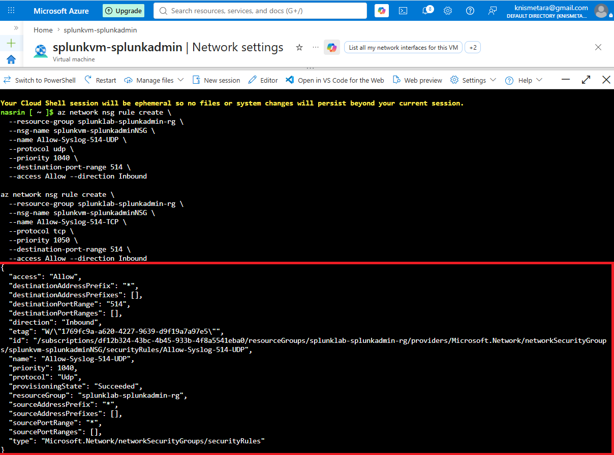

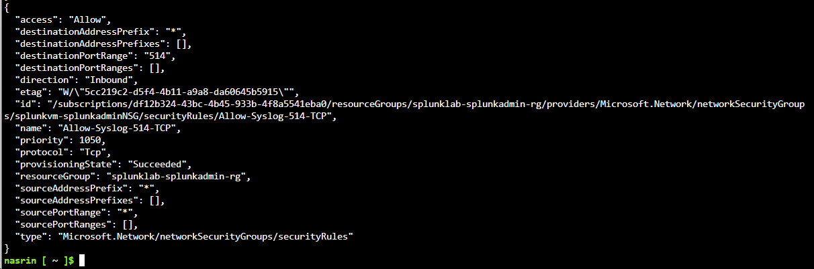

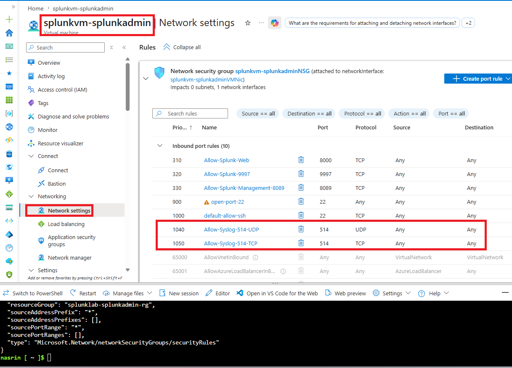

**✅ Checkpoint:** Port 514 (UDP and TCP) is allowed on both firewalls.

---

## Task 2 — Redirect 514 → 5514 with iptables

Because Splunk can't bind the privileged port 514, redirect it to 5514:

```bash
sudo iptables -t nat -A PREROUTING -p udp --dport 514 -j REDIRECT --to-port 5514
sudo iptables -t nat -A PREROUTING -p tcp --dport 514 -j REDIRECT --to-port 5514

# Make it survive reboots
sudo apt install iptables-persistent -y
sudo netfilter-persistent save
```

**✅ Checkpoint:** iptables redirects 514 traffic to 5514, and the rule is persistent.

---

## Task 3 — Create the Syslog Input in Splunk

3. In Splunk Web → **Settings → Data Inputs**.

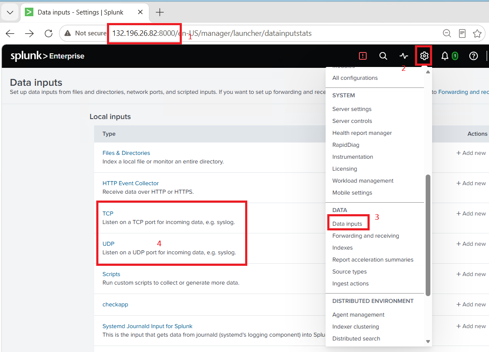

4. Click **UDP → New Local UDP**. Configure the listener on **port 5514** (it receives the redirected 514 traffic):

| Field | Value |
|---|---|
| Port | `5514` |
| Source name override | (blank) |
| Accept from | (blank — all sources) |

5. Click Next. Set the input details:

| Field | Value |
|---|---|
| Source type | `syslog` |
| Host | DNS → Hostname |
| Index | `syslog` (create it) or `main` |

6. Review → Submit.

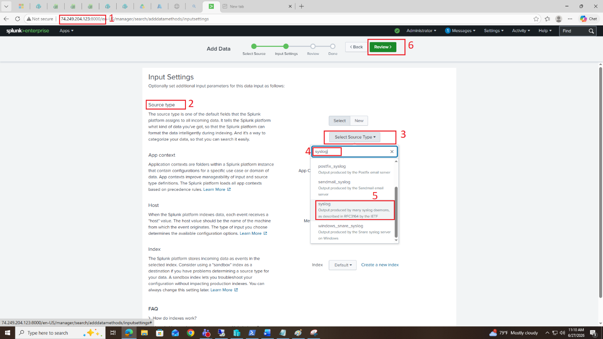

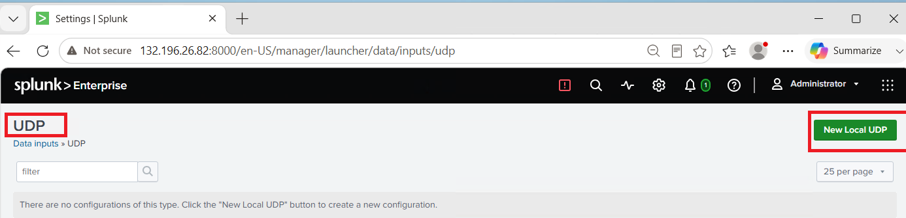

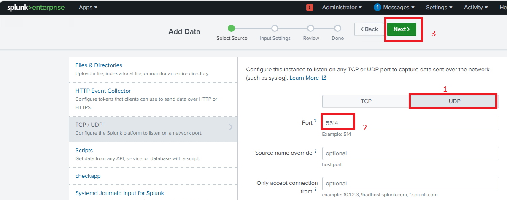

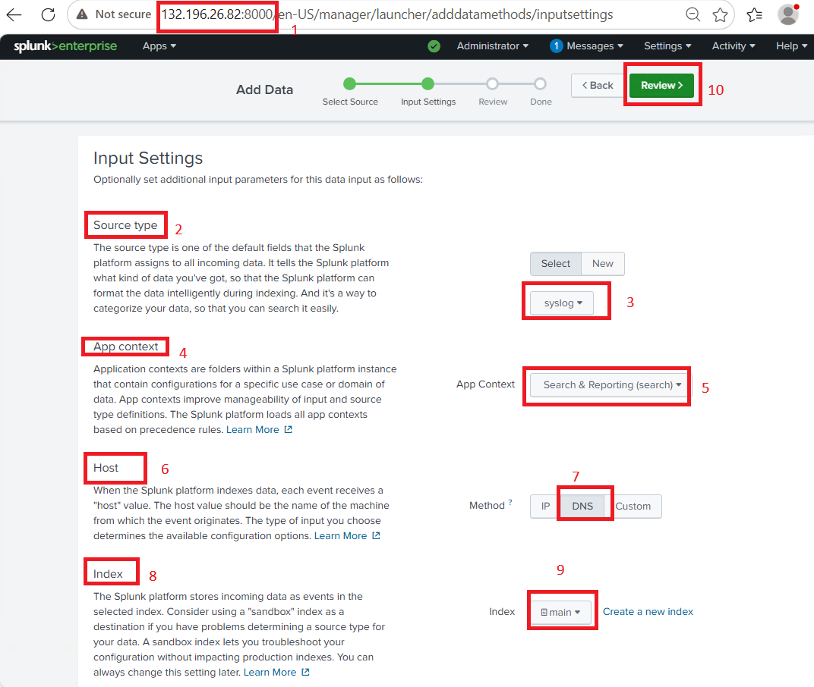

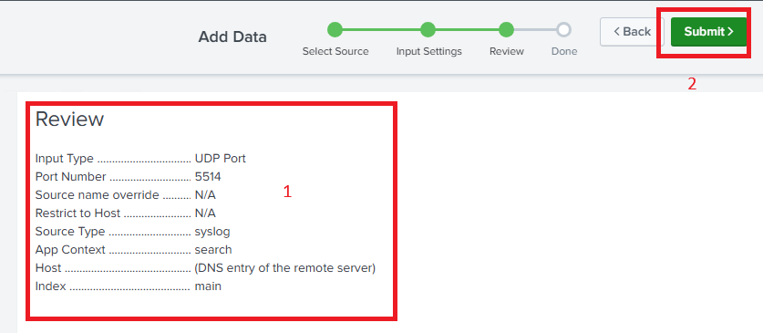

7. Repeat for TCP: **Settings → Data Inputs → TCP → New** — also port `5514`, sourcetype `syslog`.

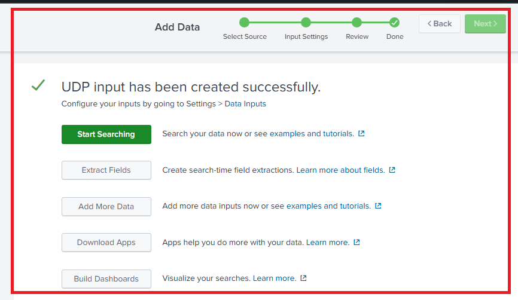

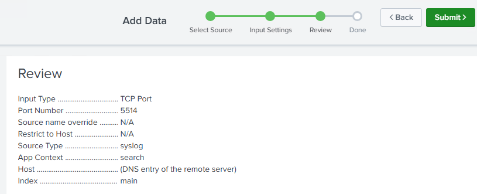

**✅ Checkpoint:** UDP and TCP listeners are running on port 5514 with sourcetype `syslog`.

---

## Task 4 — Test Ingestion

**Local test** — send a message with `logger`:

```bash
logger -n 127.0.0.1 -P 5514 --udp "TEST SYSLOG MESSAGE from Splunk Lab"
```

Then search in Splunk:

```
index=syslog "Splunk Lab" | head 5
```

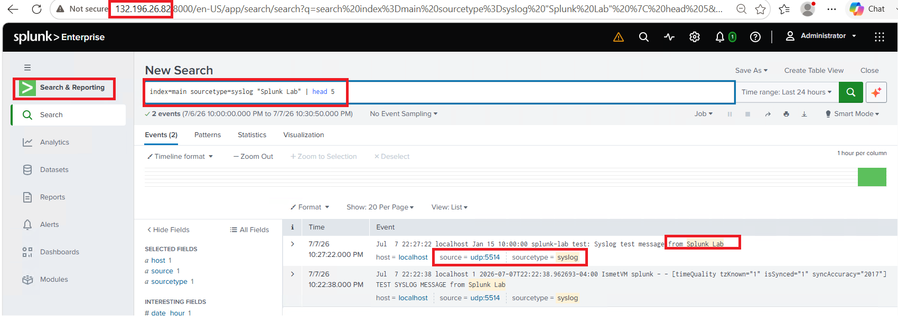

**Remote test** — from another VM (e.g. the Lab 14 Linux VM), send to the Splunk server on 514 (replace IP):

```bash
logger -n <SPLUNK_IP> -P 514 --udp "REMOTE SYSLOG TEST from Linux endpoint"
```

Verify it arrives:

```
index=syslog "REMOTE SYSLOG TEST" | head 5
```

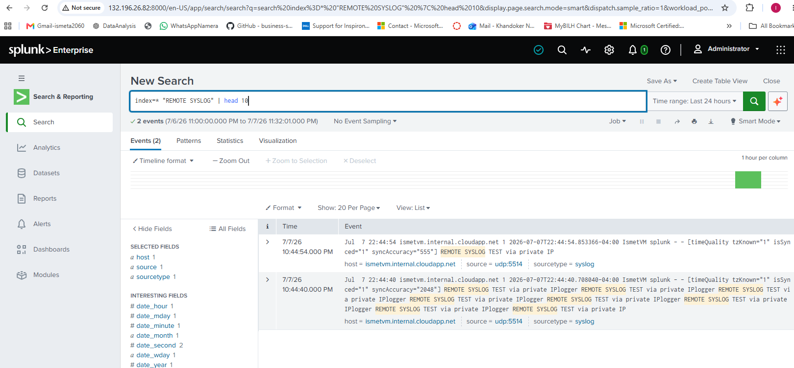

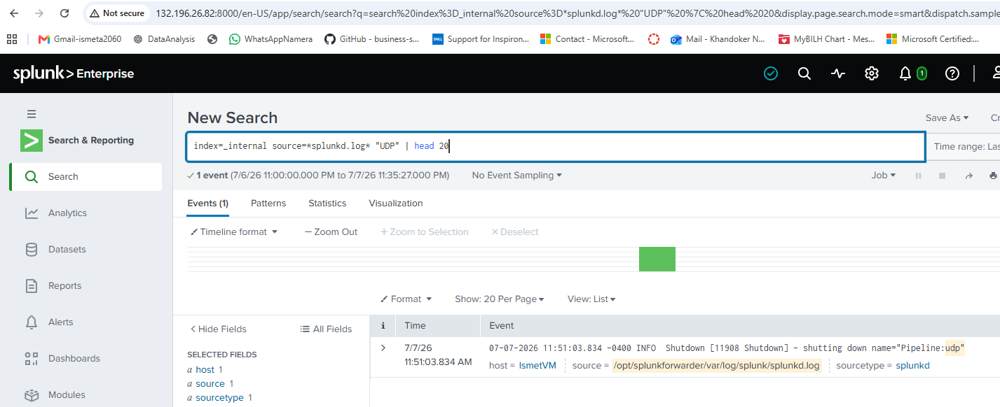

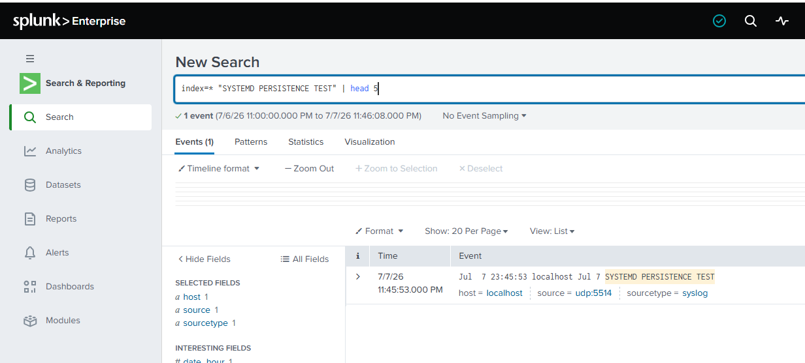

**✅ Checkpoint:** Both local and remote syslog messages appear in Splunk with `sourcetype=syslog`.

---

## 🛠️ Troubleshooting

| Problem | Solution |
|---|---|
| No data after sending a test | Check the iptables redirect (`sudo iptables -t nat -L`), UFW allows 514, NSG allows 514 |
| "Permission denied" binding 514 | Expected — use 5514 with the iptables redirect |
| `logger` not found | Install it: `sudo apt install bsdutils -y` |

---

## 🧠 Conclusion — What You Learned

This lab added a whole class of log sources — network devices — without installing a single agent.

**About Syslog Collection**
- Syslog on port 514 is how firewalls, routers, and switches send logs
- UDP is fast and universal; TCP guarantees delivery
- One listener can receive from many devices at once

**About the Privileged-Port Problem**
- Ports below 1024 need root, but Splunk runs as a non-root user
- The clean fix is to listen on 5514 and redirect 514 → 5514 with iptables
- Making the rule persistent means it survives a reboot

**Why This Matters**
- Not everything can run a forwarder — syslog fills that gap for network gear
- Firewall and router logs are essential for detecting perimeter attacks
- Knowing the iptables workaround is a real-world Splunk-on-Linux skill

---

## ✅ Verify Before Moving On

- [ ] Port 514 (UDP/TCP) is open on both firewalls
- [ ] iptables redirects 514 → 5514 and is persistent
- [ ] UDP and TCP listeners run on 5514 with sourcetype `syslog`
- [ ] Local and remote `logger` tests both appear in Splunk

---

**Next:** [Lab 16 →](../lab-16/)

[← Back to lab index](../README.md)

---

## 👤 Author

**Nasrin Ismet**
SOC Analyst & GRC Consultant | M.S. Cybersecurity

*"Find it, prove it, govern it."*

[](https://www.linkedin.com/in/kismetara/)
[](https://github.com/ismet60)

⭐ *Star this repo if it helped*

