# 🌐 Lab 17 — Log Ingestion with HEC (HTTP Event Collector)


> **How modern apps send data to Splunk — no forwarder needed.** HEC lets any system that can make an HTTP request send events straight into Splunk, authenticated with a token. Cloud platforms, microservices, and custom scripts all use it. This lab creates a HEC token and tests ingestion with Postman.

---

## 🎯 Introduction — What Is HEC?

The **HTTP Event Collector (HEC)** accepts data through HTTP/HTTPS POST requests. Any application that can send an HTTP request can send events to Splunk — no Universal Forwarder required. Modern apps, microservices, cloud platforms, and scripts all use HEC.

HEC uses **token-based authentication**: you create a token in Splunk and include it in the request's Authorization header. That makes it both secure and easy to integrate. Events are sent as **JSON** to a Splunk endpoint on **port 8088**.

> 🔐 **Security note:** A HEC token is a credential — anyone with it can send data to your Splunk. Store it securely and never commit it to a repo. (The token is redacted in this lab's screenshots.)

---

## 🏗️ How HEC Works

```
   Any app / script / cloud service
            │
            │  HTTP POST (JSON) to :8088/services/collector/event
            │  Header:  Authorization: Splunk <TOKEN>
            ▼
   ┌────────────────────────────────┐
   │  Splunk HEC endpoint (8088)     │
   │  validates the token            │
   │  → routes to index=hec-lab      │
   └────────────────────────────────┘
            │
            ▼
   {"text":"Success","code":0}   ← the app knows it worked
```

---

## 🎓 Learning Objectives

After this lab, you will be able to:

- Enable HEC globally in Splunk
- Create a HEC token
- Open port 8088 on the host firewall and Azure NSG
- Create a dedicated index for HEC data
- Send single and batch events with Postman
- Verify HEC events in Splunk

---

## Task 1 — Create the `hec-lab` Index

1. Splunk Web → **Settings → Indexes → New Index**:

| Field | Value |
|---|---|
| Index Name | `hec-lab` |
| Data Type | Events |
| Max Size | `5120` MB |

2. Save and confirm it shows Active.

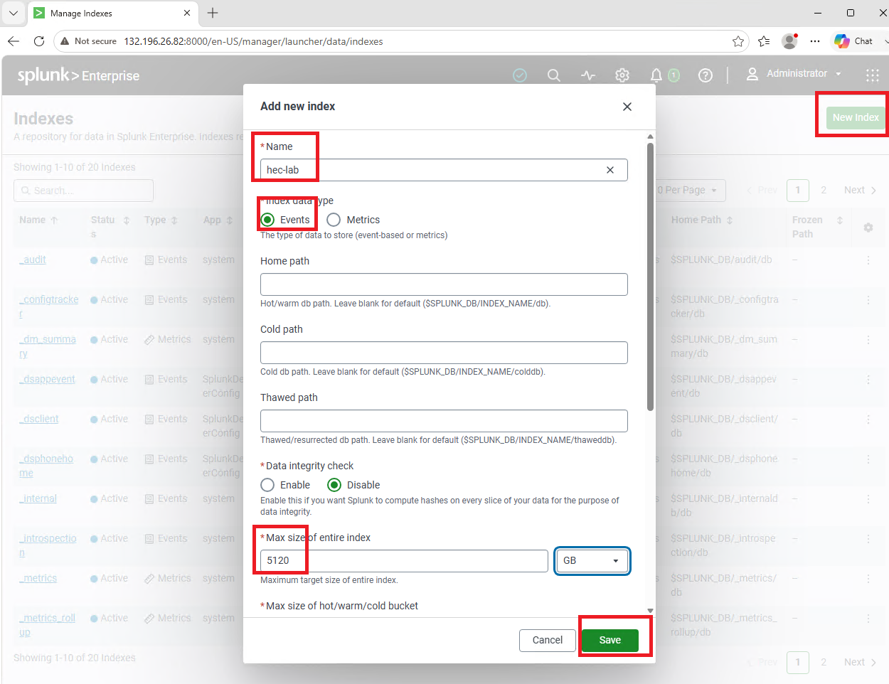

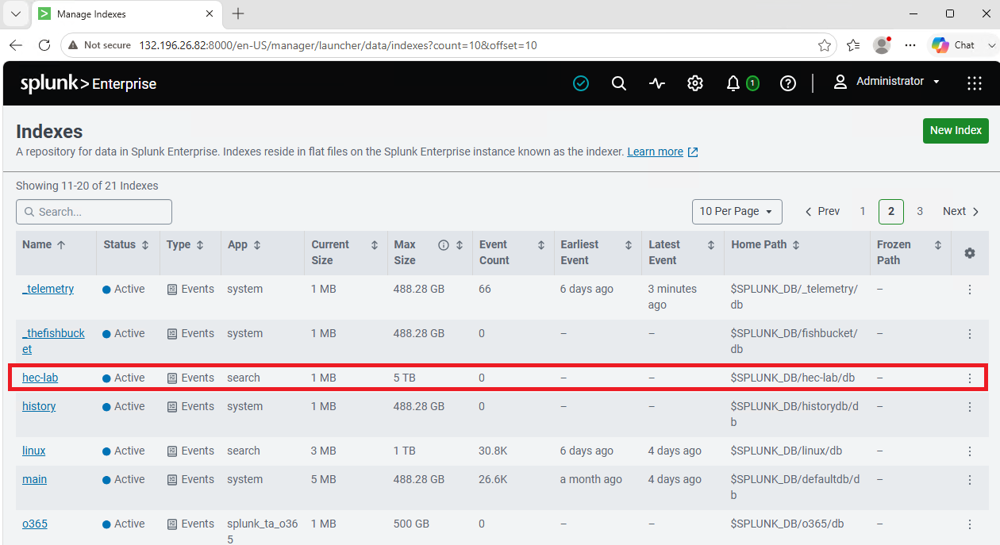

**✅ Checkpoint:** The `hec-lab` index appears with Active status.

---

## Task 2 — Enable HEC and Create a Token

3. Splunk Web → **Settings → Data Inputs → HTTP Event Collector**.

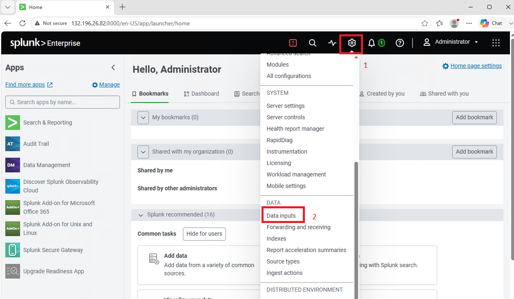

4. Click **Global Settings** and configure:

| Setting | Value |
|---|---|
| All Tokens | Enabled |
| Default Index | main (overridden per token) |
| Enable SSL | Checked |
| HTTP Port Number | `8088` |

Click **Save**.

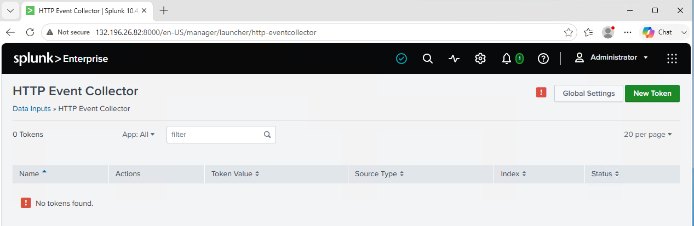

5. Click **New Token**:

| Field | Value |
|---|---|
| Name | `lab-hec-token` |
| Description | Test HEC token for Lab 17 |
| Source type | Automatic |
| Default index | `hec-lab` |

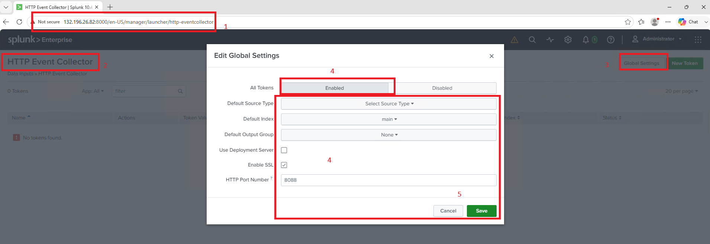

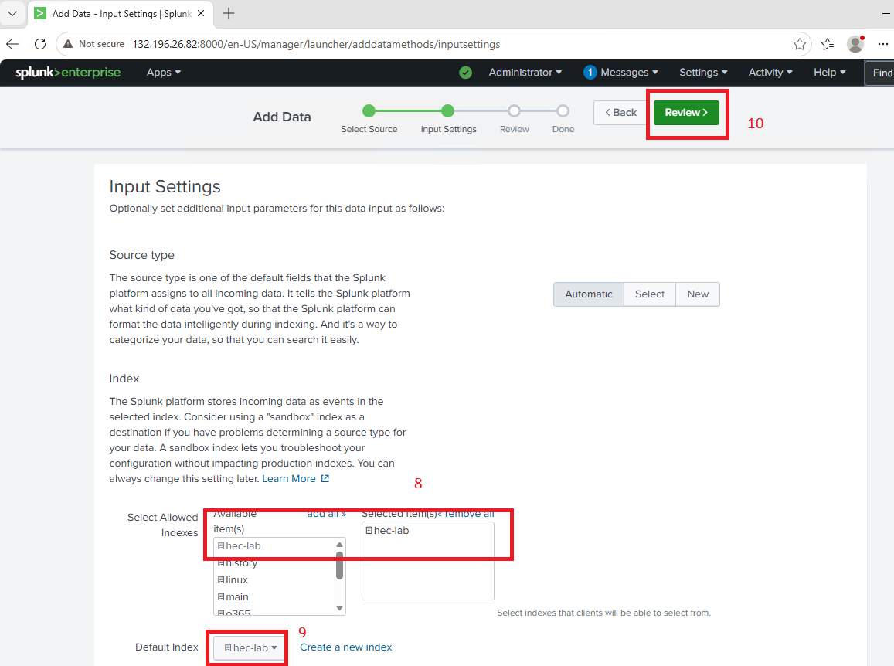

6. Review → Submit. The success page shows the **token value** — copy and save it immediately (you paste it into Postman next).

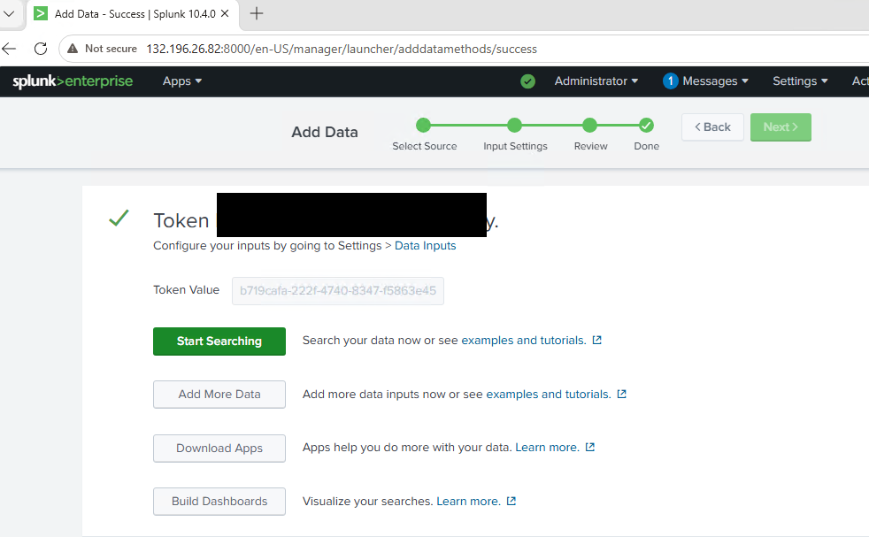

7. Open port 8088 on both firewalls (use your own resource group and NSG name):

```bash
sudo ufw allow 8088/tcp

az network nsg rule create \
  --resource-group <your-resource-group> \
  --nsg-name <your-nsg-name> \
  --name Allow-HEC-8088 \
  --protocol tcp --priority 1060 \
  --destination-port-range 8088 \
  --access Allow --direction Inbound
```

**✅ Checkpoint:** The HEC token is created (value saved) and port 8088 is open on both firewalls.

---

## Task 3 — Send Test Events with Postman

8. Install [Postman](https://www.postman.com/downloads/) on your local computer. Open it → **New → HTTP Request**.

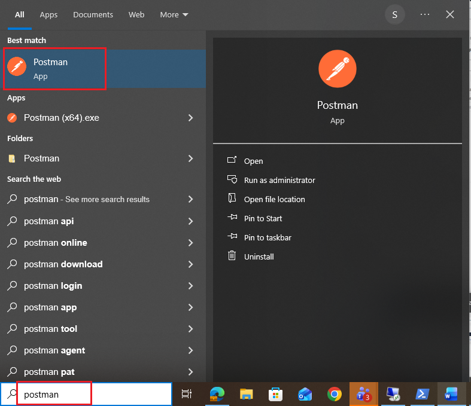

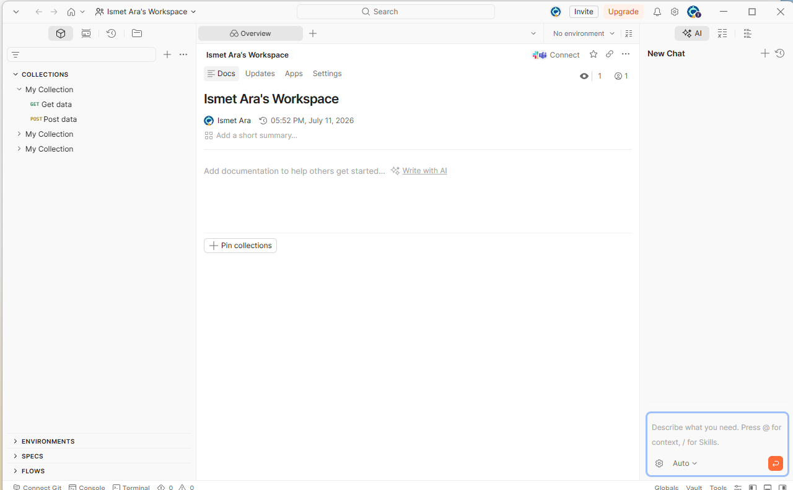

9. Configure the request:

| Setting | Value |
|---|---|
| Method | POST |
| URL | `https://<SPLUNK_VM_IP>:8088/services/collector/event` |

10. **Headers** tab → add the Authorization header:

| Key | Value |
|---|---|
| Authorization | `Splunk <YOUR_HEC_TOKEN>` |

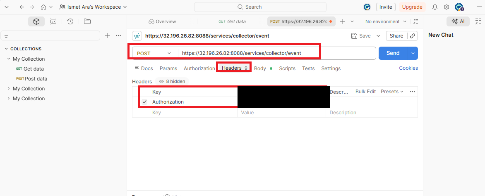

11. **Body** tab → **raw** → **JSON** → paste:

```json
{
  "event": "Test HEC event from Postman - Lab 17",
  "sourcetype": "hec_test",
  "index": "hec-lab",
  "host": "postman-test"
}
```

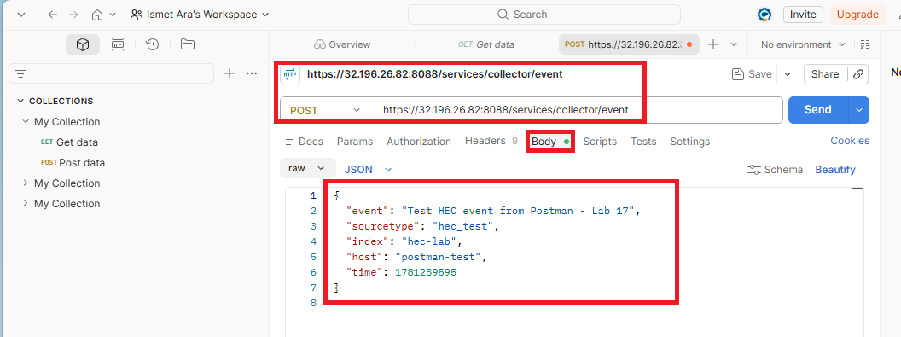

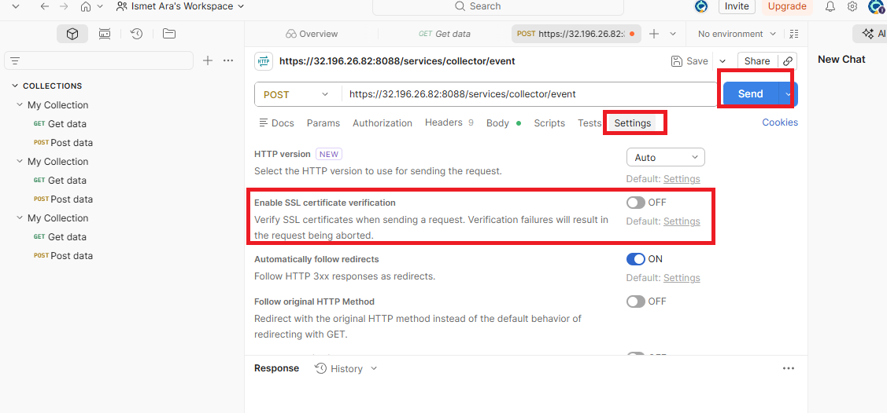

12. Splunk uses a self-signed cert, so turn off SSL verification in Postman: **Settings (gear) → General → SSL certificate verification → OFF**.

13. Click **Send**. A successful response is:

```json
{"text":"Success","code":0}
```

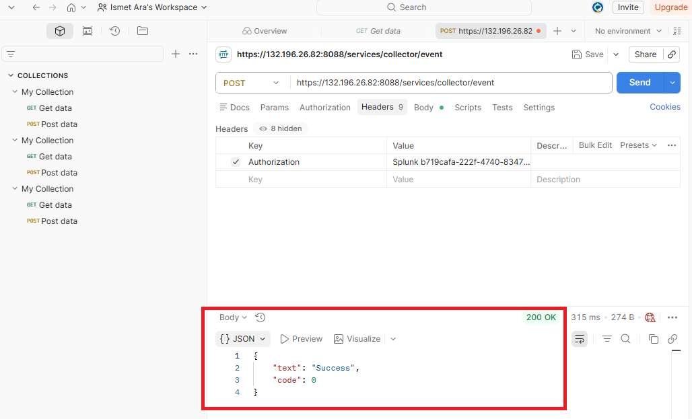

**✅ Checkpoint:** Postman returns `{"text":"Success","code":0}`.

---

## Task 4 — Send a Batch and Verify

14. HEC accepts multiple events in one request — just stack JSON objects (no commas between them):

```json
{"event": "First event in batch", "sourcetype": "hec_test", "index": "hec-lab"}
{"event": "Second event in batch", "sourcetype": "hec_test", "index": "hec-lab"}
{"event": "Third event in batch", "sourcetype": "hec_test", "index": "hec-lab"}
```

Send it — you should get the same success response.

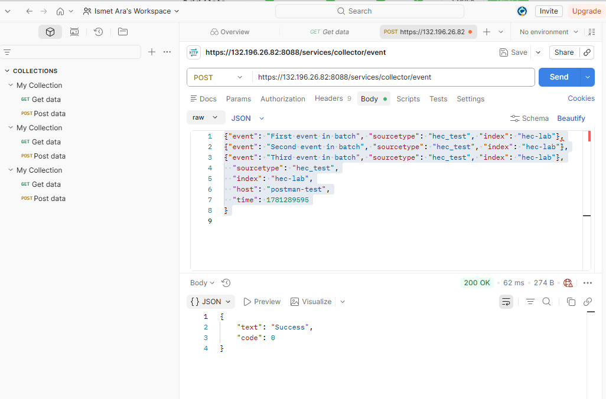

15. Verify in Splunk:

```
index=hec-lab | head 10
index=hec-lab sourcetype=hec_test | stats count
```

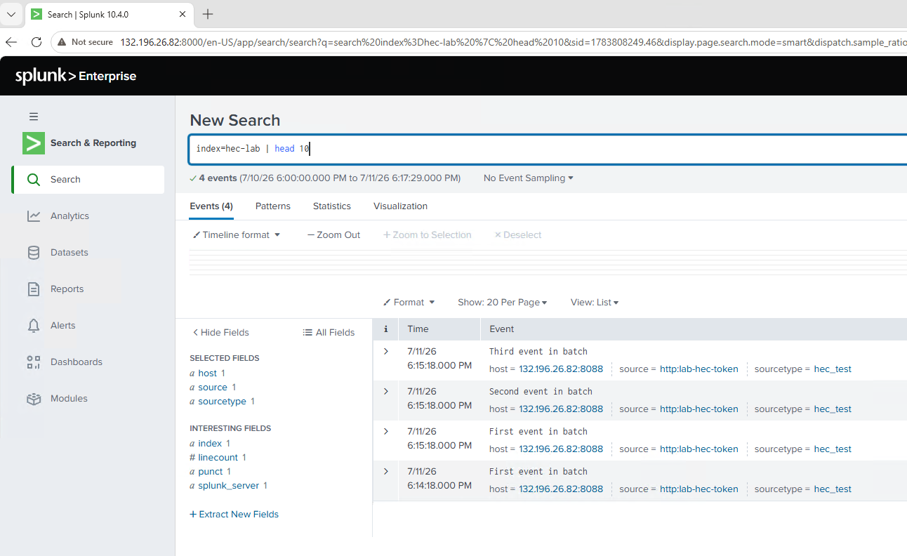

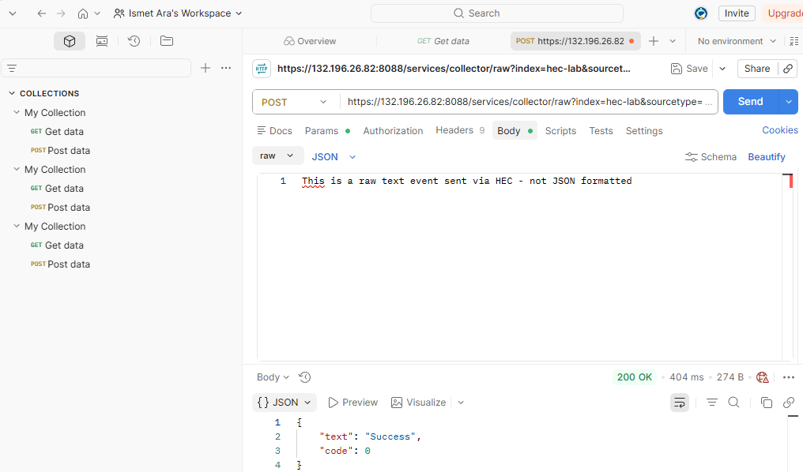

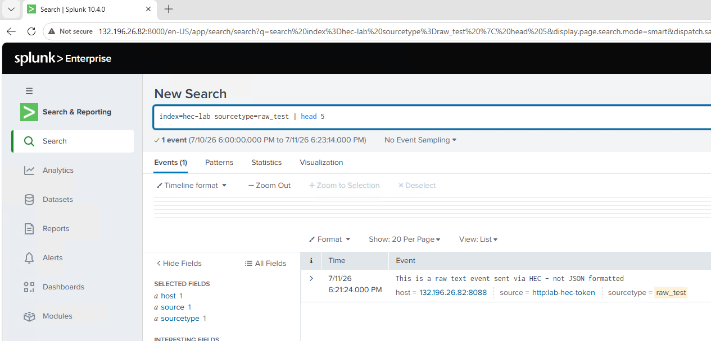

**✅ Checkpoint:** Your single and batch events appear in the `hec-lab` index with sourcetype `hec_test`.

---

## 🛠️ Troubleshooting

| Problem | Solution |
|---|---|
| `{"text":"Invalid token","code":4}` | Token wrong or disabled — check the Authorization header and that the token is enabled |
| Connection refused / timeout | Port 8088 blocked — verify UFW and NSG allow it, and HEC is enabled |
| SSL error in Postman | Turn off SSL certificate verification (self-signed cert) |
| Success response but no data in Splunk | Check the `index` in your JSON matches an existing index (`hec-lab`) |

---

## 🧠 Conclusion — What You Learned

HEC is how the modern, API-driven world sends data to Splunk.

**About HEC**
- Token-authenticated HTTP ingestion — no forwarder required
- Events are JSON, sent to port 8088; a `code:0` response confirms acceptance
- Batch mode sends many events in one request for efficiency

**About Credential Handling**
- A HEC token is a credential — store it securely, never commit it
- This is why the token is redacted in the screenshots here

**Why This Matters**
- Cloud services, microservices, and custom apps all use HEC — it's everywhere in modern environments
- Testing with Postman is exactly how you'd validate an integration before wiring it into an app
- HEC rounds out your ingestion skills: forwarders (Labs 9–14), syslog (15), cloud API (16), and now HTTP (17)

---

## ✅ Verify Before Moving On

- [ ] The `hec-lab` index exists and is Active
- [ ] HEC is enabled and a token is created (value saved securely)
- [ ] Port 8088 is open on both firewalls
- [ ] Postman returns `code:0` for single and batch sends
- [ ] Events appear in `index=hec-lab`

---

**Next:** [Lab 18 →](../lab-18/)

[← Back to lab index](../README.md)

---

## 👤 Author

**Nasrin Ismet**
SOC Analyst & GRC Consultant | M.S. Cybersecurity

*"Find it, prove it, govern it."*

[](https://www.linkedin.com/in/kismetara/)
[](https://github.com/ismet60)

⭐ *Star this repo if it helped*

