# 🩺 Lab 18 — Splunk Troubleshooting & Health Check


> **Keeping a Splunk deployment healthy — the daily operational side.** Setup is one skill; keeping it running is another. This lab walks through the routine checks a Splunk admin performs to confirm everything is healthy: component reachability, license usage, resource utilization, user/role audits, HEC token review, and index health. These are also the first checks you run during an incident when data or search "looks wrong."

---

## 🎯 Introduction — Why Health Checks Matter

A Splunk deployment needs regular check-ups, just like any critical system. If a forwarder quietly stops sending data, or the license quota is exceeded, or the disk fills up, your SOC loses visibility — often without an obvious alert.

This lab teaches a **systematic** health check: verify each component is reachable, review license and resource usage, audit users and roles, and confirm data is still flowing. These are the routine checks of a healthy operation, and the first things you look at during incident response.

---

## 🏗️ What a Health Check Covers

```
   ┌─────────────────────────────────────────────┐
   │          Splunk Health Check                 │
   ├─────────────────────────────────────────────┤
   │  1️⃣ Reachability → all ports listening?      │
   │     8000 web · 8089 mgmt · 8088 HEC ·        │
   │     9997 receiver · 8191 KV store            │
   │  2️⃣ License      → usage under quota?         │
   │  3️⃣ Resources    → CPU / memory / disk OK?    │
   │  4️⃣ Users/Roles  → least privilege intact?    │
   │  5️⃣ HEC tokens   → any unused ones enabled?   │
   │  6️⃣ Inputs/Index → data still flowing?        │
   └─────────────────────────────────────────────┘
```

---

## 🎓 Learning Objectives

After this lab, you will be able to:

- Test connectivity and reachability for all Splunk components
- Check and interpret license usage
- Review CPU, memory, and disk utilization
- Audit user accounts and role assignments
- Review HEC token configuration
- Verify data inputs and index health

---

## Task 1 — Reachability Test of Each Component

1. On the Splunk VM, confirm all Splunk ports are listening:

```bash
sudo ss -tlnp | grep splunkd
```

Expected ports: **8000** (Web), **8089** (management/REST), **8088** (HEC), **9997** (receiver), **8191** (KV Store).

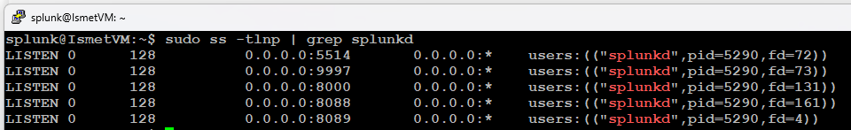

2. Check server info via the REST API:

```bash
curl -sk https://localhost:8089/services/server/info \
  -u admin:<PASSWORD> | grep -i "version\|build"
```

3. Test reachability from a **remote** machine (e.g. the Lab 14 Linux VM):

```bash
nc -zv <SPLUNK_IP> 8000   # Web
nc -zv <SPLUNK_IP> 8089   # Management
nc -zv <SPLUNK_IP> 8088   # HEC
nc -zv <SPLUNK_IP> 9997   # Receiver
```

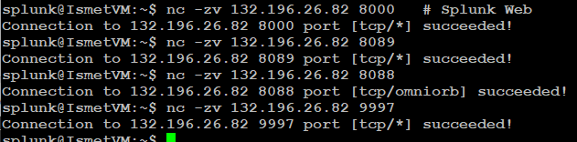

4. For a graphical overview: **Settings → Monitoring Console → Overview**.

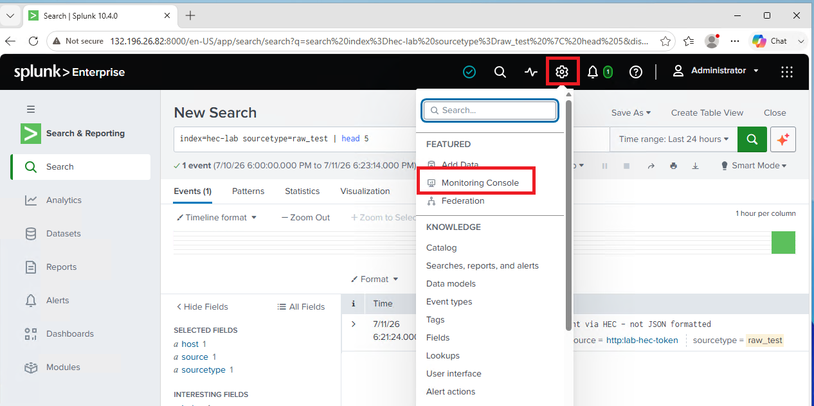

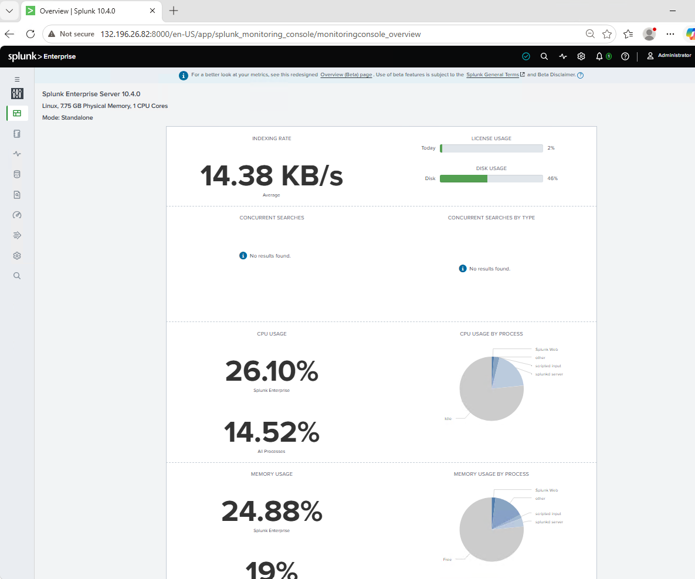

**✅ Checkpoint:** All ports listen in `ss` output, and the Monitoring Console shows components green.

---

## Task 2 — License and Performance

**License usage** — **Settings → Licensing**. Review the daily quota, current usage, and the 7-day history chart.

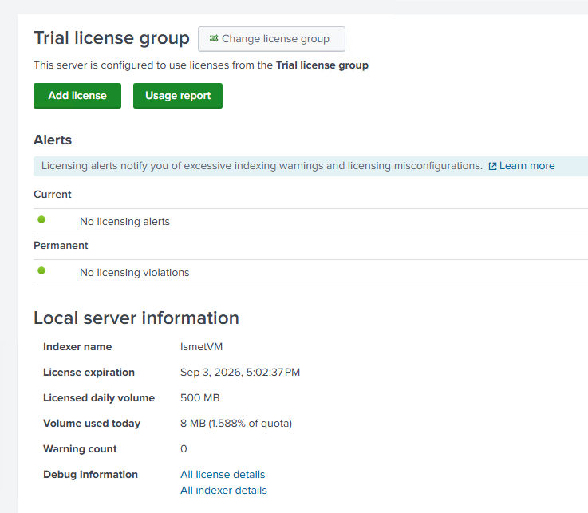

Check usage via search (useful for alerting):

```
index=_internal source="*license_usage.log" type="Usage"
| eval GB=round(b/1024/1024/1024,2)
| bin _time span=1d
| stats sum(GB) as TotalGB by _time
| sort _time
| eval Date=strftime(_time,"%Y-%m-%d")
| table Date TotalGB
```

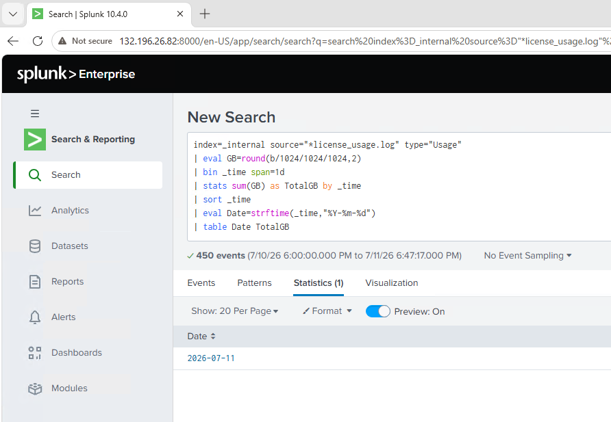

**Performance** — **Settings → Monitoring Console → Performance**. Watch for CPU consistently above 80%, the indexing rate (events/sec), and concurrent search load.

Disk check from the CLI:

```bash
df -h /opt/splunk/
sudo du -sh /opt/splunk/var/lib/splunk/*/
```

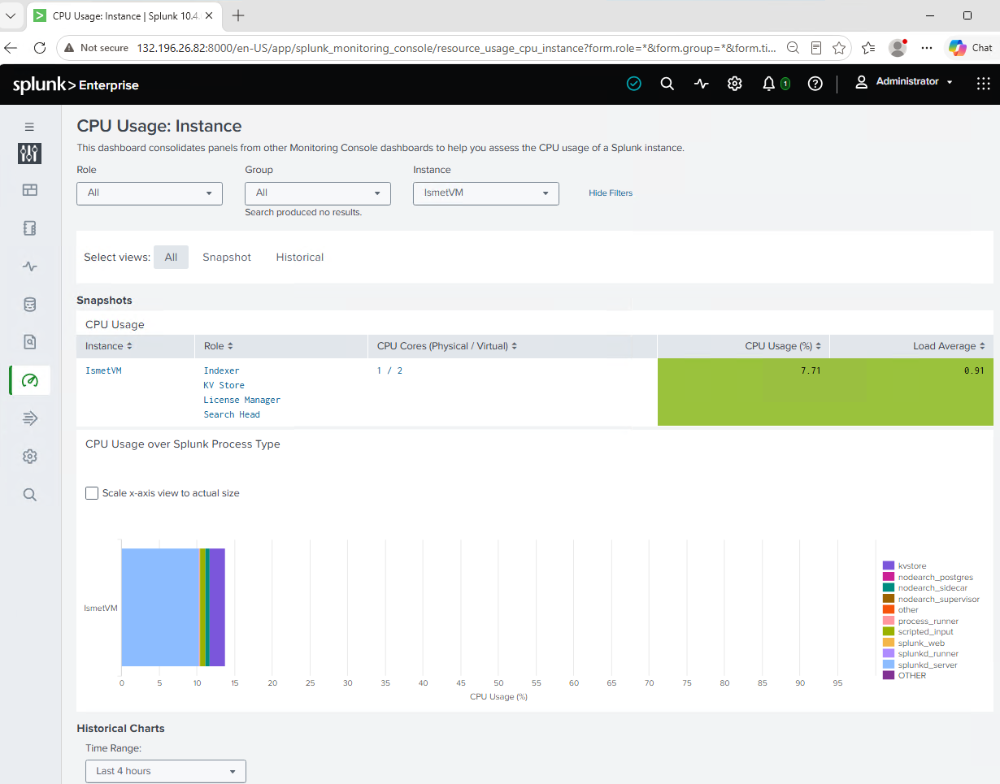

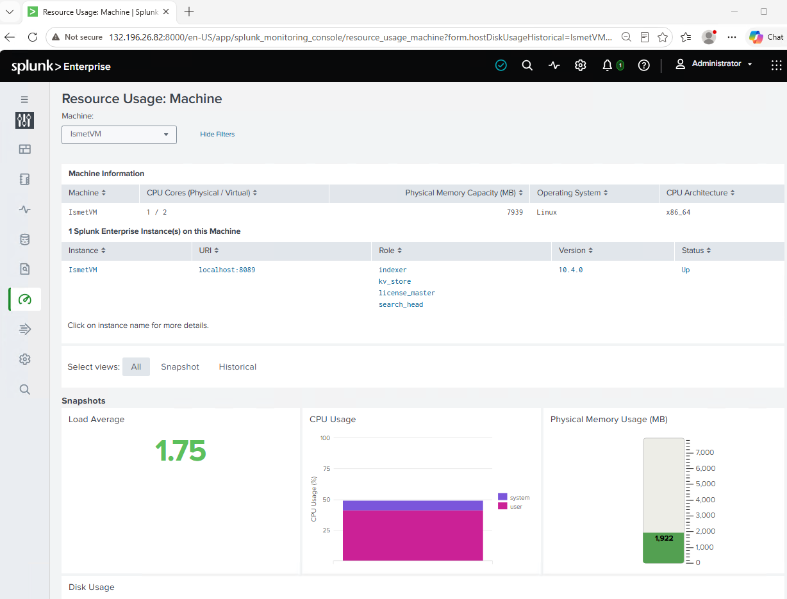

**✅ Checkpoint:** License usage is within quota and there are no critical performance alerts.

---

## Task 3 — Review Users and Roles

5. **Settings → Users**. Review the account list.

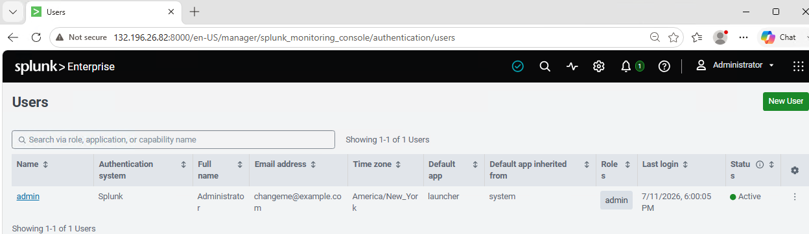

Check for: accounts that should have been removed, a default admin still on its initial password, users with more privilege than they need, and accounts that have never logged in.

6. **Settings → Roles**. Confirm the hierarchy follows least privilege:

| Role | Appropriate use |
|---|---|
| `admin` | Full access — Splunk administrators only |
| `power` | Saved searches, dashboards — for analysts |
| `user` | Read-only search — for viewers |
| `can_delete` | Can delete indexed data — restrict carefully |

**✅ Checkpoint:** No unexpected admin accounts; roles follow least privilege.

---

## Task 4 — Review HEC Tokens

7. **Settings → Data Inputs → HTTP Event Collector**. For each token, check: a descriptive name, correct enabled/disabled status, the right destination index, and correct sourcetype. Disable any unused tokens.

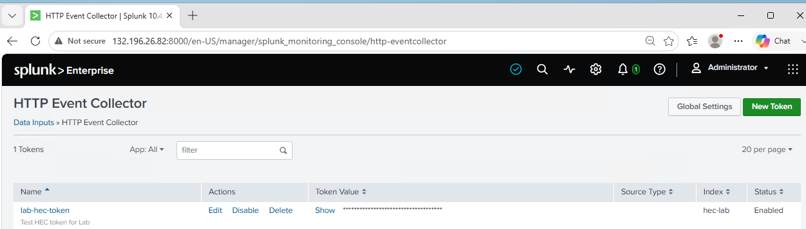

> 💡 An unused but enabled HEC token is a security risk — if the value leaks, anyone can send data to your Splunk. Rotate (delete and recreate) tokens periodically, and immediately if you suspect exposure.

**✅ Checkpoint:** All active tokens are needed and correctly configured; unused ones are disabled.

---

## Task 5 — Review Data Inputs and Index Health

8. **Settings → Data Inputs**. Check each category: file monitors pointing to valid paths, network listeners on expected ports, HEC tokens (Task 4), and scripted inputs still needed.

9. Search for input errors:

```
index=_internal log_level=ERROR sourcetype=splunkd
(component=TailReader OR component=WinEventLog)
| stats count by host, source, message
| sort -count
```

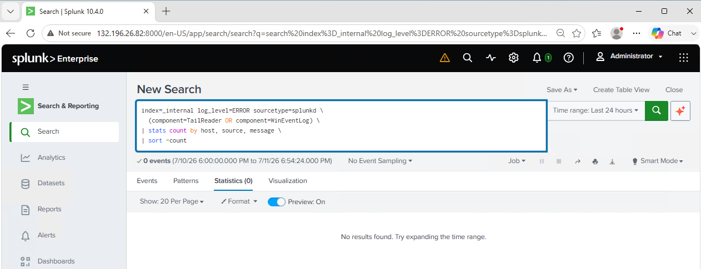

10. **Settings → Indexes**. For each index, check current size (growing as expected? unexpectedly large?) and the latest event time (is data still arriving?).

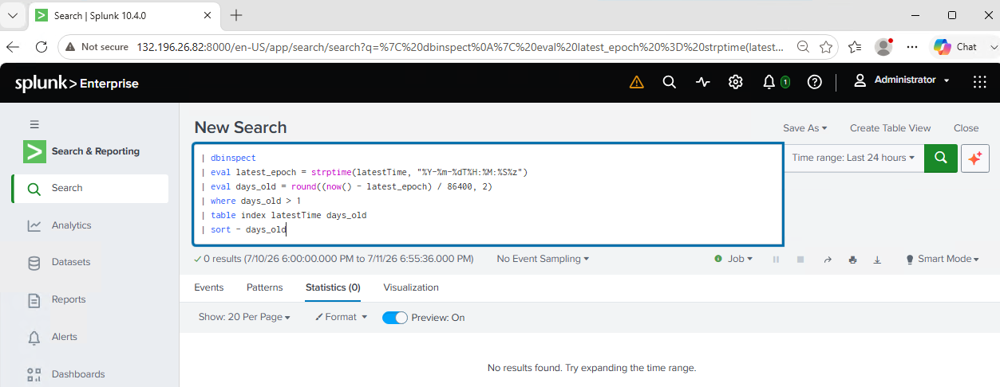

**✅ Checkpoint:** No input errors, and every active index shows recent events.

---

## 🛠️ Troubleshooting Reference

| Symptom | Likely cause | Where to look |
|---|---|---|
| A port isn't listening | Splunk down, or feature not enabled | `ss -tlnp`, then restart or enable the input |
| Searches suddenly blocked | License quota exceeded | Settings → Licensing; find the noisy new source |
| High CPU / slow search | Resource pressure or heavy searches | Monitoring Console → Performance |
| Data stopped arriving | Forwarder down, or input error | `index=_internal` error search; check the forwarder |
| Index unexpectedly huge | A misconfigured noisy input | Settings → Indexes; trace the sourcetype |

---

## 🧠 Conclusion — What You Learned

This lab is about operating Splunk, not just building it.

**About Health Monitoring**
- A systematic check covers reachability, license, resources, users, tokens, and data flow
- The Monitoring Console gives a graphical view; `ss`, `curl`, `nc`, and `df` give the command-line truth
- License usage and disk space are the two limits that silently break a deployment

**About Security Hygiene**
- Auditing users and roles enforces least privilege over time, not just at setup
- Unused HEC tokens are an open door — review and rotate them
- These audits are ongoing operational tasks, not one-time setup

**Why This Matters**
- This is real day-to-day SOC/Splunk-admin work — the difference between "I can install Splunk" and "I can run Splunk"
- During an incident, these are the first checks that tell you whether the problem is data collection, resources, or configuration

---

## ✅ Verify Before Moving On

- [ ] All Splunk ports listen locally and are reachable remotely
- [ ] License usage is within quota
- [ ] No critical CPU/memory/disk alerts
- [ ] Users and roles follow least privilege
- [ ] HEC tokens reviewed; unused ones disabled
- [ ] Every active index shows recent events

---

**Next:** [Lab 19 →](../lab-19/)

[← Back to lab index](../README.md)

---

## 👤 Author

**Nasrin Ismet**
SOC Analyst & GRC Consultant | M.S. Cybersecurity

*"Find it, prove it, govern it."*

[](https://www.linkedin.com/in/kismetara/)
[](https://github.com/ismet60)

⭐ *Star this repo if it helped*

