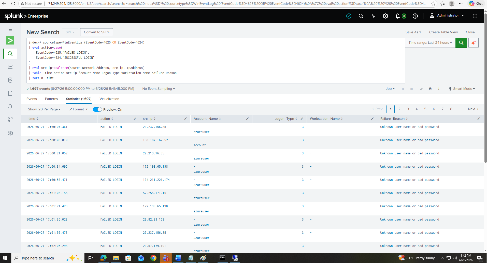

# 🔎 Lab 19 — Security Event Analysis & Alert Triage


> **The analyst job itself.** Every earlier lab got data *into* Splunk. This one is what you *do* with it: investigate a security alert, decide whether it's a real threat or a false alarm, build the attack timeline, and document the verdict. This is the core function of a Security Operations Center, worked through with real SPL.

---

## 🎯 Introduction — What Is Security Event Analysis?

Security Event Analysis is the core work of a SOC. It means examining alerts and log data to decide whether an event is a genuine threat (**true positive**) or a false alarm (**false positive**) — and if it's real, responding to it.

This lab walks through the analyst workflow in Splunk: understand the alert, gather context, examine the evidence, determine the scope, make a decision, and document it. It uses real investigation scenarios and the SPL an analyst actually writes.

---

## 🏗️ The Analyst Triage Workflow

```
   ALERT FIRES
       │
       ▼
   1. Understand   → what rule triggered? what does it detect?
       │
       ▼
   2. Gather context → who/what is affected? is it sensitive?
       │
       ▼
   3. Examine evidence → what happened in the logs? when?
       │
       ▼
   4. Determine scope → one system or many? data exfiltrated?
       │
       ▼
   5. Decide → true positive (escalate) or false positive (tune)?
       │
       ▼
   6. Document → findings, actions, verdict — always
```

---

## 🎓 Learning Objectives

After this lab, you will be able to:

- Follow the analyst triage workflow in Splunk
- Use SPL to investigate specific security events
- Build an event timeline to understand an attack sequence
- Tell true positives from false positives
- Document findings in a structured format
- Understand how Splunk Enterprise Security (ES) extends the platform

---

## The Triage Process

Every investigation follows the same six steps, regardless of tool:

| Step | What it involves |
|---|---|
| 1. Understand the alert | What rule triggered? What behavior does it detect? What's the false-positive rate? |
| 2. Gather context | Who/what is affected? Is it a sensitive asset? What's normal for this user? |
| 3. Examine evidence | What exactly happened in the logs? When did it start and end? |
| 4. Determine scope | One system or many? Any sign of data exfiltration? |
| 5. Make a decision | True positive to escalate? False positive to tune? Needs more digging? |
| 6. Document | Record findings and actions — whatever the outcome. |

---

## Scenario 1 — Brute-Force Login Investigation

**Alert:** "Multiple failed RDP logins from external IP `96.246.31.177` targeting user `root` on `linux-log-source`."

**Step 1 — Get the full picture: how many failures, over what window?**

```spl
index=* sourcetype=WinEventLog EventCode=4625
| stats count values(Account_Name) as users min(_time) as first_seen max(_time) as last_seen by Source_Network_Address
| where count > 5
| eval first_seen=strftime(first_seen,"%Y-%m-%d %H:%M:%S")
| eval last_seen=strftime(last_seen,"%Y-%m-%d %H:%M:%S")
| table Source_Network_Address users count first_seen last_seen
| sort -count
```

**Step 2 — Did the attack succeed? Look for a success (4624) after the failures (4625) from the same IP.** This `streamstats` pattern is the key analyst move — it correlates a run of failures immediately followed by a success:

```spl
index=* sourcetype=WinEventLog (EventCode=4625 OR EventCode=4624)
| eval outcome=if(EventCode=4625,"FAILED","SUCCESS")
| sort 0 Source_Network_Address _time
| streamstats count(eval(outcome="FAILED")) as failed_count by Source_Network_Address
| where outcome="SUCCESS" AND failed_count>5
| eval success_time=strftime(_time,"%Y-%m-%d %H:%M:%S")
| table Source_Network_Address Account_Name failed_count success_time Logon_Type
```

**Step 3 — Build the timeline: what happened in what order?**

```spl
index=* sourcetype=WinEventLog (EventCode=4625 OR EventCode=4624)
| eval action=case(EventCode=4625,"FAILED LOGIN", EventCode=4624,"SUCCESSFUL LOGIN")
| eval src_ip=coalesce(Source_Network_Address, src_ip, IpAddress)
| table _time action src_ip Account_Name Logon_Type Workstation_Name Failure_Reason
| sort 0 _time
```



**Step 4 — Is this IP hitting other systems too?**

```spl
index=* "96.246.31.177"
| stats count by index sourcetype host
| sort -count
```

**Step 5 — Check the IP's reputation** at [VirusTotal](https://www.virustotal.com), [AbuseIPDB](https://www.abuseipdb.com), or [ipinfo.io](https://ipinfo.io). A known-malicious IP strengthens a true-positive verdict.

---

## Scenario 2 — Suspicious Login from a New Location

**Alert:** "User `john.smith@company.com` logged in from a new country — first time this IP/country has been seen for this user."

**Step 1 — Compare against the user's normal login pattern:**

```spl
index=o365 sourcetype="o365:management:activity"
Operation=UserLoggedIn UserId="john.smith@company.com"
| iplocation ClientIP
| stats count by ClientIP, Country, City
| sort -count
```

**Step 2 — What did the user do after the suspicious login?**

```spl
index=o365 UserId="john.smith@company.com"
| stats count by Operation
| sort -count
| head 20
```

**Step 3 — Impossible travel? Check for logins from two distant locations too close in time:**

```spl
index=o365 UserId="john.smith@company.com"
(Operation=UserLoggedIn OR Operation=MailboxLogin)
| iplocation ClientIP
| table _time, UserId, ClientIP, Country, Operation
| sort _time
```


> 💡 "Impossible travel" — a login from New York and another from another continent minutes apart — is a classic sign of account compromise, because one person can't physically be in both places.

---

## Documenting the Investigation

Always document, whatever the verdict. This SPL builds a structured investigation summary you can adapt:

```spl
| makeresults
| eval "Alert Name" = "Multiple Failed SSH Logins"
| eval "Source IP" = "185.220.101.15"
| eval "Target" = "linux-log-source / root"
| eval "Total Attempts" = "847"
| eval "Successful Login" = "No"
| eval "IP Reputation" = "Known Tor Exit Node - High Risk"
| eval "Verdict" = "True Positive - Blocked at firewall"
| eval "Action Taken" = "Added IP to block list"
| table "Alert Name","Source IP","Target","Total Attempts","Successful Login","IP Reputation","Verdict","Action Taken"
```


---

## Splunk Enterprise Security (ES) — Concepts

Splunk ES is the premium security tier that adds a structured analyst workflow on top of the platform. Knowing its concepts prepares you for environments that run it:

| ES Feature | What it does |
|---|---|
| **Notable Events** | Structured alerts from correlation searches; analysts assign, update, and close them — creating an audit trail |
| **Risk Framework** | Assigns risk scores to users and systems; high scores trigger higher-priority notables |
| **Incident Review** | The triage dashboard — all open notables sorted by urgency, with assignment workflow |
| **Adaptive Response** | Auto-actions when a notable fires: block an IP, disable an account, open a ticket |
| **Asset & Identity** | Databases of assets and identities that enrich events with business context |


> 📌 This lab demonstrates the analyst workflow on the **standard Splunk platform** using SPL. ES automates much of it (correlation searches → notable events → risk scoring), but the underlying investigative thinking is the same — and doing it by hand in SPL is the best way to understand what ES does for you.

---

## 🧠 Conclusion — What You Learned

This is the SOC analyst's actual job, worked end to end.

**About Investigation**
- The six-step triage workflow applies to any alert, any tool
- `streamstats` correlates failed-then-successful logins — the heart of brute-force detection
- `iplocation` and impossible-travel logic surface account compromise
- IP reputation lookups turn a suspicion into a verdict

**About Analyst Discipline**
- True vs. false positive is a judgment call backed by evidence, not a guess
- Documentation is part of the job — an undocumented investigation didn't happen
- Structured findings create the audit trail an incident needs

**Why This Matters**
- This is the single most job-relevant lab for a SOC Analyst role
- "Walk me through how you'd investigate a brute-force alert" is a real interview question — these queries are your answer
- Understanding the workflow by hand is what makes you effective whether or not the shop runs ES

---

## ✅ Verify Before Moving On

- [ ] Investigated the brute-force scenario with SPL
- [ ] Built an event timeline of the attack sequence
- [ ] Used `iplocation` to analyze a login-location anomaly
- [ ] Produced a structured investigation summary
- [ ] Can explain how Splunk ES extends the platform workflow

---

**Next:** [Lab 20 →](../lab-20/)

[← Back to lab index](../README.md)

---

## 👤 Author

**Nasrin Ismet**
SOC Analyst & GRC Consultant | M.S. Cybersecurity

*"Find it, prove it, govern it."*

[](https://www.linkedin.com/in/kismetara/)
[](https://github.com/ismet60)

⭐ *Star this repo if it helped*

