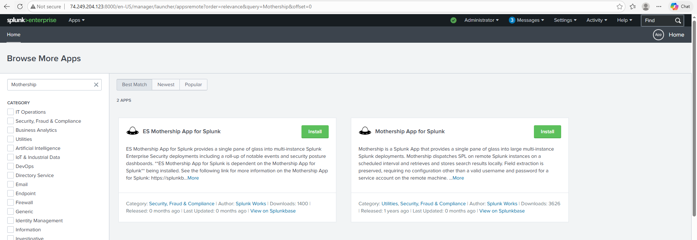
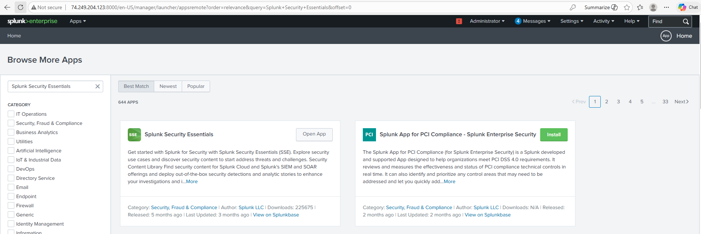
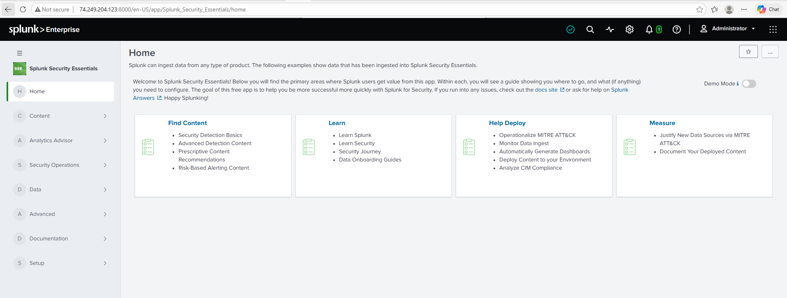

# 🏬 Lab 20 — MSSP Multi-Tenancy with the Splunk Mothership App


> **How one security company watches over many clients at once.** An MSSP (Managed Security Service Provider) runs security monitoring for lots of different companies from a single Splunk platform. The trick is keeping each client's data separate while still giving the MSSP team one view across everyone. This lab builds that setup with the Mothership App.

---

## 🎯 Introduction — What Is an MSSP Setup?

An **MSSP** is a company that does security monitoring for other companies. Instead of each business running its own SOC, they pay an MSSP to watch their logs and alerts.

The challenge: one Splunk platform now holds data from many clients. Client A must never see Client B's data — but the MSSP team needs to see everyone at once. This is called **multi-tenancy**.

The **Mothership App** is a Splunk app made for this. It gives the MSSP team one central hub to watch all client environments, jump into any single client's dashboard, and track everyone's security at a glance.

---

## 🏗️ How Multi-Tenancy Works

```
                ┌─────────────────────────────┐
                │   MSSP Team (you)           │
                │   Mothership App = one hub  │
                └─────────────────────────────┘
                    │              │
          ┌─────────┘              └─────────┐
          ▼                                  ▼
   ┌──────────────────┐            ┌──────────────────┐
   │  CLIENT: ACME    │            │  CLIENT: Globex  │
   │  index=client_   │            │  index=client_   │
   │        acme_*    │            │        globex_*  │
   │  role: acme only │            │  role: globex    │
   └──────────────────┘            └──────────────────┘

   Separate indexes + RBAC = each client sees ONLY their own data.
```

**Two things keep clients apart:** separate **indexes** per client (`client_acme_*`, `client_globex_*`) and **role-based access** so each client's analysts can only search their own indexes.

---

## 🧩 Key Terms

| Term | Simple meaning |
|---|---|
| **MSSP** | A company that runs security monitoring for other companies |
| **Multi-tenancy** | One Splunk serving many separate clients, each isolated |
| **Mothership App** | A community Splunk app for MSSP dashboards — a central hub per client |
| **Index separation** | Each client's data lives in its own indexes |
| **RBAC** | Roles that make sure a client only sees their own data |

---

## 🎓 Learning Objectives

After this lab, you will be able to:

- Install the Splunk Mothership App
- Set up a multi-client index structure
- Build and customise an MSSP dashboard
- Understand how multi-tenancy keeps client data separate

---

## Task 1 — Install the Mothership App

1. In Splunk Web → **Apps → Find More Apps**.
2. Search **Mothership** in the Splunkbase browser.



3. If available, click **Install**. Or get it from Splunkbase directly: [splunkbase.splunk.com/app/4050](https://splunkbase.splunk.com/app/4050).



4. Download the `.tgz` and install via CLI:

```bash
sudo /opt/splunk/bin/splunk install app /tmp/mothership_*.tgz -auth admin:<PASSWORD>
sudo systemctl restart Splunkd
```

5. Verify:

```bash
ls /opt/splunk/etc/apps/ | grep -i mother
```

**✅ Checkpoint:** The Mothership app appears in Manage Apps and in `/opt/splunk/etc/apps/`.

---

## Task 2 — Set Up a Multi-Client Index Structure

Each client gets their own indexes. This is what keeps their data separate.

6. In Splunk Web → **Settings → Indexes → New Index**, create four sample indexes:

| Index name | Belongs to |
|---|---|
| `client_acme_windows` | ACME Corp — Windows logs |
| `client_acme_linux` | ACME Corp — Linux logs |
| `client_globex_windows` | Globex Corp — Windows logs |
| `client_globex_linux` | Globex Corp — Linux logs |

7. Open the Mothership app and go to its configuration page.
8. Add a client entry:

| Field | Example |
|---|---|
| Client Name | ACME Corporation |
| Index Pattern | `client_acme_*` |
| Contact Email | security@acme.com |
| Tier | Standard Monitoring |

9. Add a second client entry for Globex Corp the same way.

**✅ Checkpoint:** Both client entries appear, with index patterns mapped to the right names.

---

## Task 3 — Build the MSSP Dashboard

10. In the Mothership app, open the main dashboard. It shows a client selector and summary panels per client.
11. Click **Edit** (admin role required) to customise it.

12. Add a panel showing **event counts per client**:

```spl
| union
  [search index=client_acme_* | eval client="ACME Corp" | stats count as events by client]
  [search index=client_globex_* | eval client="Globex Corp" | stats count as events by client]
| table client, events
```

13. Add a panel for the **most recent event per client**:

```spl
| union
  [search index=client_acme_* | head 1 | eval client="ACME Corp"]
  [search index=client_globex_* | head 1 | eval client="Globex Corp"]
| eval last_event = strftime(_time, "%Y-%m-%d %H:%M:%S")
| table client, last_event, _raw
```

14. Save the dashboard.



**✅ Checkpoint:** The dashboard shows both clients, and the custom panels display per-client event counts.

---

## 📌 In a Real MSSP, You'd Also Add

- **Separate roles per client** — `client_acme_analyst` can only search `client_acme_*` indexes
- **Separate accounts per client** — each with only their client's role
- **Search head clustering** — for high availability
- **Indexer clustering** — for data replication and resilience

These make the setup production-grade. This lab shows the core pattern; the extras are how it scales safely.

---

## 🛠️ Troubleshooting

| Problem | Solution |
|---|---|
| Mothership app not in the browser | Download the `.tgz` from Splunkbase and install via CLI |
| Dashboard panels empty | Confirm the client indexes exist and have data |
| One client can see another's data | The role isn't scoped correctly — restrict it to that client's indexes only |
| App won't load after install | Restart Splunk (`systemctl restart Splunkd`) |

---

## 🧠 Conclusion — What You Learned

This lab showed how one platform safely serves many clients.

**Multi-tenancy**
- Separate indexes per client keep data apart
- RBAC makes sure each client sees only their own data
- The Mothership App gives the MSSP team one view across all clients

**Why it matters**
- MSSP work is a big part of the security job market
- Client data isolation is not optional — it's a contract and a legal requirement
- Understanding multi-tenancy shows you can think at the scale a real MSSP works at

---

## ✅ Verify Before Moving On

- [ ] The Mothership app is installed
- [ ] Four client indexes exist (ACME and Globex)
- [ ] Both clients are configured in the app
- [ ] The dashboard shows per-client event counts
- [ ] You can explain how indexes + RBAC keep clients separate

---

**Next:** [Lab 21 →](../lab-21/)

[← Back to lab index](../README.md)

---

## 👤 Author

**Nasrin Ismet**
SOC Analyst & GRC Consultant | M.S. Cybersecurity

*"Find it, prove it, govern it."*

[](https://www.linkedin.com/in/kismetara/)
[](https://github.com/ismet60)

⭐ *Star this repo if it helped*

